

协作包报告 · 2026-09-14

<h1>OpenCodeX-Desktop 项目报告</h1>

给 OpenCodex 做的独立桌面管理器：安装发现、进程启停、状态观测、日志诊断、配置迁移、跨机同步、Skills 与 MCP 管理，全放进图形界面。
现在的位置是<b>需求定稿、原型能点、架构和流程图画完了，但一行实现代码都还没写</b>。

左侧目录可跳转到任意章节，滚动时自动高亮当前位置

27

条需求

REQ-01 ~ REQ-27

13

项验收标准

AC-01 ~ AC-13

13

个能力域

每域对应一条 AC

9

个开放问题

全部关闭

16

条风险

6 条仍属阻塞项

22

个工作包

覆盖全部 27 条需求

<strong>一句话看完这份报告：</strong>产品要解决的问题很清楚——OpenCodex 现在只有命令行入口，启停、状态、日志、配置迁移和多客户端扩展管理都散在各个终端和配置文件里。
做法也很克制：只做图形外壳，不改变 OpenCodex 自身的行为与权威，更新、provider、路由这些有官方通道的能力一律只做引导。
现在处在需求定稿、尚未实现的位置，下一步是先定稿项目核心，再建实施契约。

<strong>现在能做什么、不能做什么：</strong>能打开原型点一遍、能看架构和流程图对齐理解、能改需求和契约（这一步改成本最低）；不能安装使用（没有可运行的应用）、不能连真实环境（原型全是 mock 数据）、还不能开工写代码（实施契约尚未创建）。

## 02 · 这是什么 {: #what }

一句话：把 OpenCodex 日常要敲的命令、要另开终端看的状态，收进一个 macOS 桌面应用，同时**不改变 OpenCodex 自己的行为和权威**。

<h4>产品身份</h4>

仓库标识 <code>opencodex-desktop</code>，界面展示名 <code>OpenCodeX-Desktop</code>。两者并存是既定约定，不要求统一。

它是独立产品，与 OpenCodex 官方项目及其权利人<strong>不存在隶属、授权或背书关系</strong>。

<h4>技术选型</h4>

桌面壳用 <strong>Tauri v2</strong>，后端 <strong>Rust</strong>，前端是渲染在 WebView 里的 Web 界面。

第一阶段以 <strong>macOS</strong> 优先；跨平台能力在实现层预留抽象，不作为首期验收范围。

<h4>许可与素材</h4>

本项目自身代码与素材采用 <strong>MIT License</strong>。

官方来源素材（页面快照、界面截图、标识）<strong>不随仓库分发</strong>，只在本地保留。两套许可彼此独立。

## 03 · 解决什么问题 {: #problem }

麻烦的地方不在单条命令，而在于这些事散落在终端、配置文件和多个客户端之间。

<h4>启停要敲命令</h4>
启动、停止、重启都要回到终端敲 <code>ocx start / stop / restart</code>，没有图形入口。

<h4>状态和日志分散</h4>
健康状态、端口、进程、日志要另开终端看；出问题只能自己翻。

<h4>迁移和同步没有界面</h4>
配置导出、跨机同步全靠手工，覆盖前有没有备份也说不清。

<h4>扩展配置分散在六处</h4>
Skills 和 MCP 要手工改好几份客户端配置，格式还各不相同。

<h3>现在</h3>
<ul>
<li>启停要敲 <code>ocx start / stop / restart</code></li>
<li>状态和日志得另开一个终端看</li>
<li>配置导出、跨机同步没有图形入口</li>
<li>Skills 和 MCP 要手工改好几份客户端配置</li>
<li>出问题只能自己翻日志、翻环境</li>
</ul>

<h3>装了它之后</h3>
<ul>
<li>一个窗口里点启停，直接看到健康、端口、PID</li>
<li>日志和诊断中心并排看，敏感值自动打码</li>
<li>配置导成加密容器，走 WebDAV 同步，覆盖前先备份</li>
<li>Skills / MCP 统一管一次，再分发到六个客户端</li>
<li>出问题给原因和建议动作，不甩一个红点</li>
</ul>

## 04 · 做与不做 {: #scope }

先说清边界，后面才不会返工。范围原则只有一句：**原型里出现的功能都要实现**，P0 / P1 / P2 只表示先做后做和前置依赖，不表示可以不做。

<h3 style="margin-top:0">做</h3>
<ul>
<li>发现并校验本机已有的 OpenCodex 安装（npm 形态）</li>
<li>托管官方 <code>ocx start / stop / restart</code> 子进程，展示健康、端口、进程标识、最近错误</li>
<li>日志只读脱敏、运行环境诊断、内嵌官方 Web 面板</li>
<li>加密的配置导出 / 导入，以及经 WebDAV 的加密同步</li>
<li>Skills 与 MCP 统一管理，并分发到多个客户端</li>
<li>两条独立更新通道：OpenCodex 本体升级引导、应用自身更新</li>
<li>托盘、macOS 原生菜单，以及默认关闭的可选 CLI 控制面</li>
</ul>

<h3 style="margin-top:0">不做</h3>
<ul>
<li>不重写 OpenCodex 核心，不绕过官方 API</li>
<li>不管 npm（安装、卸载、依赖解析、全局前缀）</li>
<li>不替代官方 <code>ocx update</code> 的更新事务</li>
<li>不安装或管理 launchd，不接管 <code>codex-shim</code></li>
<li>不写入 provider、路由、模型映射等核心运行配置</li>
<li>不自动覆盖外部 provider 托管的配置，只检测、解释、引导官方 <code>restore</code></li>
<li>不明文迁移或同步凭据</li>
</ul>

<strong>唯一的例外：扩展配置可以写。</strong>具体是 Skills 目录同步和各客户端的 MCP 服务器节点。除此之外的一切 OpenCodex 配置仍然不可写，一律走官方 CLI。这也是安全评审里被反复盯住的边界。

<strong>先做后做的顺序：</strong>P0 是运行管理主线（发现、数据目录、启停、状态、日志诊断、面板、风险与 restore、官方升级引导、托盘菜单、关于页）；P1 是要先过安全评审的（配置迁移、扩展管理、CLI 控制面、应用自更新）；P2 是 WebDAV 同步，它依赖前面的加密容器和写入引擎。

## 05 · 能力地图 {: #capabilities }

13 个能力域，每一条都能追到需求编号、验收标准和原型落点，避免「文档里写了、原型里没有」或者反过来。

| # | 能力域 | 能力项 | 需求 | 验收 | 阶段 | 原型落点 |
|---|---|---|---|---|---|---|
| 1 | **安装发现** | 发现、展示、校验既有安装；不管理 npm | `REQ-01` | AC-01 | P0 | 概览 · 安装与数据目录 |
| 2 | **数据目录** | 选择 / 切换 `OPENCODEX_HOME`；管理器产物按结构分区 | `REQ-02 ~ 04` | AC-02 | P0 | 设置 · 安装配置 |
| 3 | **运行托管** | 托管启停子进程；展示健康、端口、进程与最近错误 | `REQ-05、06` | AC-03 | P0 | 概览 · 运行状态卡 |
| 4 | **观测** | 日志只读脱敏；诊断中心；官方 Web 面板；通知 | `REQ-07、08、11、12` | AC-04 | P0 | 日志 / 诊断中心 / 面板 |
| 5 | **风险识别** | 外部 provider 接管与 startup at-risk 的识别与 restore 引导 | `REQ-09、10` | AC-05 | P0 | 概览 · 运行状态卡 |
| 6 | **配置迁移** | 全量加密导出；导入校验、备份、确认与回滚 | `REQ-13、14` | AC-06 | P1 | 设置 · 配置迁移 |
| 7 | **WebDAV 同步** | 全量客户端加密同步；冲突提示；覆盖前备份 | `REQ-15` | AC-07 | P2 | 设置 · WebDAV 同步 |
| 8 | **官方升级** | 升级前备份；引导官方 `ocx update` | `REQ-16` | AC-08 | P0/P1 | 设置 · 版本升级（第一块） |
| 9 | **应用自更新** | 自身版本检查与更新；签名校验；失败可回滚 | `REQ-17` | AC-09 | P1 | 设置 · 版本升级（第二块） |
| 10 | **CLI 控制面** | 可选、默认关闭；经本机 IPC 委托运行实例 | `REQ-18、25` | AC-10 | P1 | 设置 · CLI 控制面 |
| 11 | **扩展管理** | Skills 与 MCP 的发现、增删改与多客户端分发 | `REQ-22 ~ 24、26、27` | AC-11 | P1 | 拓展 + 设置 · 扩展管理 |
| 12 | **托盘与菜单** | 托盘菜单与 macOS 原生菜单入口 | `REQ-19、20` | AC-12 | P0 | 托盘 + 应用菜单 |
| 13 | **关于与归属** | 官方项目 / 本应用 / 许可与归属的区分 | `REQ-21` | AC-13 | P0 | 设置 · 关于 |

通知中心与「诊断中心 → 通知历史」共用同一份数据，算在观测能力里，跟着 AC-04 一起验收。

## 06 · 需求清单 {: #requirements }

编号、阶段和验收口径都取自协作包的「需求基线」。状态上，`confirmed` 是用户确认过的，`derived` 是从原型和已有需求推出来的。

| 编号 | 需求 | 阶段 | 验收 |
|---|---|---|---|
| `REQ-01` | 发现并展示本机安装路径、版本与运行状态；不执行 npm 安装、卸载或依赖管理 | P0 | AC-01 |
| `REQ-02` | 支持选择或切换 `OPENCODEX_HOME` | P0 | AC-02 |
| `REQ-03` | 自有产物统一放在可自定义数据根，按七分区存放 | P0 | AC-02 |
| `REQ-04` | 数据目录切换表达完整分支：引用优先、迁移可选、迁移前备份、失败回滚 | P0 | AC-02 |
| `REQ-05` | 托管 `ocx start / stop / restart`；不装 launchd、不接管 shim | P0 | AC-03 |
| `REQ-06` | 状态观测区分多种运行状态，并展示端口、PID、最近错误摘要 | P0 | AC-03 AC-05 |
| `REQ-07` | 日志只读脱敏；可打开日志文件或目录；离线时明确说明实时日志不可用 | P0 | AC-04 |
| `REQ-08` | 能打开官方 Web 面板；只承载，不重绘内部、不注入控件 | P0 | AC-04 |
| `REQ-09` | 识别外部 provider 接管与 startup at-risk，不直接改写外部配置 | P0 | AC-05 |
| `REQ-10` | restore 只走官方引导，含前置备份、执行中、成功、失败、取消与刷新状态 | P0 | AC-05 |
| `REQ-11` | 运行环境诊断展示官方 `ocx doctor` 只读摘要，不提供写入型修复参数 | P0 | AC-04 |
| `REQ-12` | 通知中心与「诊断中心 → 通知历史」共用同一份数据，支持详情弹窗与单条删除 | P0 | 随 AC-04 |
| `REQ-13` | 配置导出为全量内容，敏感凭据必须进入口令保护的加密容器 | P1 | AC-06 |
| `REQ-14` | 导入前校验格式、版本、完整性；自动备份；掩码摘要；显式确认；失败不部分写入 | P1 | AC-06 |
| `REQ-15` | WebDAV 全量同步、客户端加密、冷同步、冲突待处理、覆盖前可恢复备份 | P2 | AC-07 |
| `REQ-16` | 升级前必须备份；引导官方 `ocx update`；不接管 npm、不重写官方事务 | P0/P1 | AC-08 |
| `REQ-17` | 应用自更新：stable/beta 通道、签名校验后安装、重启生效、失败可回滚、不停代理 | P1 | AC-09 |
| `REQ-18` | 可选、默认关闭的 CLI 控制面 `ocxd`，经本机 IPC 委托，提供 `--json` | P1 | AC-10 |
| `REQ-19` | 托盘菜单动作限于管理器自有域，并用图标与颜色表达状态 | P0 | AC-12 |
| `REQ-20` | macOS 原生菜单提供进程、视图与日志入口 | P0 | AC-12 |
| `REQ-21` | 「关于」区分官方项目 / 本应用 / 许可与归属，并提供许可与第三方声明入口 | P0 | AC-13 |
| `REQ-22` | Skills 发现、导入、更新、卸载、恢复，以及仓库与路径管理 | P1 | AC-11 |
| `REQ-23` | MCP 服务器导入、新增、编辑、删除与 JSON 配置校验 | P1 | AC-11 |
| `REQ-24` | 扩展路径与多客户端落点（Claude / Codex / Gemini / Grok / OpenCode / Hermes） | P1 | AC-11 |
| `REQ-25` | 本机 IPC 访问控制；关闭时不得留下可被调用的监听端点 | P1 | AC-10 |
| `REQ-26` | 扩展写入边界：只写扩展配置，禁写 provider / 路由 / 模型映射与核心运行配置 | P1 | AC-11 |
| `REQ-27` | 扩展写入约束：强制备份、原子替换、失败回滚、可恢复删除、默认掩码、执行边界确认、冲突检测 | P1 | AC-11 |

<strong>覆盖核对：</strong>能力地图与需求清单合起来覆盖 REQ-01 ~ REQ-27 全部 27 条需求与 AC-01 ~ AC-13 全部 13 条验收标准，没有遗漏项。每条需求在「开工清单」一节里都能找到对应的工作包。

## 07 · 架构 {: #architecture }

三条主线：前端只管画、后端独占外部访问、模块划分和能力域一一对应。

| 项 | 取值 |
|---|---|
| **桌面壳** | Tauri v2 |
| **后端** | Rust |
| **前端** | Web 前端，渲染在 Tauri WebView 内 |
| **平台** | 第一阶段以 macOS 优先；跨平台能力在实现层预留抽象，不作为首期验收范围 |

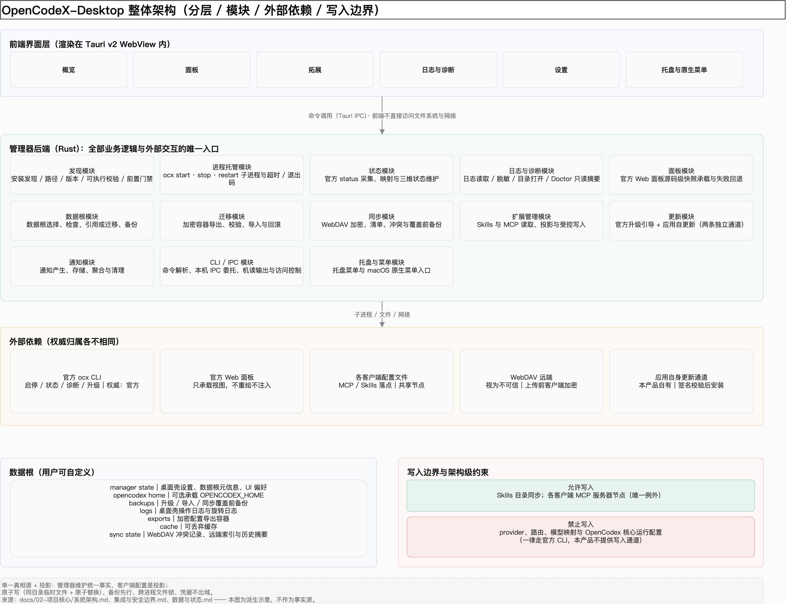

整体架构：前端界面层 → 管理器后端（13 个模块）→ 外部依赖；下方是数据根分区与写入边界

前端界面层<small style="display:block;font-weight:400;color:var(--text2);font-size:11px">概览 / 面板 / 拓展 / 日志 / 设置 / 托盘</small>

→

管理器后端<small style="display:block;font-weight:400;color:var(--text2);font-size:11px">Rust · 全部业务逻辑</small>

→

外部依赖<small style="display:block;font-weight:400;color:var(--text2);font-size:11px">ocx CLI / 官方面板 / 客户端配置 / WebDAV / 更新通道</small>

<strong>一条分工原则：</strong>前端不直接碰文件系统和网络，所有外部交互都收在 Rust 后端里，通过 IPC 命令暴露给界面。

### 13 个后端模块

模块按能力域切开，方便从能力追到实现。

| 模块 | 职责 |
|---|---|
| **发现模块** | 安装发现：路径、版本、可执行校验、前置条件门禁 |
| **进程托管模块** | 启停子进程的调用、超时、退出码与错误摘要 |
| **状态模块** | 官方状态命令的采集、映射与三维状态维护 |
| **日志与诊断模块** | 日志读取、脱敏、日志目录打开、Doctor 只读摘要 |
| **面板模块** | 官方 Web 面板快照的承载与失败回退 |
| **数据根模块** | 数据根的选择、检查、引用或迁移、备份 |
| **迁移模块** | 加密容器的导出、校验、导入与回滚 |
| **同步模块** | WebDAV 的加密、清单、冲突与覆盖前备份 |
| **扩展管理模块** | Skills 与 MCP 的读取、投影与受控写入 |
| **更新模块** | 官方升级引导与应用自更新（两条独立通道） |
| **通知模块** | 通知的产生、存储、聚合与清理 |
| **CLI / IPC 模块** | 命令解析、本机 IPC 委托、机读输出与访问控制 |
| **托盘与菜单模块** | 托盘菜单与 macOS 原生菜单入口 |

### 几条不能破的约束

- **单一真相源 + 投影：**管理器维护统一事实，各客户端配置是投影，不是权威。
- **只改目标节点：**结构化读改写，保留未知字段与注释，不整文件重建。
- **原子写：**同目录临时文件写好后原子替换，替换后保留原文件权限。
- **备份先行：**任何可能覆盖数据的写入，前面必须先有一份可恢复的备份；备份失败就阻断。
- **跨进程互斥：**和官方 CLI、编辑器共享同一批配置文件，写入要拿跨进程文件锁，并比对内容摘要。
- **凭据不出域：**凭据不进日志、不进命令行参数、不进错误信息、不进未加密文件。
- **后端独占外部访问：**前端不直接触碰文件系统与网络。

### 运行时与进程模型

- **管理器进程**：桌面应用本体，持有界面、后端逻辑和托管子进程。
- **托管子进程**：官方 `ocx start / stop / restart` 由它直接启动和持有，进程标识与退出码进入状态展示。
- **CLI 客户端**：`ocxd` 不独立执行能力，而是连接运行中实例的本机 IPC 端点委托执行；实例没跑的时候不得绕过它直接改状态。
- **重启语义**：应用自更新会重启应用本体，但不会停掉托管中的 OpenCodex 代理；重启后重新接管并恢复状态展示。
- **离线语义**：代理离线时，依赖实时能力的功能（比如实时日志）明确标注不可用，本地历史日志和日志目录仍然可用。

## 08 · 状态模型 {: #states }

最早文档只有一个「代理运行状态」，但原型里已经出现「正在同步」「正在备份」这类并行情况。压成一个状态机必然打架，所以拆成三个互相独立的维度。

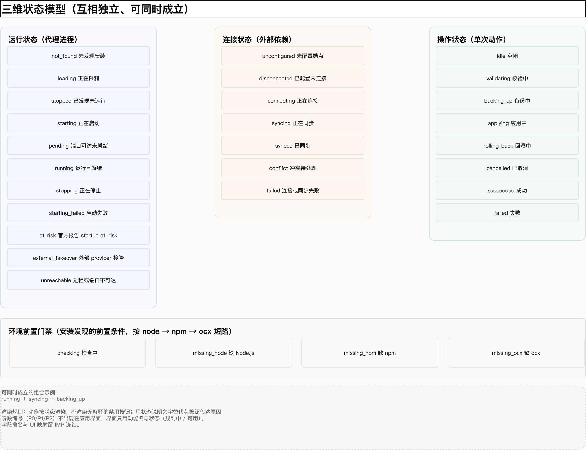

三维状态模型：运行状态（11 态）、连接状态（7 态）、操作状态（8 态），另有 4 个环境前置门禁态

<h4>运行状态 · 11 态</h4>

<code>not_found</code> 未发现安装 · <code>loading</code> 正在探测 · <code>stopped</code> 已发现未运行 · <code>starting</code> 正在启动 · <code>pending</code> 端口可达未就绪 · <code>running</code> 运行且就绪 · <code>stopping</code> 正在停止 · <code>starting_failed</code> 启动失败 · <code>at_risk</code> 官方报告 startup at-risk · <code>external_takeover</code> 外部 provider 接管 · <code>unreachable</code> 进程或端口不可达

<h4>连接状态 · 7 态</h4>

<code>unconfigured</code> 未配置端点 · <code>disconnected</code> 已配置未连接 · <code>connecting</code> 正在连接 · <code>syncing</code> 正在同步 · <code>synced</code> 已同步 · <code>conflict</code> 冲突待处理 · <code>failed</code> 连接或同步失败

<h4>操作状态 · 8 态</h4>

<code>idle</code> 空闲 · <code>validating</code> 校验中 · <code>backing_up</code> 备份中 · <code>applying</code> 应用中 · <code>rolling_back</code> 回滚中 · <code>cancelled</code> 已取消 · <code>succeeded</code> 成功 · <code>failed</code> 失败

<strong>要能同时表达</strong>「运行中 + 同步中 + 备份中」。<strong>渲染规则：</strong>动作按状态渲染，不渲染没有解释的灰色禁用按钮，用一句状态说明说清为什么现在不能点。

### 环境前置门禁

安装发现之前先按 `node → npm → ocx` 顺序短路检查，前面一项没过就不查后面一项。四个状态：`checking` / `missing_node` / `missing_npm` / `missing_ocx`。缺失时展示缺什么、当前状态和最短可复制命令；应用只做检测和引导，不代装。

### 两条主要数据流

**状态采集**：托管子进程 / 官方状态命令 → 后端采集与字段映射 → 三维状态（运行 / 连接 / 操作）→ 前端按状态渲染动作与说明。

**受控写入**：用户动作 → 前置校验（目标合法 / 冲突比对）→ 备份 → 临时区写入 + 原子替换 → 重新校验 → 成功 / 回滚。

## 09 · 关键流程 {: #flows }

挑的都是有分支、有失败、有回滚的地方。图上所有连线只有横竖两个方向、单条直线段，不穿节点。需要回环的关系（比如失败后重试）写在图下方的注释里，不画折线。源文件在 `01-需求分析/输出/架构与流程图/`，可用 draw.io 逐页编辑。

### 01 首次发现与前置门禁

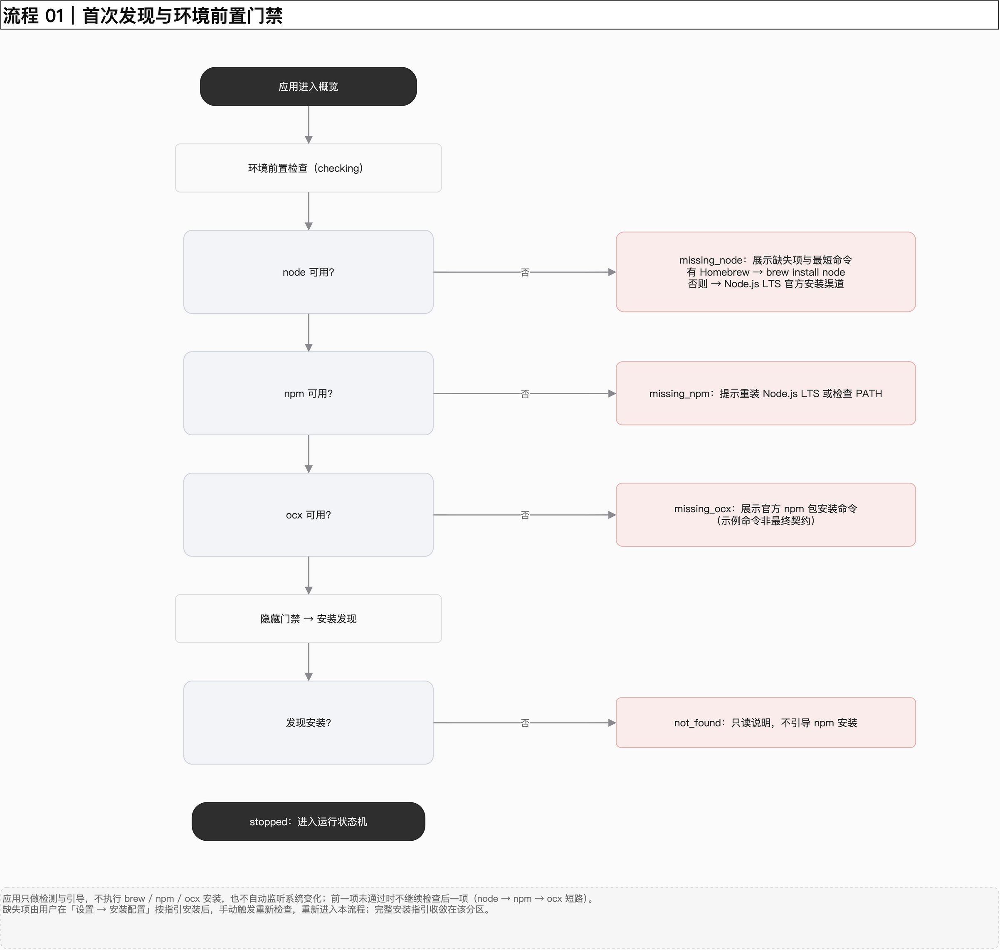

缺失项由用户在「设置 → 安装配置」按指引装好后手动重新检查，应用不代装、也不监听系统变化

### 02 正常启停

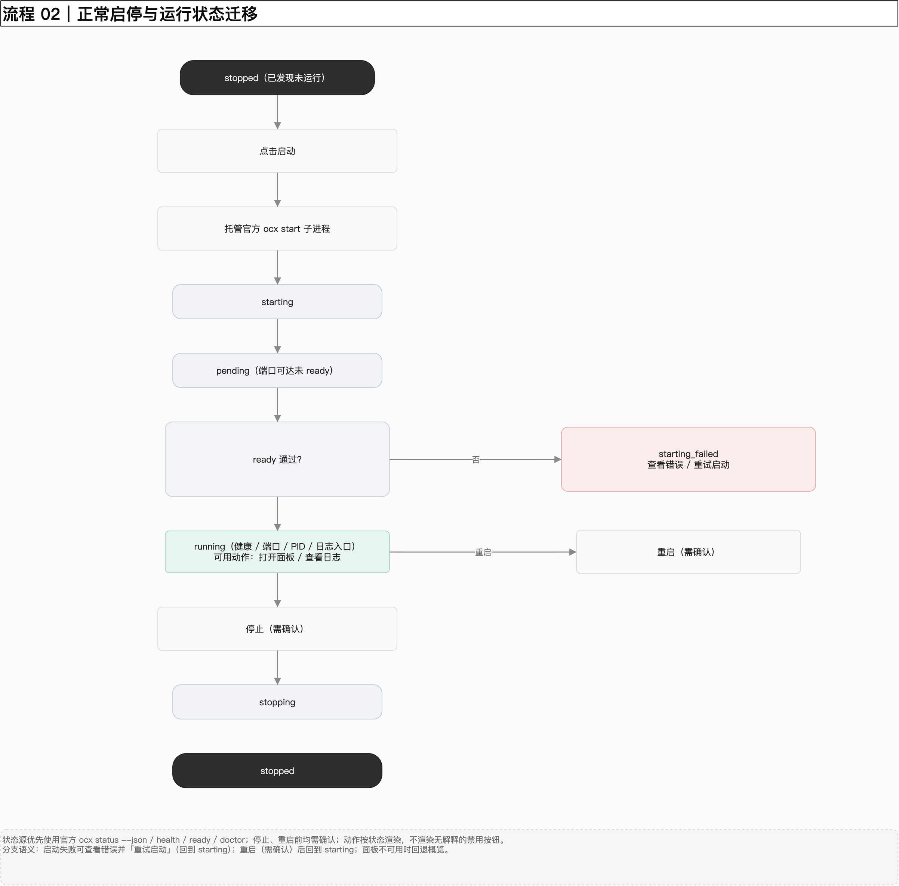

启动失败可以查看错误并重试；停止与重启前都要确认；面板不可用时回退概览

### 03 状态采集数据流

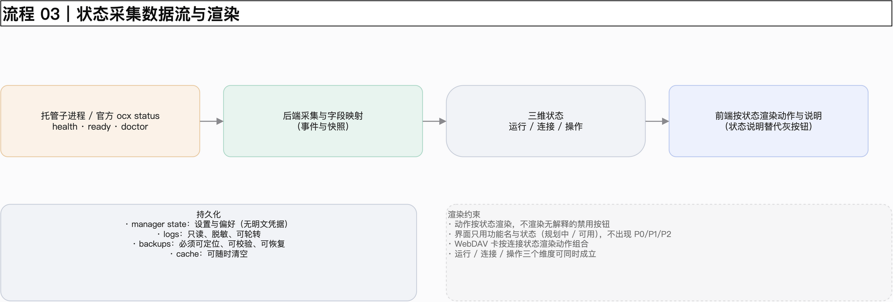

状态源优先用官方 <code>ocx status --json</code> / <code>health</code> / <code>ready</code> / <code>doctor</code>

### 04 受控写入（扩展配置）

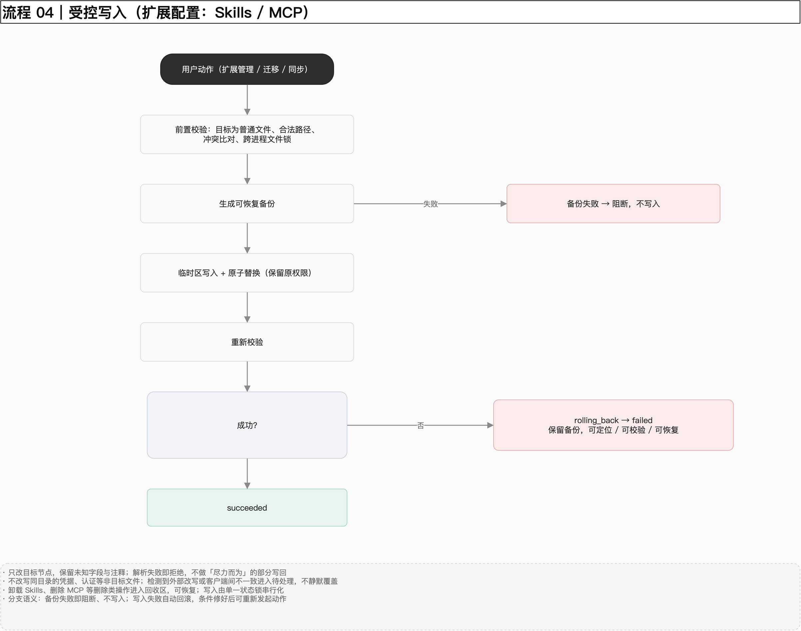

这是唯一允许写真实文件的路径：校验 → 备份 → 临时区写入 + 原子替换 → 重新校验

### 05 数据目录切换

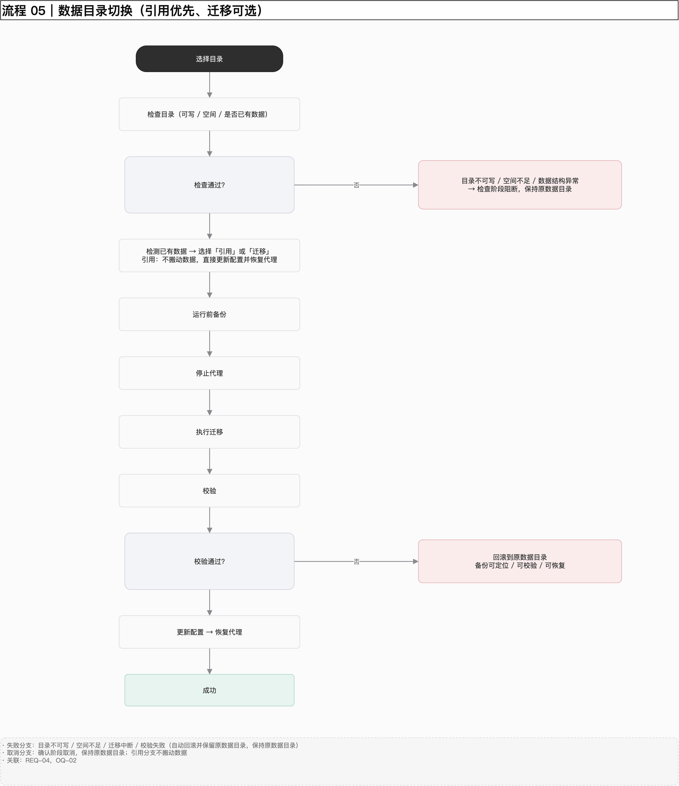

默认引用已有位置不搬数据；迁移前强制备份，中断或校验失败自动回滚并保留原目录

### 06 Restore 引导

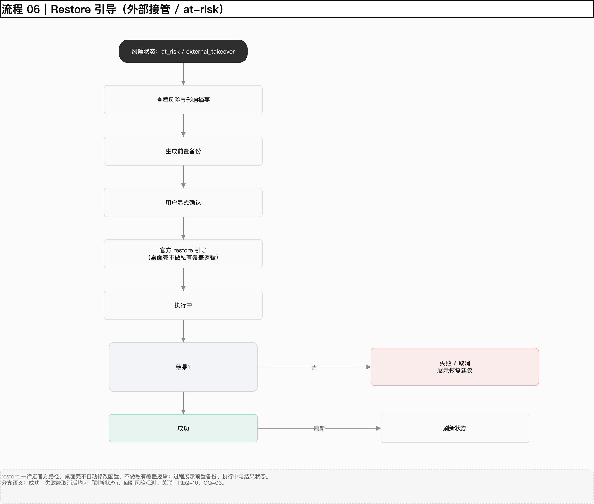

restore 一律走官方路径，桌面壳不做私有覆盖逻辑；成功、失败、取消后都可以刷新状态

### 07 导入配置

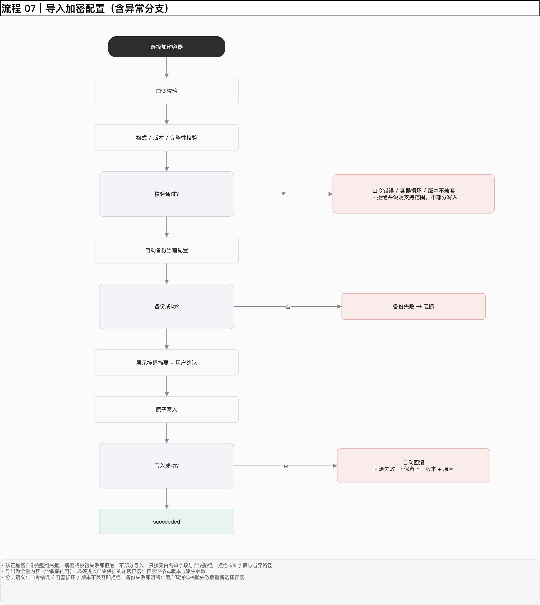

异常分支最多的一张：口令错误、容器损坏、版本不兼容、备份失败、写入失败、自动回滚、回滚失败、用户取消

### 08 WebDAV 同步

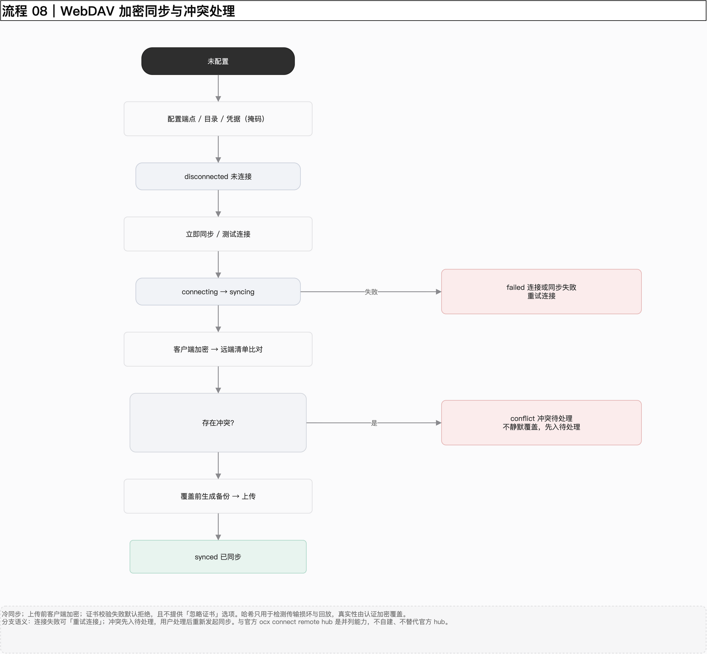

远端一律视为不可信，上传前客户端加密；冲突先入待处理，不静默覆盖

### 09 应用自身更新

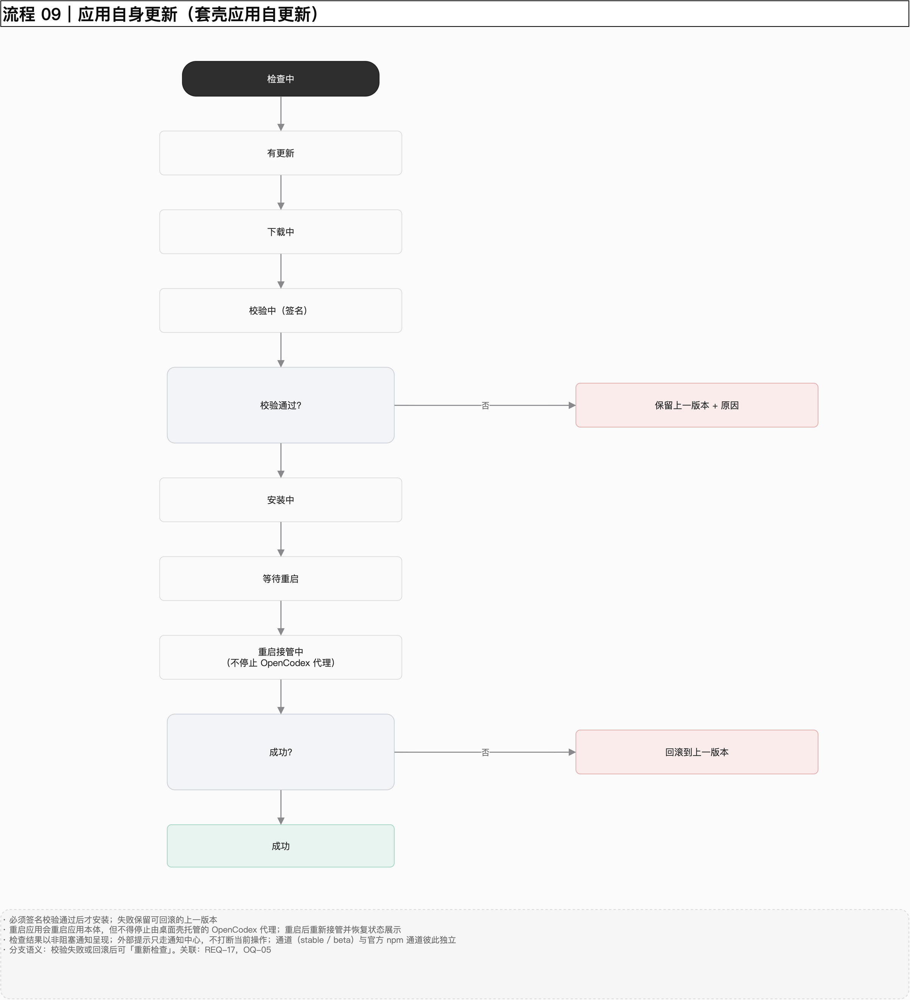

重启会重启应用本体，但不停止托管的 OpenCodex 代理；失败保留可回滚的上一版本

### 10 官方升级引导

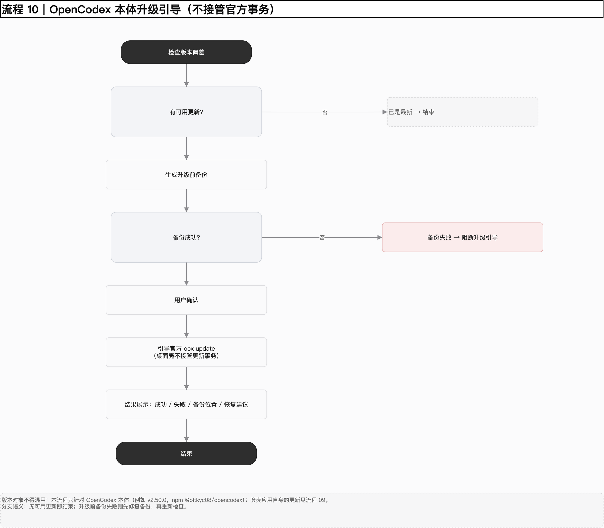

针对 OpenCodex 本体（比如 v2.50.0），和上一条是两回事；升级前备份失败就不引导升级

## 10 · 数据与安全 {: #data }

这个产品大半的复杂度都在这里：它要改别人机器上的配置文件，还要搬运凭据。原则是能不动就不动，非要动就先备份、可回滚、留证据。

### 数据根分区

用户可以选一个自定义数据根，管理器按用途划分产物。`OPENCODEX_HOME` 可以放在数据根里，也可以由用户指定成独立路径。

| 分区 | 放什么 | 约束 |
|---|---|---|
| `manager state` | 桌面壳设置、数据根元信息、界面偏好 | 不含真实凭据明文 |
| `opencodex home` | 可选承载 `OPENCODEX_HOME` | 引用或迁移，尊重既有数据 |
| `backups` | 升级、导入、同步覆盖前的备份 | 必须可定位、可校验、可恢复 |
| `logs` | 桌面壳操作日志与旋转后的日志 | 只读、脱敏、可轮转 |
| `exports` | 加密配置导出容器 | 口令保护，按凭据文件处理，权限 0600 |
| `cache` | 可丢弃缓存 | 可随时清空 |
| `sync state` | WebDAV 冲突记录、远端索引摘要、同步历史摘要 | 用于变更检测，不作权威 |

#### 切换语义：引用优先、迁移可选

选择目录 → 检查（可写 / 空间 / 已有数据）→ 引用 或 迁移 → 运行前备份 → 停止代理 → 执行迁移 → 校验 → 更新配置 → 恢复代理。

默认只「引用」已有位置，不搬动数据。迁移前强制备份，失败自动回滚并保留原数据目录。

### 数据分级

| 级别 | 数据 |
|---|---|
| S0 公开 | 应用版本、官方项目信息 |
| S1 内部 | 安装路径、版本、运行状态、端口、进程标识、数据根路径 |
| S2 敏感 | 日志正文、备份内容、同步索引摘要、Skills 文件内容、MCP 配置结构 |
| S3 凭据 | API key、token、Authorization、WebDAV 账号口令、加密口令、MCP 环境变量值 |

- S3 **不得**进入仓库、Markdown、日志、命令行参数或未加密文件。
- 敏感值范围**包含** `env`、`args`、`headers`，三者一律按潜在敏感值处理，默认掩码。
- 掩码在**取值之前**完成，不是「先明文取回来，再在界面上打码」；编辑场景按字段短暂显示。
- 涉及凭据的配置文件按凭据文件处理，Unix 权限 `0600`。
- MCP 的 `command` / `args` / `env` 具备执行本地程序的能力，必须展示执行边界并经用户显式确认，不得静默执行任意本地程序。

### 扩展配置落在哪

六家客户端的 MCP 节点位置、容器结构和文件格式都不一样，所以必须一家一个适配器，不能假设有统一 schema。这是实施阶段最容易低估的一块工作量。

| 客户端 | MCP 配置落点 | 格式 | MCP 键与形状 |
|---|---|---|---|
| **Codex** | `$CODEX_HOME/config.toml`（默认 ~/.codex/config.toml） | TOML | `[mcp_servers]` 表；`command` + `args` |
| **Claude Code** | `~/.claude.json`；项目级 `<project>/.mcp.json` | JSON | `mcpServers` 映射；另有 disabled / enabled 列表 |
| **Gemini CLI** | `~/.gemini/settings.json`；工作区同名文件 | JSON | 顶层 `mcpServers`（定义）+ `mcp`（全局规则） |
| **Grok CLI** | `~/.grok/user-settings.json`；项目级同名文件 | JSON | `mcp.servers`，是**数组** |
| **OpenCode** | `~/.config/opencode/opencode.json[c]`（XDG，可覆盖） | JSON / JSONC | `mcp.servers`；标签联合 local / remote，环境变量键为 `environment` |
| **Hermes Agent** | `<HERMES_HOME>/config.yaml`（默认 ~/.hermes/config.yaml） | YAML | `mcp_servers` 映射；`type` 归一化为 `transport` |

Skills 目录：Claude Code `~/.claude/skills/`、Codex `~/.codex/skills/`、Gemini CLI `~/.gemini/skills/`、OpenCode `~/.config/opencode/skills/`、Hermes Agent `~/.hermes/skills/`、Grok CLI 项目级 `.agents/skills/`。另有社区共享目录约定 `~/.agents/skills/`，可以作为 Skills 的源存储位置。

### 单一真相源 + 投影

管理器统一扩展配置（含每个能力项的启用矩阵）→ 逐客户端投影 → 各客户端 live 配置文件。

- 管理器维护统一事实；客户端配置是**投影**，不是权威。
- 每个能力项记录它在哪些客户端启用，启停以投影方式同步到对应文件。
- 导入方向相反：从客户端 live 配置读回并合并进统一结构，**不覆盖**其他客户端的启用状态。

### 写入边界与写入规则

<h3>允许写入</h3>
<ul>
<li>Skills 目录同步</li>
<li>各客户端的 MCP 服务器节点</li>
</ul>

<h3>禁止写入</h3>
<ul>
<li>provider、路由、模型映射</li>
<li>OpenCodex 核心运行配置</li>
</ul>

| 规则 | 要求 |
|---|---|
| **目标校验** | 目标必须是普通文件；符号链接、FIFO、设备文件或越出预期根目录的路径一律拒绝写入 |
| **前置备份** | 任何写入前生成可恢复备份；备份失败即阻断 |
| **原子替换** | 同目录临时文件写入后原子替换；替换后保留原文件权限 |
| **节点级写回** | 只改目标节点，保留未知字段与注释；解析失败即拒绝，不做部分写回 |
| **非目标文件** | 不改写同目录的凭据、认证等非目标文件 |
| **并发互斥** | 写入持有跨进程文件锁，并在写入前比对目标内容摘要 |
| **冲突处理** | 检测到外部改写或客户端间不一致时进入待处理，不静默覆盖 |
| **可恢复删除** | 卸载 Skills、删除 MCP 等删除类操作进入回收区，可恢复 |
| **串行化** | 扩展配置写入由单一状态锁串行化，避免并发动作互相覆盖 |

### 信任模型

| 对象 | 信任假设 | 结论 |
|---|---|---|
| **WebDAV 远端** | 不可信 | 上传前客户端加密；哈希只用于发现传输损坏与回放，真实性由认证加密覆盖，不能拿哈希当防恶意远端的措施 |
| **WebDAV 连接** | 需要证书校验 | 证书校验失败默认拒绝，且不提供「忽略证书」选项 |
| **外部客户端配置** | 可能被第三方改写 | 写入前比对内容摘要，冲突进入待处理 |
| **官方 CLI** | 权威写入者 | 不与其争夺 provider / 路由 / 模型映射的写入权 |

#### 加密导出容器

| 项 | 取值 |
|---|---|
| **内容范围** | 全量配置，包含敏感内容 |
| **保护方式** | 用户口令保护；推荐 Argon2id 派生 + AES-256-GCM 认证加密 |
| **完整性** | 认证加密自带完整性校验；解密或校验失败即拒绝，不部分导入 |
| **版本策略** | 容器头含格式版本与派生参数；不兼容即拒绝并说明支持范围 |
| **结构约束** | 只接受白名单字段与合法路径；拒绝未知字段与越界路径 |

<strong>几条「明确不做」也写在这里：</strong>不重写 OpenCodex 核心、不绕过官方 API；不管 npm；不替代官方 <code>ocx update</code>；不接管 <code>codex-shim</code>、不装 launchd；不写核心运行配置；不自动覆盖外部 provider 配置；不明文迁移或同步凭据。

## 11 · 原型与设计 {: #prototype }

原型的作用是定界面结构和状态分支，不是定实现。用的全是 mock 数据：不调用真实 `ocx`，不读真实配置，也不会真的启停或备份。

<strong>怎么打开：</strong>入口是 <code>01-需求分析/05-原型/原型/index.html</code>，用 hash 路由串起各页面。「面板」那一屏依赖官方页面快照，而官方素材不随仓库分发，克隆后需本地自备，缺快照时该路由不可用。

### 页面地图

原型按 1180 × 760 的 macOS 应用窗口表达，最小 900 × 600。

| 路由 | 页面 | 承载内容 |
|---|---|---|
| `#overview` | **概览** | 运行状态卡、运行详情折叠、快捷动作卡（版本升级 / 配置迁移 / WebDAV 同步）、最近事件 |
| `#panel` | **面板** | 官方 GUI 源码级快照，方案 B：保留标题栏与 64px 图标栏 |
| `#extensions` | **拓展** | Skills 管理、MCP 服务器管理 |
| `#logs` | **日志 / 诊断中心** | 日志查看、运行环境诊断（`ocx doctor` 只读摘要）、通知历史 |
| `#settings` | **设置** | 通用、安装配置、数据与备份、扩展管理、配置迁移、WebDAV 同步、日志与通知、CLI 控制面、版本升级、关于 |
| `#tray` | **托盘** | macOS / Windows 托盘状态菜单原型 |

设置分区的锚点是 `general` / `installation` / `backup` / `extensions` / `migration` / `sync` / `cleanup` / `cli` / `upgrade` / `about`。

### 界面截图

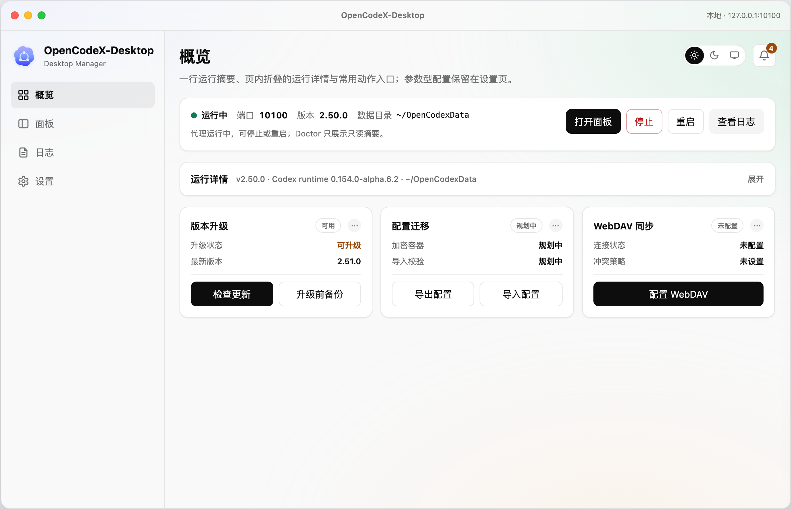
概览（亮色）：运行摘要 + 运行详情折叠 + 快捷动作卡

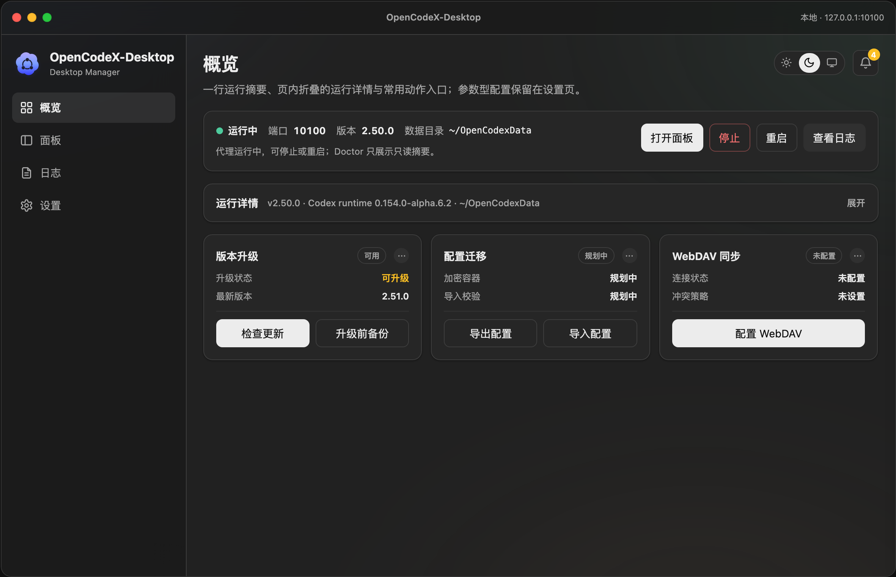
概览（暗色）：外壳与内嵌面板由同一份主题 token 派生

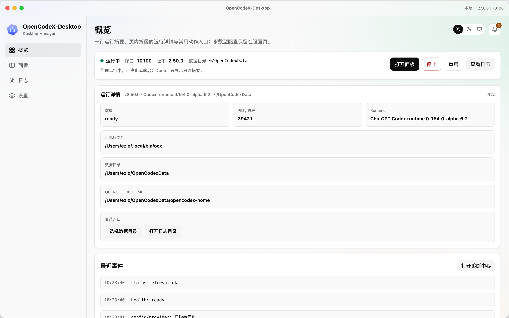
运行详情展开：健康、PID / 进程、Runtime、可执行文件、数据目录

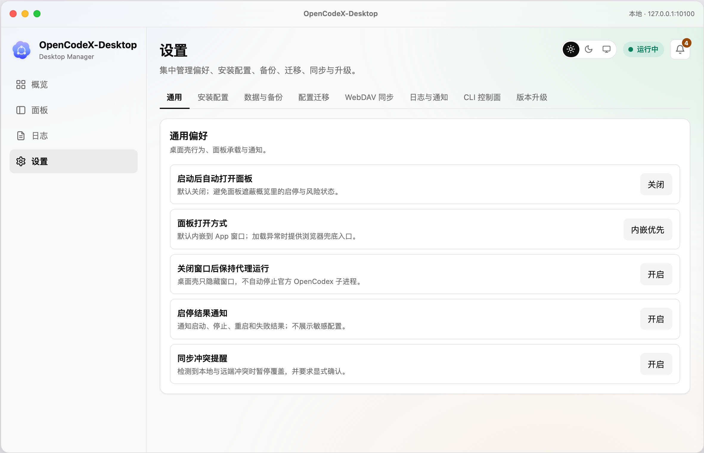
设置：十个分区，参数和边界都在这里

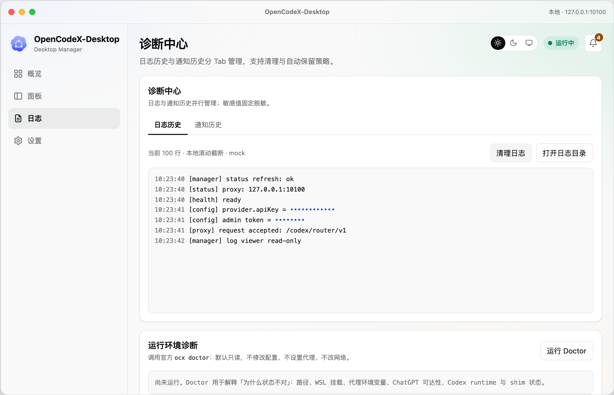
日志 / 诊断中心：只读日志 + Doctor 只读摘要 + 通知历史

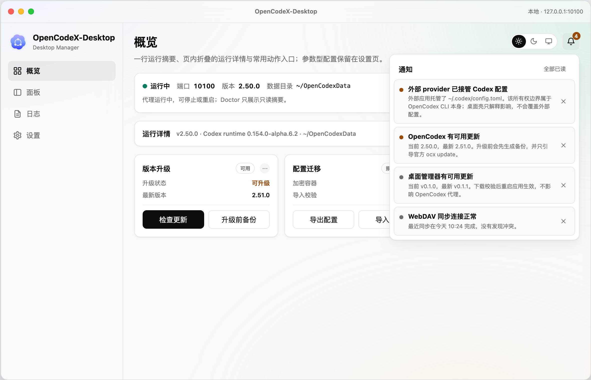
通知中心：与诊断中心的「通知历史」共用同一份数据

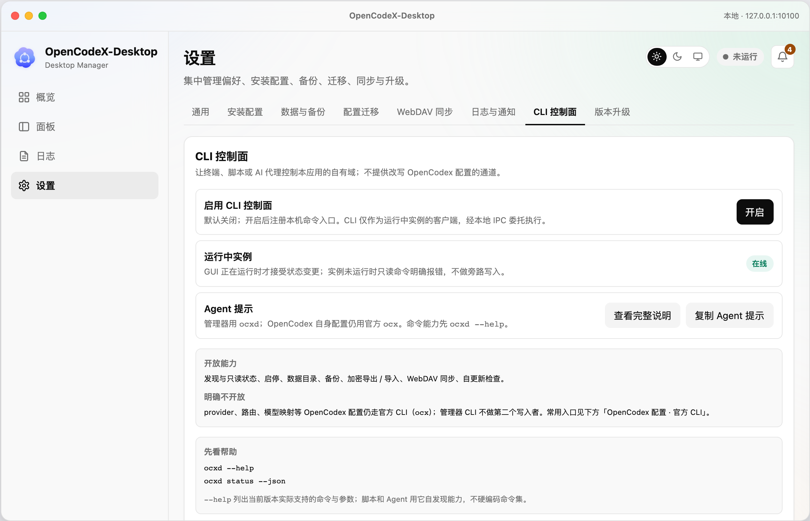
CLI 控制面：默认关闭，开启前说明开放的能力范围

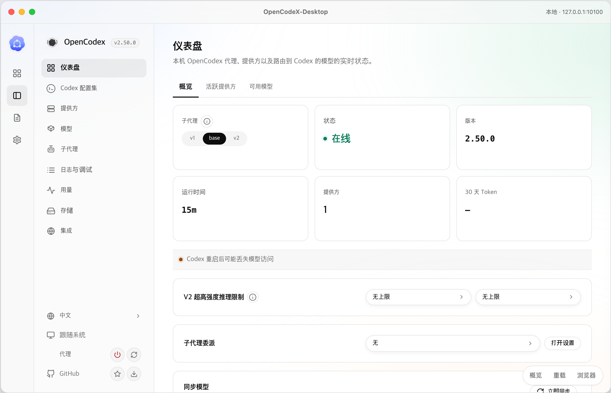
官方面板：全幅承载官方 GUI，保留标题栏与图标栏，不重绘不注入

### 几条必须守住的界面口径

- **动作按状态渲染，不渲染没有解释的灰色禁用按钮。**用状态说明文字说清为什么现在不能点。比如 `starting_failed` 下，启动按钮的文案变成「重试启动」。
- **界面里不出现 P0 / P1 / P2。**设置分区、卡片标签、面板标题都只用功能名和「规划中 / 可用」，阶段编号只留在文档里。
- **两个版本对象分开。**概览「版本升级」卡和设置第一块是 OpenCodex 本体（官方 `ocx update` 引导）；设置第二块是桌面管理器自身（应用自更新）。按钮和文案必须让用户分清当前更新的是哪一个。
- **主题只有一份取值。**`ocx-theme`（light / dark / system）由外壳和内嵌官方面板共同派生，面板不保存自己的主题，切换时用 `postMessage` 实时同步。
- **WebDAV 卡按连接状态渲染。**未配置时不置灰，只把动作区换成一颗「配置 WebDAV」直达设置；其余状态各自的动作组合不同。
- **概览定稿为 B+ 合并版：**一行运行摘要 + 页内折叠的「运行详情」+ 压缩后的快捷动作卡。
- **敏感值永远掩码**，按钮用明确动词（启动、停止、重启、刷新状态、打开面板、查看日志），涉及 restore / 停止 / 重启 / 切换数据目录时必须解释后果。

<strong>视觉来源：</strong>颜色体系从官方 GUI 构建产物的设计 token 提取，再向官方面板对齐，避免嵌入面板后割裂。截图只作为视觉 QA 证据，不用来反推样式。

## 12 · 进度与治理 {: #progress }

需求阶段已经收尾：9 个开放问题全部关闭，五个评审门都过了。剩下的是把项目核心定稿，再建实施契约。

2026-09-12 · 已完成

<h4>需求输入与协作包建立</h4>

原始诉求、生态调研、本机现状观察整理进协作包；需求范围和技术选型确认。

2026-09-13 · 已完成

<h4>P0 原型 + 状态流程</h4>

可点击原型跑通概览、面板、拓展、日志、设置、托盘；状态维度、页面地图与流程分支补齐。

2026-09-14 · 已完成

<h4>需求 revision 3 回写</h4>

OQ-01 ~ OQ-09 全部关闭并逐项落地；新增 AC-11 / AC-12 / AC-13；确认「原型全部功能都要实现」的范围原则。

2026-09-14 · 已完成

<h4>项目核心事实建立 + 图集与报告产出</h4>

产品定义、能力地图、系统架构、数据与状态、领域模型、契约字段、集成与安全边界、术语与命名八份当前事实；整体架构、三维状态模型、10 张流程图，以及本报告。

现在 · 进行中

<h4>项目核心定稿</h4>

这八份事实（已补到字段级）需要你过一遍并确认，确认后才进入实施契约。

下一步 · 未开始

<h4>创建 IMP，冻结 9 类契约</h4>

目录布局与数据根、状态协议、进程模型、发现 / 日志 / 升级、加密格式、扩展管理、WebDAV 同步、CLI 控制面、验收环境与 mock 数据。

之后 · 未开始

<h4>拆实施任务，按 22 个工作包推进</h4>

完整清单见下一节「开工清单」。

### 五个评审门

<h4>Gate A 基线与范围</h4>
已通过

每条需求都有来源、范围和状态。

<h4>Gate B 场景与流程</h4>
已通过

P0 主流程没有未识别的关键分支。

<h4>Gate C 安全评审</h4>
已通过

四域材料齐备，阻塞项转成已确认需求。

<h4>Gate D 领域与契约分析</h4>
已通过

可供 IMP 冻结字段与生命周期约束。

<h4>Gate E 评审与移交</h4>
产物已补齐

IMP 输入清单已建立。

<h4>IMP / TASK</h4>
未创建

前置条件：项目核心定稿。

### 9 个开放问题，全部关闭

| 编号 | 问题 | 状态 | 结论 |
|---|---|---|---|
| `OQ-01` | Skills / MCP / 扩展管理是否属于本期正式范围 | 已关闭 | 正式纳入需求，回写 AC-11 与 §8 / §10 |
| `OQ-02` | 数据目录切换的迁移与回滚分支未冻结 | 已确认 | 采用引用优先、迁移可选；分支写入契约输入 |
| `OQ-03` | restore 引导的结果链不完整 | 已确认 | 补齐执行中 / 失败 / 取消 / 恢复建议 |
| `OQ-04` | WebDAV 冲突模型未完全冻结 | 已确认 | 冻结冲突判定与覆盖策略，留 IMP |
| `OQ-05` | 应用自更新状态链待补 | 已确认 | 状态链写入流程说明并通过安全评审 |
| `OQ-06` | 导入异常链与加密参数未冻结 | 已确认 | 异常链与容器参数写入契约输入 |
| `OQ-07` | CLI 契约未冻结 | 已确认 | 命令集与 IPC 访问控制留 IMP |
| `OQ-08` | 托盘菜单是否属于 P0 | 已关闭 | 纳入 P0，动作限管理器自有域，回写 AC-12 |
| `OQ-09` | 关于 / 许可 / 归属只存在于原型 | 已关闭 | 回写 DMD 新增 §11 与 AC-13 |

### 16 条风险

「阻塞」指的是：这些条目必须在对应能力开工前处理完，不能带着走进实现。

| 编号 | 风险 | 阻塞 | 现状 |
|---|---|---|---|
| `R-01` | 原型已承诺扩展管理，但正式需求未授权，实施人员可能把原型当范围 | 否 | 已关闭：正式纳入需求并回写 |
| `R-02` | 设计 QA 文档累积多轮历史方案，容易被误读成当前仍有多个选项 | 否 | 已加「以最后定稿章节为准」声明 |
| `R-03` | 候选原型可能被误认为正式入口 | 否 | 已在原型 README 说明 |
| `R-04` | 界面已隐藏阶段编号，但文档仍在用 P0/P1/P2 描述原型边界 | 否 | 口径已分开：阶段信息只留文档 |
| `R-05` | 扩展管理涉及真实系统高风险写入：多客户端配置、删除 MCP、卸载 Skills、改命令参数 | 是 | 已补安全条款，实现前仍需闭环 |
| `R-06` | MCP 的 `command / args / env` 能执行任意本地程序，不能当普通表单字段 | 是 | 已定确认与展示策略 |
| `R-07` | 需求声明不写 OpenCodex 配置，但 MCP 路径含 config.toml，可能制造第二个写入者 | 是 | 已拆分允许管理 / 禁止管理边界 |
| `R-08` | 多客户端配置不一致、外部应用改动后缺冲突检测 | 是 | 已核实六家客户端都有官方写入者，按共享写入处理 |
| `R-09` | 删除类操作（卸载 Skills、删除 MCP）不可恢复 | 是 | 已定可恢复性与确认模型 |
| `R-10` | 原型状态数量超过文档，且混成单一状态机 | 否 | 已拆成运行 / 连接 / 操作三维 |
| `R-11` | 多个高风险操作缺失败、取消、回滚与并发状态表达 | 部分 | 依赖 OQ-02 ~ 06 的结论 |
| `R-12` | 通知中心与诊断中心共用数据源，两处各自维护会导致不同步 | 否 | 已声明共用，实现需单一数据源 |
| `R-13` | 需求追踪、场景矩阵、验收矩阵缺失，无法判定闭环 | 否 | 已补齐三份产物 |
| `R-14` | 未决项若被实现工作绕过，会产生越权实现 | 是 | 未关闭的 OQ 一律作为 Gate 阻塞项 |
| `R-15` | 官方项目自己也在做扩展编辑能力，本产品的扩展管理落在官方也会做的区间内 | 否 | 差异点定为「运行管理 + 配置管理一体」 |
| `R-16` | 原型状态测试器只有 10 个运行状态，缺 `stopping`（事实口径 11 态） | 否 | 记为原型缺口，实施阶段补齐 |

<strong>6 条阻塞项集中在两处：</strong>扩展管理的真实写入面（R-05 ~ R-09），以及未决项不能被绕过（R-14）。这两处在「开工清单」里对应工作包 WP-20。

### 协作包产物索引

| 位置 | 内容 |
|---|---|
| `01-需求分析/01-原始输入/` | 原始诉求、参考调研、本机现状核对与边界 |
| `01-需求分析/02-方案草案/` | 技术候选与范围拆分（含品牌与许可边界） |
| `01-需求分析/03-确认与评审/` | 确认记录与回写索引 |
| `01-需求分析/04-需求分析产物/` | 需求基线、场景与验收矩阵、风险与开放问题、安全评审输入、IMP 输入清单 |
| `01-需求分析/05-原型/` | P0 原型、状态流程、设计 QA 与截图证据 |
| `01-需求分析/06-版本记录/` | 原型与报告的多轮版本演进索引 |
| `01-需求分析/输出/架构与流程图/` | 整体架构、状态模型、10 张流程的 drawio 源文件与 PNG 导出 |
| `01-需求分析/输出/需求分析报告/` | 本报告（Markdown 源 + 构建脚本 + 单页 HTML） |

<strong>协作包本身不是事实源。</strong>稳定的需求规则回写 DMD，长期事实进 <code>docs/02-项目核心</code>，实施契约另外建 IMP。协作包里放的是过程材料。

## 13 · 开工清单 {: #plan }

22 个工作包，把 13 个能力域、27 条需求全部覆盖到，P0 / P1 / P2 和贯穿各阶段的工作都在里面。每个工作包都写了要做什么、产出什么、依赖什么、卡在哪里。

<strong>先说清这份清单的性质：</strong>它是<strong>派生的规划草案</strong>，用来对齐「开工要做什么」。正式的字段级契约由 IMP 冻结，任务拆分由治理流程产生。清单里的顺序表示先后依赖，不表示可以砍——范围原则仍然是「原型里出现的功能都要实现」。

### 开工前必须先做完的三件事

这三件是治理动作，不是实施内容。跳过它们直接写代码，后面返工的概率很高。

<h4>第 1 步 · 定稿项目核心</h4>
产品定义、能力地图、系统架构、数据与状态、领域模型、契约字段、集成与安全边界、术语与命名这八份事实过一遍并确认。现在写的是「已确认的设计事实」，确认后才更新成「实际架构事实」。

<h4>第 2 步 · 创建 IMP，冻结 9 类契约</h4>
目录布局与数据根、状态协议、进程模型、发现 / 日志 / 升级、加密格式、扩展管理、WebDAV 同步、CLI 控制面、验收环境与 mock 数据。项目核心里标了「待冻结」的 43 项字段级条款已经逐条登记在 IMP 输入清单里，和这 9 类契约双向对上，不会漏。

<h4>第 3 步 · 拆实施任务</h4>
按下面的工作包拆分任务，每个任务带验收检查和证据保留要求。

### 工作包总表

| 编号 | 工作包 | 阶段 | 覆盖需求 | 验收 |
|---|---|---|---|---|
| `WP-01` | **工程底座与桌面壳** | P0 | —（支撑全部） | |
| `WP-02` | **安装发现与前置门禁** | P0 | `REQ-01` | AC-01 |
| `WP-03` | **数据根与数据目录** | P0 | `REQ-02 ~ 04` | AC-02 |
| `WP-04` | **进程托管与启停** | P0 | `REQ-05` | AC-03 |
| `WP-05` | **状态采集与三维状态** | P0 | `REQ-06` | AC-03 AC-05 |
| `WP-06` | **日志、诊断中心与通知** | P0 | `REQ-07、11、12` | AC-04 |
| `WP-07` | **官方 Web 面板承载** | P0 | `REQ-08` | AC-04 |
| `WP-08` | **风险识别与 restore 引导** | P0 | `REQ-09、10` | AC-05 |
| `WP-09` | **官方升级引导** | P0/P1 | `REQ-16` | AC-08 |
| `WP-10` | **托盘与原生菜单** | P0 | `REQ-19、20` | AC-12 |
| `WP-11` | **关于、许可与归属** | P0 | `REQ-21` | AC-13 |
| `WP-12` | **应用自身更新** | P1 | `REQ-17` | AC-09 |
| `WP-13` | **配置导出（加密容器）** | P1 | `REQ-13` | AC-06 |
| `WP-14` | **配置导入与回滚** | P1 | `REQ-14` | AC-06 |
| `WP-15` | **扩展管理 · Skills** | P1 | `REQ-22` | AC-11 |
| `WP-16` | **扩展管理 · MCP 与六客户端适配** | P1 | `REQ-23、24` | AC-11 |
| `WP-17` | **扩展写入引擎** | P1 | `REQ-26、27` | AC-11 |
| `WP-18` | **CLI 控制面与本机 IPC** | P1 | `REQ-18、25` | AC-10 |
| `WP-19` | **WebDAV 加密同步** | P2 | `REQ-15` | AC-07 |
| `WP-20` | **安全阻塞项闭环** | 贯穿 | `R-05 ~ R-09、R-14` | |
| `WP-21` | **测试与验收基线** | 贯穿 | 全部 AC | |
| `WP-22` | **打包、签名与更新通道** | 贯穿 | 支撑 `REQ-17` | |

### P0 · 运行管理主线

先把「发现 → 起得来 → 看得到 → 出问题有出路」这条线打通。这一段做完，产品就已经能日常用了。

<h4>WP-01 · 工程底座与桌面壳 P0 支撑全部</h4>

<strong>目标：</strong>把能跑、能打包的空壳立起来，后面所有能力都往这个壳里加。

<ul>
<li>初始化 Tauri v2 工程：Rust 后端 + Web 前端两个工作区，定目录结构与构建脚本</li>
<li>约定 IPC 命令层：命名规则、请求 / 响应结构、错误模型与错误码、超时与取消</li>
<li>把「前端不直接访问文件系统与网络」做成可检查的约定，而不是口头规则</li>
<li>日志基础设施：分级、落盘位置、轮转、统一脱敏过滤器</li>
<li>偏好与设置存储（manager state），确保不落明文凭据</li>
<li>macOS 上跑通开发与打包两条路径</li>
</ul>

<strong>产出物：</strong>可运行的桌面壳、IPC 契约草案、日志与脱敏模块　<strong>依赖：</strong>无　<strong>卡点：</strong>无

<h4>WP-02 · 安装发现与前置门禁 P0 AC-01 REQ-01</h4>

<strong>目标：</strong>一进来就告诉你环境缺什么，并且只说不装。

<ul>
<li><code>node → npm → ocx</code> 短路探测：前面一项没过就不查后面一项</li>
<li>展示安装路径、版本、可执行校验结果</li>
<li>缺失态给出当前状态与最短可复制命令：有 Homebrew 给 <code>brew install node</code>，没有给官方 LTS 渠道</li>
<li>提供「重新检查」入口；不执行任何安装、不监听系统变化</li>
<li>完整安装指引收敛到「设置 → 安装配置」</li>
</ul>

<strong>产出物：</strong>发现模块、门禁状态机与文案表　<strong>依赖：</strong>WP-01　<strong>卡点：</strong>无

<h4>WP-03 · 数据根与数据目录 P0 AC-02 REQ-02 ~ 04</h4>

<strong>目标：</strong>自有产物有地方放，已有的 OpenCodex 数据默认不动。

<ul>
<li>数据根选择与检查：可写、空间、是否已有数据</li>
<li>七个分区布局与初始化：manager state / opencodex home / backups / logs / exports / cache / sync state</li>
<li><code>OPENCODEX_HOME</code> 支持「引用已有位置」或「独立路径」两种形态</li>
<li>切换流程：检查 → 引用或迁移 → 运行前备份 → 停代理 → 迁移 → 校验 → 更新配置 → 恢复代理</li>
<li>失败分支：不可写、空间不足、数据结构异常一律在<strong>检查阶段</strong>阻断</li>
<li>迁移中断或校验失败自动回滚，保留原数据目录</li>
<li>备份保留策略与完整性校验（备份不可定位时不得开始迁移）</li>
</ul>

<strong>产出物：</strong>数据根模块、切换状态机、备份与回滚　<strong>依赖：</strong>WP-01　<strong>卡点：</strong>目录命名与迁移细节需 IMP 冻结

<h4>WP-04 · 进程托管与启停 P0 AC-03 REQ-05</h4>

<strong>目标：</strong>点一下就能起停，进程握在自己手里。

<ul>
<li>直接托管 <code>ocx start / stop / restart</code> 子进程，采集退出码与错误输出</li>
<li>超时、取消、重复点击的幂等处理</li>
<li>停止与重启前的确认，并说明后果</li>
<li>不安装或管理 launchd，不接管 <code>codex-shim</code></li>
</ul>

<strong>产出物：</strong>进程托管模块　<strong>依赖：</strong>WP-02（要能定位到 ocx）　<strong>卡点：</strong>进程模型需 IMP 冻结

<h4>WP-05 · 状态采集与三维状态 P0 AC-03 AC-05 REQ-06</h4>

<strong>目标：</strong>状态如实，多个维度同时成立也不打架。

<ul>
<li>采集官方 <code>ocx status --json</code> / <code>health</code> / <code>ready</code> 的输出并做字段映射</li>
<li>三维状态建模：运行 11 态、连接 7 态、操作 8 态，允许同时成立</li>
<li>做一张「状态 → 可用动作 + 说明文案」的映射表，前端照着渲染</li>
<li>展示端口、PID、最近错误摘要；不做无解释的灰色禁用按钮</li>
</ul>

<strong>产出物：</strong>状态模块、状态到动作的映射表　<strong>依赖：</strong>WP-04　<strong>卡点：</strong>字段命名与枚举映射需 IMP 冻结

<h4>WP-06 · 日志、诊断中心与通知 P0 AC-04 REQ-07、11、12</h4>

<strong>目标：</strong>出问题能自己查，不用开终端。

<ul>
<li>日志只读读取、脱敏、打开日志文件或目录、轮转</li>
<li>代理离线时明确说明实时日志不可用；本地历史日志与日志目录仍可用</li>
<li>运行环境诊断展示官方 <code>ocx doctor</code> 只读摘要；<strong>不提供</strong>写入型修复参数</li>
<li>通知中心与「诊断中心 → 通知历史」共用单一数据源，任一处改动两处同步</li>
<li>通知详情弹窗、单条删除、批量已读与清理</li>
</ul>

<strong>产出物：</strong>日志与诊断模块、通知模块　<strong>依赖：</strong>WP-01、WP-05　<strong>卡点：</strong>无

<h4>WP-07 · 官方 Web 面板承载 P0 AC-04 REQ-08</h4>

<strong>目标：</strong>官方界面照原样看得到，不改它。

<ul>
<li>全幅视图承载官方 GUI，保留标题栏与 64px 图标栏</li>
<li>只承载，不重绘内部、不注入管理器控件</li>
<li>加载失败时在同一区域给重试与「在浏览器打开」</li>
<li>面板不可用时回退概览，不留空白区域</li>
</ul>

<strong>产出物：</strong>面板模块、失败回退路径　<strong>依赖：</strong>WP-01　<strong>卡点：</strong>官方素材不随仓库分发，运行期加载方式需 IMP 确认

<h4>WP-08 · 风险识别与 restore 引导 P0 AC-05 REQ-09、10</h4>

<strong>目标：</strong>看出问题、说清影响，但不动手改别人的配置。

<ul>
<li>识别外部 provider 接管与 startup at-risk，给出影响摘要，不直接改写外部配置</li>
<li>restore 引导链：前置备份 → 用户显式确认 → 官方路径 → 执行中 → 成功 / 失败 / 取消 → 刷新状态</li>
<li>失败与取消都要给恢复建议</li>
</ul>

<strong>产出物：</strong>风险识别、restore 引导流程　<strong>依赖：</strong>WP-05　<strong>卡点：</strong>无（明确不做私有覆盖逻辑）

<h4>WP-09 · 官方升级引导 P0/P1 AC-08 REQ-16</h4>

<strong>目标：</strong>升级前先备份，升级本身交给官方。

<ul>
<li>检测版本偏差</li>
<li>升级前强制生成备份；<strong>备份失败就阻断升级引导</strong></li>
<li>引导官方 <code>ocx update</code>，不接管更新事务、不管 npm</li>
<li>结果展示：成功 / 失败 / 备份位置 / 恢复建议</li>
</ul>

<strong>产出物：</strong>更新模块第一通道　<strong>依赖：</strong>WP-03（备份）、WP-05　<strong>卡点：</strong>无

<h4>WP-10 · 托盘与原生菜单 P0 AC-12 REQ-19、20</h4>

<strong>目标：</strong>不开主窗口也能启停和看状态。

<ul>
<li>托盘菜单：启停、打开面板、查看日志、打开数据目录、快速设置、退出</li>
<li>用图标与颜色表达运行状态；系统托盘默认只显示图标</li>
<li>macOS 原生菜单：进程、视图、日志入口</li>
<li>应用退出后不残留托盘与菜单项</li>
</ul>

<strong>产出物：</strong>托盘与菜单模块　<strong>依赖：</strong>WP-04、WP-05　<strong>卡点：</strong>无

<h4>WP-11 · 关于、许可与归属 P0 AC-13 REQ-21</h4>

<strong>目标：</strong>把「官方」和「本应用」分清楚，别让人误会。

<ul>
<li>关于页三块：官方项目 / 本应用 / 许可、归属与免责声明</li>
<li>说明与 OpenCodex 官方项目不存在隶属、授权或背书关系；不复制或再分发官方素材</li>
<li>提供官方许可与第三方声明的查阅入口，并说明两套许可彼此独立</li>
</ul>

<strong>产出物：</strong>关于页　<strong>依赖：</strong>WP-01　<strong>卡点：</strong>无

### P1 · 要先过安全评审的

这一组的共同点是都会碰真实数据或真实系统：写文件、搬凭据、开本地端口。所以顺序上排在 P0 之后，安全评审先落地。

<h4>WP-12 · 应用自身更新 P1 AC-09 REQ-17</h4>

<strong>目标：</strong>套壳应用能自己升级，但别把正在跑的代理弄停。

<ul>
<li>版本检查，区分 stable / beta 通道</li>
<li>下载 → 签名校验 → 安装 → 等待重启</li>
<li>重启后重新接管托管的 OpenCodex 代理并恢复状态展示；<strong>重启不停止代理</strong></li>
<li>失败保留可回滚的上一版本，并展示原因与恢复建议</li>
<li>检查结果以非阻塞通知呈现，不打断当前操作</li>
<li>界面与文案必须和「官方 <code>ocx update</code>」分清</li>
</ul>

<strong>产出物：</strong>更新模块第二通道、签名校验、回滚　<strong>依赖：</strong>WP-22（打包与签名）、WP-03（备份）　<strong>卡点：</strong>状态链细节与发布通道需 IMP 冻结

<h4>WP-13 · 配置导出（加密容器） P1 AC-06 REQ-13</h4>

<strong>目标：</strong>全量导出可行，但敏感内容只能进加密容器。

<ul>
<li>全量导出（含敏感内容），必须落在口令保护的加密容器里</li>
<li>容器格式：口令派生（推荐 Argon2id）+ 认证加密（AES-256-GCM）</li>
<li>容器头带格式版本与派生参数，便于将来兼容判断</li>
<li>口令输入与确认；导出文件按凭据文件处理，Unix 权限 <code>0600</code></li>
<li>只接受白名单字段与合法路径</li>
</ul>

<strong>产出物：</strong>迁移模块导出侧　<strong>依赖：</strong>WP-03　<strong>卡点：</strong>加密参数需 IMP 冻结（OQ-06）

<h4>WP-14 · 配置导入与回滚 P1 AC-06 REQ-14</h4>

<strong>目标：</strong>导入失败也不能把现有配置写坏。

<ul>
<li>口令 → 格式 / 版本 / 完整性三重校验</li>
<li>自动备份当前配置 → 展示掩码摘要 → 显式确认 → 原子写入</li>
<li>异常链全部要有出路：口令错误、容器损坏、版本不兼容、备份失败、写入失败、自动回滚、回滚失败、用户取消</li>
<li>校验失败一律中断，<strong>不做部分写入</strong></li>
</ul>

<strong>产出物：</strong>迁移模块导入侧　<strong>依赖：</strong>WP-13、WP-17（共用原子替换与备份）　<strong>卡点：</strong>异常链与容器参数需 IMP 冻结（OQ-06）

<h4>WP-15 · 扩展管理 · Skills P1 AC-11 REQ-22</h4>

<strong>目标：</strong>Skills 管一次，六个客户端都能用。

<ul>
<li>发现、导入、更新、卸载、恢复</li>
<li>仓库与路径管理；多客户端 Skills 目录同步</li>
<li>卸载进回收区、<strong>可恢复</strong>（恢复窗口留 IMP 冻结）</li>
<li>与官方 Skills 能力的职责边界要在 IMP 里写清</li>
</ul>

<strong>产出物：</strong>扩展管理 Skills 侧　<strong>依赖：</strong>WP-17（写入引擎）　<strong>卡点：</strong>允许写入的客户端清单需 IMP 冻结；安全评审要闭环

<h4>WP-16 · 扩展管理 · MCP 与六客户端适配 P1 AC-11 REQ-23、24</h4>

<strong>目标：</strong>同一份 MCP 定义，投影到六家格式各异的客户端。

<ul>
<li>六家客户端各写一个适配器：Codex（TOML）、Claude Code（JSON）、Gemini CLI（JSON）、Grok CLI（JSON 数组）、OpenCode（JSON / JSONC，标签联合）、Hermes（YAML）</li>
<li>MCP 导入、新增、编辑、删除；JSON 配置 + 向导 + 校验</li>
<li>统一真相源 + 逐客户端投影；每个能力项记录在哪些客户端启用</li>
<li>导入方向相反：从 live 配置读回并合并，<strong>不覆盖</strong>其他客户端的启用状态</li>
<li><code>env</code> / <code>args</code> / <code>headers</code> 默认掩码；<code>command</code> / <code>args</code> 展示执行边界并显式确认</li>
<li>删 MCP 进回收区，可恢复</li>
</ul>

<strong>产出物：</strong>MCP 管理界面、六客户端适配器层　<strong>依赖：</strong>WP-17　<strong>卡点：</strong>R-06 执行边界策略要落到实现；可写客户端清单需 IMP 冻结

<h4>WP-17 · 扩展写入引擎（Skills / MCP 共用） P1 AC-11 REQ-26、27</h4>

<strong>目标：</strong>整个产品唯一允许写别人文件的地方，必须最稳。

<ul>
<li>写入边界硬校验：只允许扩展配置；禁写 provider / 路由 / 模型映射与核心运行配置</li>
<li>目标必须是普通文件；符号链接、FIFO、设备文件、越出预期根目录的路径一律拒绝</li>
<li>备份 → 同目录临时文件 + 原子替换 → 保留原文件权限 → 重新校验</li>
<li>跨进程文件锁 + 写入前内容摘要比对；单一状态锁串行化</li>
<li>节点级写回：保留未知字段与注释；解析失败即拒绝，不做部分写回</li>
<li>不改写同目录的凭据、认证等非目标文件；删除类操作进回收区</li>
<li>检测到外部改写或客户端间不一致时进入待处理，不静默覆盖</li>
</ul>

<strong>产出物：</strong>受控写入引擎　<strong>依赖：</strong>WP-03（备份）　<strong>卡点：</strong>R-05 / R-07 / R-08 / R-09 必须闭环后才能开工

<h4>WP-18 · CLI 控制面与本机 IPC P1 AC-10 REQ-18、25</h4>

<strong>目标：</strong>给脚本和 AI 代理一个机读入口，但不能变成第二个写入者。

<ul>
<li><code>ocxd</code> 命令集；<code>--json</code> 机读输出；非交互与幂等语义；破坏性操作确认标志</li>
<li>本机 IPC 端点与访问控制：受限文件权限 + 调用方校验</li>
<li>关闭时不得留下可被调用的监听端点</li>
<li>实例未运行时：只读命令给降级说明，变更类命令报错</li>
<li>默认关闭；开启前弹确认并说明开放的能力范围</li>
<li>能力限定在管理器自有域；不提供写核心运行配置的通道</li>
</ul>

<strong>产出物：</strong>CLI / IPC 模块、访问控制　<strong>依赖：</strong>WP-01 ~ WP-05　<strong>卡点：</strong>命令契约与 IPC 协议需 IMP 冻结（OQ-07）

### P2 · WebDAV 加密同步

<h4>WP-19 · WebDAV 加密同步 P2 AC-07 REQ-15</h4>

<strong>目标：</strong>跨机同步配置，但远端一律当不可信处理。

<ul>
<li>端点 / 目录 / 凭据配置，凭据掩码显示</li>
<li>证书校验：失败默认拒绝，<strong>不提供</strong>「忽略证书」选项</li>
<li>客户端加密后上传；远端清单与摘要用于变更检测</li>
<li>冷同步；覆盖前生成可恢复备份</li>
<li>冲突判定与待处理队列，不静默覆盖；<code>sync state</code> 记录冲突与历史摘要</li>
<li>与官方 <code>ocx connect</code> remote hub 并列：不自建 hub、不替代官方 hub</li>
</ul>

<strong>产出物：</strong>同步模块、冲突处理与备份　<strong>依赖：</strong>WP-13（加密）、WP-17（写入与备份）　<strong>卡点：</strong>冲突模型需 IMP 冻结（OQ-04）

### 贯穿各阶段的三件事

<h4>WP-20 · 安全阻塞项闭环 贯穿 R-05 ~ R-09、R-14</h4>

<strong>目标：</strong>把 6 条阻塞风险一条条关掉，别带着走进实现。

<ul>
<li><strong>R-05</strong> 扩展管理真实写入面：确认控制措施覆盖每一种写入动作</li>
<li><strong>R-06</strong> MCP 命令执行边界：展示与确认策略落到实现，不允许静默执行</li>
<li><strong>R-07</strong> 写入边界拆分：确保没有第二个写入者，核心运行配置不出现写入通道</li>
<li><strong>R-08</strong> 六客户端共享写入：文件锁、摘要比对、冲突待处理三者都要有</li>
<li><strong>R-09</strong> 删除可恢复：回收区与恢复窗口</li>
<li><strong>R-14</strong> 未决项不得被绕过：未关闭的 OQ 一律作为 Gate 阻塞项</li>
</ul>

<strong>产出物：</strong>安全评审结论、控制措施落实清单　<strong>依赖：</strong>与 WP-15 ~ WP-19 并行推进　<strong>卡点：</strong>本身就是在解卡点

<h4>WP-21 · 测试与验收基线 贯穿 全部 AC</h4>

<strong>目标：</strong>每条验收标准都能跑一遍，且有证据留下。

<ul>
<li>把 AC-01 ~ AC-13 逐条变成可执行的验收场景，含正常 / 失败 / 取消 / 恢复路径</li>
<li>mock 数据方案：不读真实配置、不触发真实启停与备份</li>
<li>回归清单：三维状态、通知共用数据源、备份可恢复性</li>
<li>分层测试门与证据保留策略</li>
</ul>

<strong>产出物：</strong>可执行的验收矩阵、mock 数据、回归清单　<strong>依赖：</strong>WP-01　<strong>卡点：</strong>验收环境与 mock 数据需 IMP 冻结

<h4>WP-22 · 打包、签名与更新通道 贯穿 支撑 REQ-17</h4>

<strong>目标：</strong>让「应用能自己升级」这件事有东西可升。

<ul>
<li>macOS 打包、签名与公证流程</li>
<li>stable / beta 两条通道的产物与元数据</li>
<li>更新包签名校验所需的密钥与验证路径</li>
<li>回滚所需的上一版本保留策略</li>
<li>发布动作本身按治理要求单独确认；这里只准备通道</li>
</ul>

<strong>产出物：</strong>打包脚本、签名与通道配置　<strong>依赖：</strong>WP-01　<strong>卡点：</strong>无（正式发布需单独授权）

### 需求覆盖核对

把 27 条需求逐条对到工作包，用来确认没有漏项。

| 需求 | 工作包 | 验收 | 需求 | 工作包 | 验收 |
|---|---|---|---|---|---|
| `REQ-01` | `WP-02` | AC-01 | `REQ-15` | `WP-19` | AC-07 |
| `REQ-02` | `WP-03` | AC-02 | `REQ-16` | `WP-09` | AC-08 |
| `REQ-03` | `WP-03` | AC-02 | `REQ-17` | `WP-12` | AC-09 |
| `REQ-04` | `WP-03` | AC-02 | `REQ-18` | `WP-18` | AC-10 |
| `REQ-05` | `WP-04` | AC-03 | `REQ-19` | `WP-10` | AC-12 |
| `REQ-06` | `WP-05` | AC-03 AC-05 | `REQ-20` | `WP-10` | AC-12 |
| `REQ-07` | `WP-06` | AC-04 | `REQ-21` | `WP-11` | AC-13 |
| `REQ-08` | `WP-07` | AC-04 | `REQ-22` | `WP-15` | AC-11 |
| `REQ-09` | `WP-08` | AC-05 | `REQ-23` | `WP-16` | AC-11 |
| `REQ-10` | `WP-08` | AC-05 | `REQ-24` | `WP-16` | AC-11 |
| `REQ-11` | `WP-06` | AC-04 | `REQ-25` | `WP-18` | AC-10 |
| `REQ-12` | `WP-06` | 随 AC-04 | `REQ-26` | `WP-17` | AC-11 |
| `REQ-13` | `WP-13` | AC-06 | `REQ-27` | `WP-17` | AC-11 |
| `REQ-14` | `WP-14` | AC-06 | — | — | — |

<strong>核对结果：</strong>REQ-01 ~ REQ-27 全部 27 条都有对应工作包，AC-01 ~ AC-13 全部 13 条都有承接。没有孤儿需求，也没有无需求支撑的工作包（WP-01 与 WP-20 ~ WP-22 是底座与横切工作，不直接对应单条需求）。

### 依赖与开工顺序

WP-01 工程底座 → WP-02 发现 → WP-04 进程托管 → WP-05 状态 → WP-06 / 07 / 08 / 10 / 11

WP-03 数据根与备份 → WP-09 升级引导 / WP-17 写入引擎 → WP-15 / 16 扩展管理 · WP-13 / 14 配置迁移 → WP-19 WebDAV

- **备份能力是公共底座。**WP-03 的备份与回滚会被 WP-09、WP-13、WP-14、WP-17、WP-19 一起用，所以要早做、做扎实。
- **写入引擎要先于扩展管理。**WP-17 是 Skills 和 MCP 的共同底座，先做引擎再做界面，避免两处各写一套。
- **WebDAV 排最后有原因。**它同时依赖加密容器（WP-13）和写入与备份（WP-17），前面不稳，同步就会丢数据。
- **安全阻塞项不排在最后。**WP-20 和 WP-15 ~ WP-19 并行推进，因为 6 条阻塞风险就长在这些能力里。
- **打包和签名要早准备。**WP-22 支撑应用自更新，签名链路通常比预想的慢。

<strong>最后提醒一句：</strong>这份清单是为了让你看清工作量，不是授权开工。正式开工前要走完「开工前必须先做完的三件事」；其中创建 IMP 和正式发布都属于需要单独确认的动作。

## 14 · 依据索引 {: #sources }

| 内容 | 在哪 |
|---|---|
| **需求权威** | `docs/01-需求管理/需求/DMD-OPENCODEX-DESKTOP-MANAGER.md`（revision 3） |
| **项目核心事实** | `docs/02-项目核心/`（产品定义 / 能力地图 / 系统架构 / 数据与状态 / 领域模型 / 契约字段 / 集成与安全边界 / 术语与命名） |
| **需求基线** | `01-需求分析/04-需求分析产物/需求基线.md`（REQ-01 ~ REQ-27） |
| **场景与验收矩阵** | `01-需求分析/04-需求分析产物/场景与验收矩阵.md`（AC-01 ~ AC-13） |
| **风险与开放问题** | `01-需求分析/04-需求分析产物/风险与开放问题.md`（OQ-01 ~ OQ-09、R-01 ~ R-16） |
| **安全评审输入** | `01-需求分析/04-需求分析产物/安全评审输入.md` |
| **IMP 输入清单** | `01-需求分析/04-需求分析产物/IMP输入清单.md` |
| **原型与状态流程** | `01-需求分析/05-原型/` |
| **版本记录** | `01-需求分析/06-版本记录/` |
| **架构与流程图** | `01-需求分析/输出/架构与流程图/` |
| **本报告的源文件** | `01-需求分析/输出/需求分析报告/需求分析报告.md` |

<strong>图片说明：</strong>报告里的图用相对路径引用仓库内的 PNG，请用浏览器直接打开本文件查看；单独把 html 拷走会看不到图。

