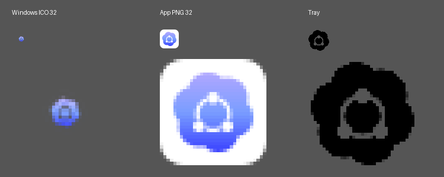

# 01-本机诊断与证据边界

本节解释 [RUN-OPENCODEX-DESKTOP-20261006-01](../../../../../../../03-开发实施/RUN-OPENCODEX-DESKTOP-20261006-01.md) 的诊断结果。日期为 **2026-10-06**，本地时间为 Asia/Shanghai；应用日志使用 UTC。

## 安装与环境身份

| 项目 | 核对值 |
|---|---|
| 安装目录 | `D:\Software\Develop\OpenCodeX Desktop` |
| EXE / FileVersion / ProductVersion | `opencodex-desktop.exe` / `0.1.7` / `0.1.7` |
| 文件大小 / SHA-256 | 7,551,488 bytes / `058d924f762b8c1f7b1909e4b63ffb79ed5a4009663a80e5bc9825829798afba` |
| 日志声明的构建提交 | `ed99a59af25e49dbed21820d3300ebdf3273e86a`，与本地 `v0.1.7` 对应 |
| 操作系统 | Microsoft Windows Server 2025 Datacenter，`10.0.26100`，64 位 |
| WebView2 Runtime | `154.0.4258.53`，注册表可见且已生成应用 WebView 数据目录 |
| HOME / USERPROFILE | HOME 未设置；USERPROFILE=`C:\Users\15119` |
| 快捷方式目标与工作目录 | 均指向安装目录中的正确 EXE；无额外参数 |
| 快捷方式 IconLocation | `,0`，使用目标 EXE 的默认图标 |

文件摘要固定本次安装实例；日志中的 commit 是构建来源声明，不等于本轮已验证整个制品的可复现构建或发布签名。安装器与快捷方式摘要另见 [observations.json](../../../../../../../../.adg/evidence/MNT-OPENCODEX-DESKTOP-20261006-01/observations.json)。

## 启动对照

| 对照 | 唯一有意改变的启动条件 | 结果 |
|---|---|---|
| 原环境 | 不补 HOME | EXE 退出，退出码 `-1073740791`（`0xC0000409`）；标准错误为 setup 阶段 `application is not configured yet` |
| 补家目录变量 | 仅向诊断子进程设置 `HOME=USERPROFILE`，另开 RUST_BACKTRACE 辅助诊断 | 同一 EXE 保持运行，创建主窗口，`Responding=True`；未进行完整界面和业务验收 |

本机 HOME 缺失、启动返回路径、补 HOME 后不再退出三项相互印证，支持家目录解析缺少 Windows 回退是本次启动阻断根因。WebView2 已安装，快捷方式目标正确，不需要靠重装解释本次故障。

对照使用日常应用数据根，不是隔离沙箱；应用初始化会建立管理器结构并写入启动日志。没有修改全局或用户级环境变量、安装 EXE 或快捷方式。原快捷方式的再次双击尚未修复，补变量进程也不能代表版本修复完成。

## Windows ICO 图形占比

以只读资源加载方式从安装 EXE 提取 `RT_GROUP_ICON=32512`，得到七档图标。每档解码 RGBA 像素与固定源码 `icons/icon.ico` 一致；容器字节排列不同，不用 ICO 文件整体哈希相等代替像素比较。

以 **alpha > 16** 的像素边界统计有效图形：

| ICO 画布 | 有效图形 | 边长占比 |
|---|---|---|
| 16×16 | 6×6 | 37.50% |
| 24×24 | 8×8 | 33.33% |
| 32×32 | 10×10 | 31.25% |
| 48×48 | 14×14 | 29.17% |
| 64×64 | 18×18 | 28.13% |
| 128×128 | 34×34 | 26.56% |
| 256×256 | 68×68 | 26.56% |

PNG 应用图标在同一 alpha 阈值下覆盖整个画布，且有白色底板；ICO 只有中央的小图形。下图依次展示源码 ICO 32px、应用 PNG 32px、托盘 PNG 的原尺寸及放大效果。放大采用最近邻插值，供观察留白，不是系统实际渲染截图。

该结果解释用户截图中的“小点”外观。已确认发布图标资源自身有问题；尚未验证修复后的多种 DPI、任务栏、开始菜单与图标缓存行为。

图标逐档测量见 [icon-metrics.json](../../../../../../../../.adg/evidence/MNT-OPENCODEX-DESKTOP-20261006-01/icon-metrics.json)，提取资源与素材摘要见 [机器证据索引](../../../../../../../../.adg/evidence/MNT-OPENCODEX-DESKTOP-20261006-01/manifest.json)。

## 适用范围

本机测试平台是 Windows Server 2025 x64，不自动代表 Windows 10/11 全部环境；HOME 缺失的源码失败路径具有更广的平台风险，仍需对应系统验证。已确认进程存活和主窗口句柄，未确认首屏完整渲染、托管安装、官方代理启停、CLI/IPC、自更新或恢复结果。

本次临时诊断报告已拆分回写为本专题、RUN 与 `.adg` 证据；后续复核使用仓库内链接，不依赖本机 Temp 路径。
