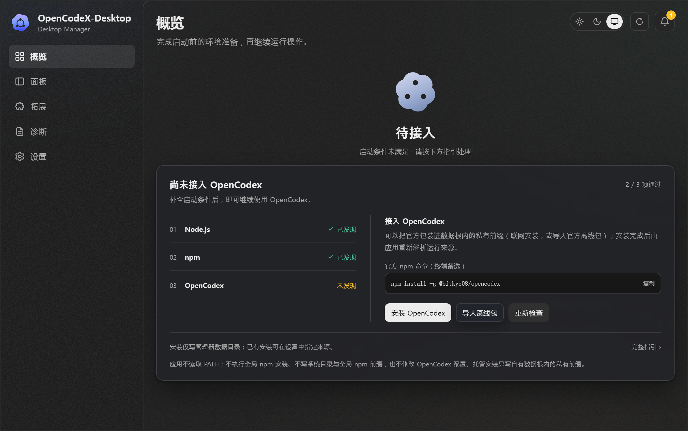
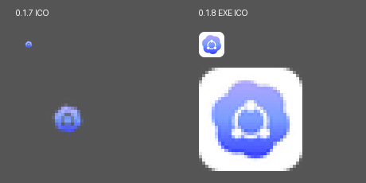

# 04-0.1.8 开发测试与交接

2026-10-06，Asia/Shanghai。用户在诊断归档后明确授权以目标模式完成开发、测试和提交，并保留另一设备的后续合并、打包。实施见 [IMP-OPENCODEX-DESKTOP-18](../../../../../../../03-开发实施/IMP-OPENCODEX-DESKTOP-18.md)。**本轮开发、本机测试与分支提交已完成；未合并 main，未生成安装器，未打标签或发布。**

后续更新：用户已推送特性分支；远端 Windows CI 在 CDP target 获取阶段失败。原始 Windows 本机证据仍保留，其结果不覆盖 CI 续修。当前复核、修正与 Windows 复验交接见 [05-Windows CI 首屏门禁复核与修正](05-Windows-CI首屏门禁复核与修正.md)。

## 分支与提交

基线为 `main@5a0859ad2e6d44f4ca5751eedfb5a1b7eb8c5d09`。独立代码工作树使用 **`feature/0.1.8-windows-fixes`**：

| 提交 | 内容 |
|---|---|
| `536a791` | 修复家目录启动阻断、受控工具发现、Windows 托管入口与子进程环境；真实平台与 CLI 未支持呈现；单实例身份和日志脱敏 |
| `d3b86a7` | 统一七档 Windows ICO，并验证每档解码与有效图形占比 |
| `785e80dada6928c9643ee69f16056d414cd7304e` | Windows 回归、最终 EXE 首屏冒烟、跨平台动画基准与 CI 测试门禁 |

四份软件版本清单一致为 **0.1.8**。CHANGELOG 按仓库归属由合并后的 main 补写；本轮没有改共享 README、AGENTS 或发布标签。

## 实际验证

| 检查 | 结果与范围 |
|---|---|
| 前端 | 79 文件 / **375 passed，0 failed**；类型检查与 Vite 生产构建通过 |
| Windows 后端 | **331 passed，0 failed，5 ignored**；Unix 专属测试没有在 Windows 执行。部分已有真实服务测试按环境开关返回，不能把计数当作全部外部服务验证 |
| 测试机独立性 | 发现路径的空候选测试不再假设系统未装 Node；两项相关测试在最终修订后单独重跑通过 |
| 格式与静态检查 | `cargo fmt --check` 与 Windows `cargo clippy --workspace --all-targets -- -D warnings` 通过 |
| 真实 Windows 运行接口 | CMD 启动器在中文、空格路径执行 Node，版本/Doctor/status 回读通过；停止命令 0/非0 退出码保持真实；npm 参数与受控环境、短期目录句柄释放通过 |
| 真实官方托管包 | **OpenCodex 2.78.0** 的联网安装、版本探针、运行来源切换、一级卸载备份、离线导入、系统目录/坏包拒绝、外部改写保护和最终卸载通过；全部使用测试根，不启动日常代理 |
| 最终 Windows EXE | release EXE 从最终提交编译，FileVersion/ProductVersion=0.1.8，GUI 子系统；移除 HOME 后在独立应用/WebView 数据根持续 30 秒，主窗口响应且 Vue 首屏实际渲染，Tauri 关于/发现/偏好/数据根命令成功 |
| 发现结果 | 本机 `.nvmd/bin/node.exe` 与 `npm.exe` 被正确发现；官方运行时未安装时展示接入引导，不再崩溃 |
| 最终 EXE 图标 | 七档内嵌图标逐帧解码像素与来源 ICO 一致，alpha>16 边界均覆盖完整画布；32px 档不再是 10px 小图形 |
| 构建来源 | 跟踪工作树 HEAD、分支引用与 packed-refs，避免提交后仍嵌入旧提交号；冒烟要求当前源码提交与启动日志一致 |
| 九态动画 | 生产动画实现未修改。优化前固定提交与当前 36 帧在 1e-6 精度下相同；新基准来自旧提交而非当前实现 |
| 发布工具与远端 CI | 初始 Windows 本机发布工具回归未完成；用户随后推送后的 CI run `37397271349` 中，Linux 发布工具、前端、macOS 后端已通过；Windows 编译和后端回归通过，final EXE smoke 的 CDP target 获取失败 |

最终 EXE SHA-256：`792c11c1a8ed8d4b11a827a7272ca07435cc6692eb64637567967dcd17a3fac2`。隔离启动日志明确记录：

```text
2026-10-05T19:21:29.611Z [manager] startup version=0.1.8 commit=785e80dada6928c9643ee69f16056d414cd7304e
```

该日志时间为 UTC，对应本地 **2026-10-06 03:21:29.611**。验证用 EXE 不是签名或可发布安装包；本机 portable LLVM/SDK 链接产生缺少 PDB 的调试信息告警，未影响本次启动与测试结果。





首屏为隔离实例，显示 Node/npm 已发现、官方 OpenCodex 待接入。图标对比为提取资源的原尺寸及最近邻放大，不能代替任务栏或安装快捷方式的 DPI 验收。

证据入口：[WIN-018-20261006/manifest.json](../../../../../../../../.adg/evidence/WIN-018-20261006/manifest.json)。只保留检查日志、非敏感身份、截图与摘要，不复制 EXE、安装器、官方包体、用户配置或源码全文。

## 跨设备交接

初始 Windows 交接时，Git Credential Manager 未完成认证，非交互推送失败，因此生成下述 bundle。随后用户已推送，2026-10-06 在 Mac 核实远端特性分支为 `785e80dada6928c9643ee69f16056d414cd7304e`，文档分支为 `5235ee217c4af9f2e292c183b2b9bfe238f0b3cd`。现在优先同步 origin；bundle 保留为原始交接运输副本，不能替代后续修正提交。

本轮同时准备增量 Git bundle，包含 `feature/0.1.8-windows-fixes` 和 `docs/governance-main` 的本轮提交。bundle 是运输副本，权威事实仍在对应 Git 分支；最终回执记录其绝对路径、大小、SHA-256、包含的 refs 和校验结果。另一设备先同步现有 origin/main 与 origin/docs/governance-main，以满足 bundle 前置对象，再从 bundle 导入：

```bash
git fetch origin main docs/governance-main
git bundle verify /path/to/opencodex-0.1.8-windows-handoff.bundle
git fetch /path/to/opencodex-0.1.8-windows-handoff.bundle \
  refs/heads/feature/0.1.8-windows-fixes:refs/remotes/handoff/feature/0.1.8-windows-fixes \
  refs/heads/docs/governance-main:refs/remotes/handoff/docs/governance-main
```

上述命令只建立 `handoff/*` 跟踪引用，不自动合并或覆盖正在使用的本地分支。然后按另一设备现有分支状态接续特性分支与文档分支；如已完成本机 GitHub 推送，则直接取 origin 的对应分支。

## 后续集成门禁

1. 保留已通过的前端、macOS 后端和 Linux 发布工具 CI 证据；修正后 Windows CI 的 Node >=24、实际回归和 EXE 首屏冒烟必须通过。macOS 原生 UI/安装回归另行执行。
2. 按用户后续安排合入 main，在 main 补 CHANGELOG。共享文件本轮没有改动，无同步漂移。
3. 制作 Windows NSIS/MSI 与 macOS 安装包，检查实际快捷方式、任务栏、开始菜单、100%/150%/200% DPI，以及全新安装和旧版本升级。
4. 验证真实官方代理生命周期及 0.1.7 → 0.1.8 OTA、数据/偏好保持。CLI/IPC 在 Windows 仍明确未支持，不写入“已实现”发布说明。
5. 只有在上述集成与发布授权完成后才打标签、上传制品和晋升通道。

本轮不更换 `D:\Software\Develop\OpenCodeX Desktop` 的日常 0.1.7。无 HOME 的修复效果由隔离候选实例验证，原安装与原快捷方式仍需后续安装或升级交付。
