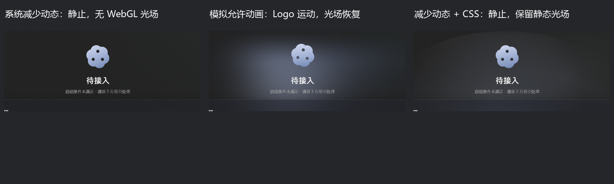
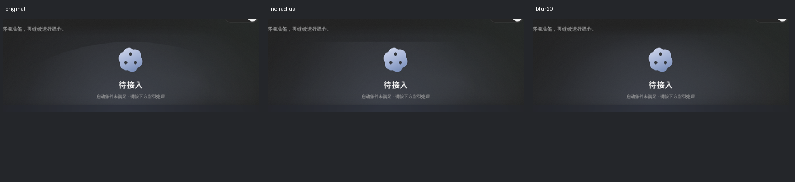

# Windows 动效与光场本机诊断及综合分析交接

2026-10-08，Asia/Shanghai。承接 [09 的反馈与排查清单](09-Windows高档动效与下拉玻璃待查.md)。用户要求先在 Windows 本机排查 Logo 不动和背景光缺失，随后指出光场呈扇形、边缘与原型有差距，并要求补充信息回写供另一端综合分析。

**已完成本机原因定位与受控对照，未实施修复。** 本轮只回写材料与证据；应用源码、日常偏好和系统动画设置均未修改。下拉菜单玻璃穿透未继续排查，仍待查。原始截图保留在 [问题来源记录](../问题来源记录/README.md)，静态截图不作为逐帧运行证据。

## 结论与问题拆分

| 编号 | 结论 | 证据级别与范围 |
|---|---|---|
| WIN-UI-01：高档保存值下 Logo 不动 | 本机系统客户端区域动画关闭，WebView2 报告减少动态；应用将保存 high 折算为有效 mid，从而停止装饰动画。这符合现有系统偏好策略；界面没有清楚显示实际降档及原因，容易将保存值理解为有效值 | 系统 API、实际 WebView 策略、SVG 连续采样与只改变媒体条件的对照确认 |
| WIN-UI-03：WebGL 静态光场缺失 | `mesh.setActive(animating)` 把是否可绘制与是否可连续动画绑定；减少动态或中档下，静态首帧也被取消。mesh 模式同时隐藏 CSS 光场，于是背景光为空 | 固定源码、有效 mid、可用 GPU、画布存在但 drawArrays=0、恢复 high 后光场出现共同确认 |
| WIN-UI-04：CSS 光场弧形／扇形硬边 | cloud-a 的渐变到 `border-radius:50%` 边界时还未透明，被椭圆轮廓截断；软件 CSS 没有原型的统一柔化，边界可辨认 | 光层隔离、实际计算样式、取消圆角／加统一柔化的单变量图像对照确认；结论限定 CSS 分支 |
| WIN-UI-02：下拉菜单透明穿透 | 原反馈保持，玻璃采样、嵌套层及合成原因未确认 | 本轮未复现或修复菜单，不用光场诊断替代菜单验收 |

不要把后三项都归为“Windows 不支持动画”或“GPU 不可用”。本机临时解除媒体限制后，同一 EXE 的 SVG 与 WebGL 均正常推进。中档 WebGL 缺失与 CSS 硬边还需分别修复，不能仅让动画重新运行就宣称视觉差距消失。

## 安装身份与诊断方法

| 项目 | 核对值 |
|---|---|
| 日常安装 EXE | `D:\Software\Develop\OpenCodeX Desktop\opencodex-desktop.exe` |
| 软件版本 / 构建提交 | 0.1.8 / `cffca3afc29b8b251f3f14535f997b5d08560cb2` |
| EXE SHA-256 | `ecfa04d4fe73150f99831af6df5fc4a490ef598cb3b823cefd3e5065d869dac5`；与 [08 的 MSI 候选身份](08-Windows安装候选包与验收交接.md)一致 |
| 系统 / WebView2 | Windows Server 2025 Datacenter，10.0.26100，x64 / `Edg/154.0.4258.62` |
| 日常保存外观 | `visual_effects=high`、`glow_render=mesh`、`theme=system`、缩放偏好 100 |
| 系统原生读取 | `SPI_GETCLIENTAREAANIMATION`（0x1042）调用成功，返回 false |
| 实际页面媒体条件 | `matchMedia('(prefers-reduced-motion: reduce)').matches=true` |
| 实际 GPU | ANGLE / Intel UHD Graphics 770 / Direct3D11；WebGL 支持为 true |

首先只读核对日常 EXE、日志、外观偏好与系统 API，然后使用**同一已安装 EXE**启动独立 sandbox 和 WebView 数据目录，设置相同的 high/mesh 外观值。诊断通过既有受控 smoke CDP 入口观察隔离实例；没有连接日常实例的页面、重启日常应用或替换安装文件。

WebView 中读取有效策略、原生 `app_foreground`、DOM 焦点、页面可见性、CSS 计算样式与 WebGL 能力。逐帧证据由 SVG 变换/属性变化和临时 drawArrays 计数形成；另外设置独立 rAF 心跳，仅验证页面调度是否继续，**不把心跳存在当作 Logo 实际运动**。计数包装结束后恢复原函数。

两次隔离诊断分别为动画/光场和 CSS 形状；所有媒体、store、样式变化都只在诊断页面内存中发生，不调用保存偏好。媒体模拟没有修改 Windows 动画设置，也不构成产品绕过系统减少动态的方案。

## 动画与光场三组对照

| 条件 | 保存 / 实际档位 | 约 3 秒采样 | 背景光 |
|---|---|---|---|
| 系统默认减少动态，诊断窗口前台 | high / mid | 独立心跳 192 次；SVG 1 个静态采样状态、0 属性变更；WebGL drawArrays=0 | mesh 画布存在，四个 framebuffer 像素抽样均为透明 0；截图无光场 |
| 仅对该页面模拟 `no-preference` | high / high | 5 个不同 SVG 采样状态、2,958 个属性变更；drawArrays=174，抽样存在非零 RGBA | Logo 漂浮与内核角度推进，WebGL 光场恢复 |
| 恢复系统媒体值，内存切 CSS 光场 | high / mid | Logo 静态；CSS 层显示，WebGL 画布卸载 | 静态 CSS 光场可见，仍有后述弧形硬边 |

第一组五次采样中前三次（约前 1.5 秒）原生前台与 DOM 焦点均 true，后两次工具切回后台；已确认前台的样本中 Logo 仍静止。第二组五次采样前台全部 true。取样时长约 3,009/3,019ms，短于长期性能验收，不能以次数直接推导帧率、功耗或全部暂停恢复行为。

这些对照支持：

1. 本次静止不是待接入状态本来没有动画：解除媒体限制后，待接入形象立即推进。
2. 已确认前台时依然 reduced/mid，不能用“窗口当时在后台”解释全部样本。
3. WebGL 能力探测与真实绘制都可用；默认 mid 的零绘制与组件门控吻合。
4. CSS 在相同减少动态条件下可呈现静态光，证明停止连续动画不必意味着关闭背景光。

逐次 SVG 和计数原件：[reduced-samples.json](../../../../../../../../.adg/evidence/WIN-018-VISUAL-20261008/motion/reduced-samples.json)、[unreduced-samples.json](../../../../../../../../.adg/evidence/WIN-018-VISUAL-20261008/motion/unreduced-samples.json)。能力与策略投影见 [appearance-observations.json](../../../../../../../../.adg/evidence/WIN-018-VISUAL-20261008/motion/appearance-observations.json)。截图中官方运行时未接入，未执行安装或代理启停。

## CSS 硬边的分层与样式对照

将 energy、cloud-a/b/c 和无光层画面分别显影。上缘明显弧线在**仅 cloud-a**时仍出现；energy 单层不是这条弧线的来源。实际样式：

- cloud-a：`border-radius:50%`，`radial-gradient(44% 98% at 46% 44%, ..., transparent 74%)`；光团和容器均 `filter:none`。
- 实测光团盒子约 817.875×540px；渐变椭圆尺寸、中心与圆角裁剪轮廓不同。按这些 CSS 参数计算，裁剪椭圆顶端中心的渐变在元素透明度前仍约有 38.1% alpha。这是解析推算，**不是直接像素测量或视觉阈值**；显示强度还受光团、父层透明度及遮罩影响。
- 只有纵向容器渐隐，没有使每个光团在其自身圆角轮廓前归零的软边。

| 单变量操作 | 实际图像 | 含义 |
|---|---|---|
| 原 CSS | 明显弧形／扇形上缘 | 重现用户所指硬边 |
| 仅取消光团圆角 | 弧线变为盒子直边 | 证明边界来自裁剪；仅删圆角不是完整修复 |
| 仅给 CSS 容器临时加 `blur(20px)` | 硬边柔化成扩散光团 | 视觉因果对照成立；没有性能或正式方案验收 |

各层对照见 [layer-isolation.png](../../../../../../../../.adg/evidence/WIN-018-VISUAL-20261008/halo/layer-isolation.png)，原始计算样式见 [layer-styles.json](../../../../../../../../.adg/evidence/WIN-018-VISUAL-20261008/halo/layer-styles.json)。

原型 `2026-09-28-Logo本体形变/index.html` 的 hero-embed CSS 光场有多层渐变和统一 20px 柔化；研究页的 `glow-plain` 旧变体还明确说明“不叠加、不柔化”会露出裁剪硬边。软件 CSS 目前为单层渐变、无模糊，源码注释记录了移除模糊的性能依据。

[UI规范 §25.1](../../../../../../../02-项目核心/UI规范.md) 的 2026-10-02 性能约束要求不逐层模糊，并记有“无模糊与容器模糊肉眼差异不可辨”的历史结果。**本次实际状态下硬边可辨认**，该历史样本不能直接覆盖本机 CSS 减少动态/待接入画面；另一端需综合原型和性能约束决定软遮罩、绘制范围、渐变或统一柔化方案，不能据本轮临时 blur 就直接撤回性能约束。

WebGL 的核心光团公式与原型 mesh 同源，使用指数衰减；本轮只直接定位了 CSS 分支的裁剪硬边，**未完成 WebGL 全状态/相位与原型的像素对照**，不要将 CSS 根因推广到所有渲染路径。

## 另一端综合分析与修复输入

1. 保留系统减少动态策略，同时明确显示“保存高档、实际中档及原因”。是否增加用户覆盖选项属于产品决定，不在本轮擅自实施。
2. WebGL 区分“光层可绘制（可见/前台）”和“可连续动画（高档且非减少动态）”。中档应有静态首帧，颜色/尺寸变化应按需重绘，后台不持续绘制；验证新装、状态切换、隐藏重开及 resize。
3. CSS 应在触及绘制边界前透明，或用宽软边遮罩/正确的绘制范围避免截断。只删圆角会变矩形；整体降透明度或只恢复动画不能作为形状修复。统一柔化若纳入方案，重新测前台帧预算和后台暂停。
4. 分别对照原型的准备/就绪、九态、深浅主题、高/中/低、减少动态及 CSS/WebGL，不以单张截图或循环回调数量替代实际图像验收。
5. WIN-UI-02 下拉玻璃继续按 09 的菜单计算样式、父层采样与像素证据独立分析，不能因光场问题已定位而关闭。

以上为诊断与建议，没有冻结新实施范围、变更应用策略或宣称修复完成。已有首屏/安装门禁的历史结果保持原覆盖范围。

## 运行与证据边界

当天本机日常版本已经是 **0.1.8**，于 2026-10-06 14:21:46.6541258+08:00 启动（PID 47476）。09 中“日常 0.1.7 保持原状”是原登记上下文，**不能当作 10 月 8 日现场版本事实**。本轮没有替换当前 0.1.8 或更改安装包。

动画诊断前后：日常 EXE SHA-256、`preferences.json` SHA-256、PID 与启动时间均相同；系统客户端区域动画仍 false。媒体模拟恢复默认，内存光场选择恢复 mesh；两组隔离实例均退出，动画诊断还逐 PID 验证子进程无残留。没有写入日常偏好、开启系统动画、执行官方代理启停、合入 main、打包或发布。

直接运行观察来自同一安装 EXE 的**隔离实例**，日常页面缓存未直接取证；本轮未做完整管理员、Windows 10/11、多 DPI、录屏或长期性能矩阵。截图为诊断渲染结果，拼图是从原图派生的裁切/缩放，不替代原始 PNG 或连续采样。

机器材料已从本机缓存归档到 [.adg/evidence/WIN-018-VISUAL-20261008/manifest.json](../../../../../../../../.adg/evidence/WIN-018-VISUAL-20261008/manifest.json)，含必要状态、逐帧数据、原截图、图层单变量结果、固定源码/原型摘要和前后核对。只存证据与源码引用，不复制应用实现、EXE、完整日常配置或 WebView 缓存；原始用户截图不改动。本机临时脚本只用于取证，没有提交为项目实现。
