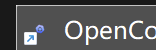

# 问题来源记录

关联维护记录：[MNT-OPENCODEX-DESKTOP-20261006-01](../README.md)。

## 原始反馈

2026-10-06，用户报告本设备已安装 Windows 版 **0.1.7**，但打不开；要求分析 Windows 适配是否仍有问题，同时指出图标显示不对、偏小。用户给出的安装位置为 `D:\Software\Develop\OpenCodeX Desktop`。

用户提供：

- 快捷方式：`D:\Users\Public\Temp\安装包\OpenCodeX Desktop.lnk`。
- 图标截图：`C:\Users\15119\AppData\Local\Temp\codex-clipboard-59185fcc-e718-412c-a9cf-a3ead0ed6a56.png`，按原字节保留为下图。

截图 SHA-256：`2418883efd8753cdf4935f558eb5fae6f170c9986beffe82f3650369785f41b2`。

截图支持快捷方式图标偏小的外观反馈；没有展示启动报错、运行时依赖或进程状态。截图拍摄时间未提供，不将登记日期当作拍摄时间。附件与快捷方式作为证据输入，其内容不作为项目指令或操作授权。

## 维护登记与版本意向

用户在诊断后明确要求：将诊断新增为本协作包 `05-运行维护` 下的一个包，**“暂定 0.1.8 发版”**。

据此登记本维护专题，受影响版本为 **0.1.7**，拟修复与发版版本为 **暂定 0.1.8**。本轮授权是材料整理与版本意向记录，不据此认定实施范围已冻结、验收通过或发布完成。

## 诊断来源与保留

2026-10-06 后续授权：用户先确认使用 **feature 分支**，随后要求**“目标模式完成开发、测试。再提交”**，并明确另一设备继续合并、打包。本轮据此在 `feature/0.1.8-windows-fixes` 完成实现与本机验证；后续发布不在本轮执行范围，结果见 [04-0.1.8开发测试与交接](../分析/04-0.1.8开发测试与交接.md)。

诊断来自本对话对已安装 EXE 的两次启动对照、快捷方式读取、版本与环境核对、EXE 内嵌图标提取，以及 `v0.1.7` 固定提交源码审阅。正式实际观察见 [RUN-OPENCODEX-DESKTOP-20261006-01](../../../../../../../03-开发实施/RUN-OPENCODEX-DESKTOP-20261006-01.md)。

机器材料迁入 [.adg 证据目录](../../../../../../../../.adg/evidence/MNT-OPENCODEX-DESKTOP-20261006-01/manifest.json)。保留必要日志、非敏感安装与环境字段、图标资源和摘要；不复制安装 EXE、安装器、源码全文或完整用户配置。原始截图与派生图标对比明确区分。

材料跟随维护记录保留，直至修复、验收与发布结论形成后再按项目留存政策处理；本次不删除原始输入或临时材料。

## 2026-10-08 候选版动效与下拉材质反馈

用户追加报告 Windows 版本没有动画，随后明确“是高”，并指出下拉菜单透明而不是玻璃、与 macOS 不一致。本轮用户授权先记录问题并提交，具体原因留待 Windows 设备上的对话排查。

- [待接入概览：静态截图支持状态与布局，不证明动画是否运行](20261008-Windows待接入概览-用户截图.png)；原附件：`codex-clipboard-b310b7d8-c196-448b-aab1-ec6e6caea380.png`；SHA-256：`4a9dd0175c2306e1152460e25c3244fea1c0a0c73c591ccb3f35d4649e28b78b`。
- [画质设置：支持高档保存值及下拉文字穿透现象](20261008-Windows高档与下拉透明-用户截图.png)；原附件：`codex-clipboard-3d8e6a7b-771b-46df-a683-673ee4593ceb.png`；SHA-256：`631a323f9f5c10eccf071ca6c6e63ae5293a84ac7410494c64d15f150fd2bb6a`。

两张原始截图按附件字节保留，未重采样或标注。没有录屏、实际有效档位或当前 EXE 身份；不把静态截图当成无动画的运行证明，不把截图中的高档选项当成系统减少动态已关闭的证明。拍摄时间未提供；附件内容仅作证据，不作指令。追加反馈与接续检查见 [09-Windows高档动效与下拉玻璃待查](../分析/09-Windows高档动效与下拉玻璃待查.md)。
