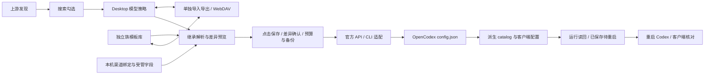

# 模型配置管理与同步方案（Desktop 0.2.0 草案）

当前设计演示见 [共享原型](../../../../03-共享原型/原型/index.html)、[DESIGN](../05-原型/DESIGN.md) 和 [原型 QA](../05-原型/原型QA.md)；原型制作已执行，本文的生产读取器 / schema / adapter / 同步契约仍未实现或冻结。

日期：2026-10-04。状态：候选产品与实现方案；没有已实现的模型策略读取器。OpenCodex 调研基线为本机代理 2.69.0，Desktop 实现引用 main@9ca7a945。详见 [调研依据](本地调研依据.md)。

2026-10-04 用户修订：族模板与渠道 / 模型策略分为两个文件。此拆分已纳入草案，其他产品契约仍待冻结。

2026-10-04 用户排序修订：选择器按渠道顺序及渠道内部模型顺序逐组展开；排序融入“渠道模型”页，采用所见即所得交互。该局部规则已明确，一级菜单和其他产品契约仍为候选。

2026-10-04 用户 Tab 修订：页面标签采用“渠道模型”“模型模版”。本机分页核对与 Agent / 版本 / 恢复建议已补充，只有 Tab 命名属本轮局部明确选择，新增功能契约仍待评审。

2026-10-04 用户设置补充：截图中的上下文窗口、输入模态、可选推理档位和默认档位同时纳入渠道 / 模型与模型模版，保留已有 Fast。字段逐项可继承，自定义推理列表不是必选条件；统一控件及高级区仍按候选细化。

2026-10-04 用户保存与生成修订：当前 100 项兼容模式显示全渠道激活数；渠道主动作收敛为“保存”写入后提示重启 Codex。“Agent 制作”显示名称改为“自动生成模版”，补充对话纠偏与外部 CLI 上下文任务包。模板多版本 + 单策略 + 自动快照方向已获局部同意；具体交互、接入与 schema 继续待冻结。

2026-10-04 逻辑审计修订：补齐模板引用作用域、保存范围、并存状态、候选合并与异常退出；问题和未验证技术门见 [协作包逻辑审计](../03-确认与评审/协作包逻辑审计.md)。最新页面走查入口为 [原型交互方案](原型交互方案.md)。上方为讨论追踪，当前行为以以下条款为准；新增细则仍为可评审候选，不表示功能通过。

## 1. 交付目标

在 Desktop 增加“模型配置”原生页面，集中完成上游列表发现、搜索勾选白名单、按族配置推理、已有 Fast 开关管理、自定义排序，以及独立导入导出和 WebDAV 同步。覆盖全部渠道，保留现有启用状态与协议差异。

配置流程：新增渠道并配置连接（或选择已有渠道） → 获取 / 刷新上游列表 → 搜索勾选 → 按族套模板 → 调整顺序 / 个别覆盖 → 点击“保存”并确认差异 → 写入并读回 → 提示重启 Codex → 核对客户端生效。获取列表不发生成请求，A6api 使用已有清单和 mock 完成验收。

## 2. 页面和操作

### 2.1 导航与功能分区（菜单候选，Tab 名称与排序交互已明确）

当前草案只确定新增 Desktop 原生页面，尚未冻结菜单层级。针对用户后续提出的菜单与功能结构问题，建议新增一级导航短名“模型”，页面全名“模型配置”，顺序为：概览 → 面板 → 模型 → 拓展 → 诊断 → 设置。模型配置承担独立日常管理任务；设置继续承载应用偏好、WebDAV 端点和同步策略。

后续逐项交互草案见 [模型页交互细化](模型页交互细化.md)：菜单候选图标为三层叠片线框，短名“模型”保持两个字；两个 Tab 名称按用户修订明确为“渠道模型”“模型模版”；布局、紧凑适配和配套设置继续按候选记录，关键流程已补绘静态 mock，具体覆盖 / 缺口以 DESIGN 为准。

模型页内部建议采用两个同级分区；按用户排序修订，在“渠道模型”中直接调整渠道及内部模型顺序：

| 分区 | 核心任务 | 页面形态与数据职责 |
|---|---|---|
| 渠道模型（默认） | 查看全部渠道、刷新上游列表、搜索勾选白名单、调整渠道和内部模型顺序、按族批量套模板、渠道默认及单模型例外、推理与已有 Fast 控制 | 全宽可排序渠道表，进入渠道后展示贴顶标题、可收起锚点导航及模型 / 连接 / 端点 / 默认四区连续表单，左侧底部放状态和保存；批量操作选中后出现，完整选择器和模型明细按需弹窗。选择、顺序与覆盖保存到 `model-policy.json` |
| 模型模版 | 自建模版就是自建模型族；版本内定义精确 / 前缀 / 通配包含和排除规则、渠道范围及优先级，独立声明输出协议和能力 | 全宽模板表 → 新建 / 编辑候选 → 匹配预览 / 字段比较 → 保存版本；编辑内自动填充及持续纠偏，外部 Agent 单独提供批量入口。模板正文保存到 `model-family-templates.json`；采用引用保存到策略文件 |

自动生成模版、模板候选 / 主 / 历史版本与应用记录的细化方案见 [Agent 制模与版本恢复方案](Agent制模与版本恢复方案.md)。用户已同意模板多版本 + 单份当前渠道策略 + 自动应用快照的方向。沿用模板 ID / revision，主版本只作为以后套用的默认指针，每次保存写入前自动记录可恢复基线。自动生成的对话纠偏、外部 CLI 接入作为本轮候选需求细化；实现接入和交付拆分仍待冻结。

两个分区共同使用当前草稿、差异预览和写入 / 重启状态。渠道模型的页级主动作统一为“保存”，预览为次级动作；模型模版的“保存模版”只入库新版本。导入、导出和应用记录收入页级“更多”；导出范围可选模板、策略或组合包，不与页面过滤范围混淆。同步状态和“打开同步设置”出口在模型页可见；WebDAV 端点、认证和定时策略继续复用设置页，后续增加模型配置的同步范围。

配套设置候选为现有设置中的轻量“模型配置”分区，承载本机自动生成 Agent、已有全局 Fast 策略及文件 / 应用状态。Agent 复用已保存渠道和模型，独立保存本机执行偏好，不要求 Codex 重启；配置执行模型不等于接入 runner 或检索能力，详见 [Agent 执行配置](Agent制模与版本恢复方案.md#211-内置-agent-执行配置新增候选)。运行策略控件与模型页共用草稿和应用流程。模板、白名单、单模型规则和排序继续在模型页维护，WebDAV 两项产物范围放在已有同步分区，不新增第三个模型页 Tab。

渠道列表覆盖已启用、停用及发现失败的渠道；原有启用状态不会因为套模板改变。跨渠道批量配置先显示明确作用范围。按最新输入，增加显式“新增渠道”和已有自定义渠道“渠道配置”：先暂存连接、获取并选择模型，再加入草稿；只有页级保存才注册 / 更新运行连接。原生来源不提供凭据表单，暂不支持的认证 / adapter 保留官方管理出口。连接与密钥不进入双份可移植模型配置。详见 §2.5。

推理和 Fast 随配置对象显示：模板规则、渠道默认、渠道内族覆盖和单模型例外均显示来源与最终值，不各建一个独立主菜单。已有 Fast 开关共用同一状态，不建立第二个同义总开关；开关与模型能力声明分开呈现。

模型页写入运行配置属于对现行产品管理范围的扩展；整体冻结前须回写 DMD、产品定义 `OUT-06`、能力地图、集成边界和相关 UI 规范。应用仍按本草案的官方 API / CLI 适配与读回流程执行，不把导航设计当作现行产品边界已更新。

### 2.2 列表与批量操作

最新列表反馈细化为：表头全选 / 半选当前结果，搜索外已选范围保留；全域选择使用清除搜索后的表头，不另放“全部渠道”按钮。选中后提供批量启用 / 停用 / 删除及族配置 / 套用模版，官方 / 原生排除。未保存状态由页级统一显示，不在行内重复；启停和确认删除都先进入草稿，页级保存后待重启，删除可撤销或从成功应用记录生成恢复草稿。完整交互与删除 / 恢复的生产缺口以 [渠道列表契约](模型页交互细化.md#42-渠道列表) 为准；当前仍为候选 mock，不冻结真实删除、凭据 / 绑定和同步合并实现。

最新补充：自定义渠道行内“管理”统一包含渠道配置与模型设置，另有只作用该行的“删除”；原生为只读“查看”。列表顶部 / 渠道详情左侧底部“查看草稿”固定可达，按最近成功保存与当前工作区对比全部改动，合法改动可进入原保存确认。完整展示、空态、超预算与保存中行为由 [公共区域与保存](模型页交互细化.md#32-公共区域与保存) / [原型交互](原型交互方案.md) 维护，当前不新增第三份可移植文件或持久草稿实现。

“渠道模型”先显示全宽渠道表，点击后进入单渠道模型详情，返回时保留列表与草稿上下文。渠道连接、协议端点及模型默认在详情连续分区，内部导航点击定位；完整选择器和单模型明细通过弹窗按需查看。渠道表支持搜索、多选和全部渠道批量操作；显示发现状态、已选 / 全量数量及启用状态。调整渠道顺序使对应模型整组移动，调整渠道内部模型顺序只改变该组内部；打开预览时按同一份最新草稿展开，不受当前页面过滤影响，完整规则见 §6。

模型管理列表支持原始 ID / 别名 / 显示名称搜索、族筛选和仅启用视图。复选框仅选择批量目标，启停另有独立开关；表头选择当前结果，筛选外选择保留且提示数量。首层直接编辑别名和启停并展示最终配置摘要；展开行编辑协议、上下文预设 / 自定义、推理多选与默认等级、Fast 能力和指定端点；编辑明细包含显示名称、输入模态及完整高级设置。跨渠道同名模型保持独立身份，名称不改变原始 ID。

排序针对当前渠道完整模型序列，停用保留位置，计划选择器仅投影启用项。搜索、族或仅启用视图过滤时先清除再重排；选择框本身不改变白名单、预算或顺序。

“刷新模型”沿用官方发现能力；状态区分 ready、pending、failed、stale 和静态来源。失败保留上次清单和白名单，标注更新时间；不能把失败当作成功返回空列表。未知模型列入“未归族”，允许手动归族。

渠道 / 族层批量配置保留既有入口；当前渠道模型批量栏仅在有勾选时显示，移除操作范围下拉和重复全选。表头选择当前结果并保留筛选外选择，清除过滤后可选当前渠道全部模型。范围冻结且完整预览，启用 / 停用只改启停；批量编辑按字段不修改 / 继承 / 自定义，别名可保留 / 清空 / 规则生成。恢复字段继承清除单模型覆盖与指定端点，保留别名、启停、精确模版引用和排序；套模版默认保留人工例外。未确认行编辑须先加入草稿或还原；任何目标无效或基准变化拒绝整批，一次提交 / 撤销且无变化不加记录。所有有效更改由页级保存统一处理。

基础模型在管理页只占一项；Fast 开关 / 能力显示在该项详情中。`--fast` 兼容行由官方生成，共享基础模型的白名单、推理和相对顺序。

### 2.3 草稿、保存与重启

渠道模型的默认流程为：勾选白名单 / 套用模板 → 调整渠道及内部模型顺序、字段例外 → 查看激活数并按需打开完整草稿预览 → 点击“保存” → 在同一流程中确认差异 → 校验、备份、写入并读回 → 显示“已保存，待重启 Codex” → 重启后核对客户端。勾选、排序、详情确认、切 Tab 和预览都只改草稿；取消保存差异确认不写入。主工具栏不再要求用户分别完成“保存草稿”和“预览并应用”两次提交。

“保存”是提交本次模型配置的唯一常用入口，内部仍把 Desktop 双文件持久化、官方运行字段写入和客户端重载作为可观察阶段，不能假装跨文件 / API 天然原子。只有计划写入和运行读回一致才显示保存成功；失败、部分写入或前置条件缺失保留草稿与真实结果。运行时未启动、计数无法核对、依赖 / 绑定缺失时先提示处理或暂存，不显示已保存生效。草稿可以本机暂存以便返回继续编辑，但不作为已提交策略同步，也不增加第三份可移植配置。

保存成功表示新配置已提交，Codex 客户端尚待重启重载。页面提供“重启 Codex” / “稍后”候选入口；明确重启对象为 Codex 客户端，重启前沿用会话处理提示，不在保存后自动关闭应用。选择稍后保留待重启状态；重启后的目录、顺序与客户端可达性核对通过才显示“客户端已生效”。运行目录读回与客户端显示是两种证据；若无法直接核对客户端，保持“待验证”，不能仅读回 catalog 就宣称已生效。无实际运行差异时说明无需重启，不凭一次模板编辑重复要求重启。

模型模版的“保存模版”只保存新的候选 revision，不写运行字段、不要求重启、不自动切主版本或渠道引用。“采用此版本”形成明确范围的渠道策略草稿，之后经渠道模型的“保存”提交；仅设主版本也不升级已有引用。同步 / 导入候选、历史恢复以及设置页的全局 Fast 调整，都进入同一草稿和保存写入流程。

默认保存范围为本次全部策略改动，确认页逐项列出渠道、族、模型与全局字段。未修改的离线、停用、待绑定渠道不因存在而阻塞其他独立改动；其已发布条目仍纳入全局目录预算。本次影响对象缺绑定、依赖或适配能力时阻止计划，允许用户明确选择“这些改动稍后提交”再重新生成计划，不能静默跳过并报告全部成功。已提交策略由上次成功快照加本次确认范围组成，剩余草稿继续标记未提交，不混入导出 / 同步当前策略。全局模板、Fast、完整排序等共享改动须校验整个影响范围，不能借排除渠道绕过依赖或全局预算。停用 / 未发布渠道仅保存可合法表达的策略字段，不擅自启用；必须读回的字段仍按适配器条件阻止提交。

模板编辑草稿、渠道策略草稿、上次成功提交、实际运行结果、客户端加载状态和下载候选分别记录，不能用一个互斥状态枚举替代它们。允许显示“已保存待重启 · 另有 3 项草稿改动”。再次保存成功后，待重启目标指向最新提交；丢弃新草稿回到最新提交，不能退回仍在客户端加载的旧版本。无新增运行差异只能说明“本次无需新增重启”，不能清掉以前的待重启。

“重启 Codex”是否可自动执行和客户端是否可自动核对仍是技术门；不以管理器或代理重启替代客户端重启。能力不可用时显示手动重启说明和“我已重启，重新检查”入口。进程已启动只证明重启动作；没有客户端加载证据时保持待验证。用户目视确认单列为“用户已确认”，不伪装为自动验证通过。

### 2.4 模型激活数与 100 项兼容模式

当前所核对的 Codex 客户端只读 model/list 第一页 100 项，证据见 [本机分页核对](本地调研依据.md#codex-模型选择器分页核对2026-10-04)。先按这个已知客户端提供兼容模式，在“渠道模型”列表状态栏 / 详情左侧底部持续显示 **模型激活数 xx/100**，这是全部渠道及官方 / 原生来源共用的读取预算，不是每渠道各有 100 项。客户端版本能力修复后可调整 / 解除此兼容阈值，白名单 schema、模板库和发现清单不设永久 100 项容量。

| 计数 / 状态 | 表达 |
|---|---|
| 编辑中 | 主计数显示例如“模型激活数 82/100 · 草稿计划”，旁列上次已写入数；选择不会立即被标记为激活成功 |
| 保存成功、未重启 | 显示“已写入 82/100 · 待重启”，保留旧客户端读取状态 |
| 重启并核对后 | 标注客户端已生效；实际下拉显示数及过滤差额另列，不能将目录读取数等同可选模型数 |
| 超限 | 例如“108/100 · 超出 8 项”，保留全部发现 / 草稿内容，提示按渠道和族收窄，当前兼容模式阻止提交运行配置，不静默截取前 100 项 |
| 计数不完整 | 显示已知数与“待核对”原因，不伪造精确 xx；阻止以预算校验已通过的名义提交，保留本机草稿 |

分子按最终编译后的真实 catalog / model/list 目录条目统计，必须覆盖实际进入读页的官方 / 原生、featured、alias 和渠道条目；停用、未绑定、暂缺而未发布的项目只保留策略位置，不进入实际发布数。若当前请求包含隐藏项且这些行仍发布，它们也占页，另列隐藏占用及可处理原因。管理表格基础模型只一项，不直接累加上游行数；Fast 仅作为父项元数据时不额外计数，只有真实独立发布的派生行才占一个目录项。

计数使用冻结草稿和实际发布映射的完整投影，读取核对必须取全分页；保存后再以真实目录复核，出现偏差报告待核对 / 部分结果，不按预估宣称预算通过。刷新发现或外部修改可能使 all 模式再次超限，需显示现状和待调整原因；不能擅自改白名单、关闭 discovery 或删除新模型。已存在的超过 100 项配置打开页面时仅诊断，保留现状；用户收窄后再保存。预算在保存时检查，编辑、模型发现、模板保存和候选导入不因超限丢失内容。阈值适用版本、投影能力及无法收窄的原生 / 隐藏占用在 WP-01 核对，不用任意移除来凑数。

完整运行目录读取已有证据，任意草稿的写前准确投影尚无验证，不能把文档中的 dry-run 当作官方已经提供的接口。草稿未能完整映射时显示“预估 xx / 待核对”，提交门不通过；WP-01 须证明投影覆盖全部来源且与读回一致，或先补齐适配能力。确认前和写入前核对发现快照 / 运行字段是否变化，不能用过期 all 清单通过预算。原生、featured、隐藏占用中无法由当前适配器收窄的部分单列“不可由当前版本调整”，给出官方管理 / 更新适配的出口；不提供绕过预算的强行保存。已写入后才发现超限属于异常结果，按 §9 停止、核对与安全补偿，不晋升为成功提交。

100 是本机已核对客户端版本的兼容值。未识别版本暂按该兼容口径提示“尚未验证此版本”，不能自动宣称它也只读 100；解除阈值须有对应版本的实际分页和可达性证据。

### 2.5 新增渠道与保存前获取模型（最新候选）

渠道列表顶部“新增渠道”打开两步表单。第一步填写名称、稳定渠道标识、默认接口协议、Base URL、认证方式及 API Key；第二步主动“获取模型列表”、搜索勾选、选择 / 取消当前结果。已有自定义渠道直接在详情“渠道配置”分区编辑同类连接字段，按渠道保留未确认缓冲，返回 / 切换 / 重绘不丢输入；“确认连接与模型”校验后进入模型选择步骤，确认才加入草稿。只改名称保留清单和选择，地址 / 协议 / 认证 / 密钥替换意图变化使旧清单失效，需重取或手动 ID；取消保留输入，保存阻止未确认连接和过期确认。模型默认独立分区编辑能力与推理。原型仅记录是否配置密钥及替换意图，不保存秘密输入，正式凭据暂存 / 绑定仍待实现。

当前通用连接原型候选支持 Responses / Chat / Anthropic / Google AI Studio / Ollama 和 API Key / 无需认证演示；其他本机注册 adapter 需要专用认证或连接流程，显示待接入原因，不能共用表单假装支持。标识校验重复 / 保留值，地址不附密钥、生成端点或查询参数；实际 adapter、别名、认证及校验边界须 WP-01 冻结，不把此表单视为覆盖全部官方连接类型。新发现模型全部不勾选，精确 ID 不改写；族名提示不是能力证据。清单不支持时可手动添加 ID，去重后仍需显式勾选，能力保持未知。获取不发送生成请求，不证明推理 / Fast 可用。

获取按适配器构造 URL / 认证。例如 NewApi 使用包含 /v1 的 Base URL 时，OpenAI 兼容规则取 /v1/models；不能把这个端点硬套所有协议。现有 POST /api/providers 会立即写入，POST /api/providers/test 仅接受已注册渠道且返回数量，不能直接用来实现未保存连接的清单预览。拟补本机预览服务复用官方 transport / auth / discovery 解析，以暂存连接请求完整精确 ID，返回可诊断错误并实施超时、取消、响应上限与协议分页；目前没有已实现预览接口，禁止先注册再删除来伪装无写入。证据见 [本地核对](本地调研依据.md#新增渠道与模型获取核对2026-10-04)。

“加入草稿”需要至少一个已选项，只追加渠道到末尾并进入详情，原保存态和客户端不变；零项不会写 selectedModels:[]。清单超过 100 仍完整保留，统一预算仅在页级保存时校验。新渠道运行注册、非空白名单 / 可见性、字段、顺序及本机绑定纳入同一受管保存计划，不允许注册默认 all 时短暂公开全部模型。真实分阶段写入、失败补偿、超时核对、凭据和绑定持久化须通过新增 G-09 后交付；保存成功仍先待 Codex 重启。

取消 / 关闭不创建，重试 / 空清单 / 失败保留原选择与顺序；取消请求、切换目标或关闭使迟到结果失效。更换协议、地址或认证后要求重新获取 / 选择，旧已保存策略在新计划成功前保留。当前简单原型不提供“仅保存连接并保持停用”的捷径；已有全隐藏由明确 none 模式表达。编辑未改变连接时保留当前有效已选集合。

生产凭据只在本机短期暂存，密码不回显；遮罩字符串不能当作真实 Key 回写。取消清理，日志 / 错误 / 任务包 / 双文件及其 digest 输入中不得带密钥、连接摘要或认证值。原型只保存是否配置和虚构地址到内存连接摘要，导出及其模拟基线剔除此摘要，不构成生产 schema。跨机输入只有策略 / 模板及绑定需求，接收端另配本机连接。

本轮扩展仍是候选产品范围与静态补绘。整体冻结前须同步 DMD、OUT-06、能力地图、集成边界和本机凭据职责；本次不修改生产源码或运行文件。

## 3. 白名单语义

| 模式 | 管理器语义 | 官方适配 |
|---|---|---|
| all | 明确允许当前及后续发现模型进入目录 | 清除受管 `selectedModels` 覆盖，并处理先前由管理器写入的隐藏状态 |
| whitelist | 仅指定精确模型 ID 可见；新发现项默认不勾选 | 非空 `selectedModels`，发现继续 |
| none | 当前及后续模型全部隐藏，仍保留渠道与发现能力 | 官方可见性 / disabledModels 与新模型策略；不得用空白名单表示 |

官方 `selectedModels:[]` / 缺失表示 all。UI 白名单选到零项时提示改为 none，不能把零项保存成“白名单已全关”。none 的未来模型约束必须由官方 `newModelPolicy` / 可见性规则及读回验证覆盖；若版本契约不足，适配器阻止应用并明确说明。

发现 pending 时官方白名单 API 可能返回 409；保留草稿并等待可重试状态。失效或暂未发现的已选 ID保留为不可用项，不擅自删除；必要时由用户明确采用 retain 兼容策略。

官方已有 `modelPreset` 是上游预设来源。Desktop 接管白名单时按官方写入路径形成 custom 选择，读取并展示 preset 来源，不复制第二套自动升级规则。注册 `initialModelSelection` 状态由官方接口维护，不手改 registrationId / status。

## 4. 模型族、继承和推理

能力字段独立解析：官方 / 注册表基线 → **按作用域确定的一份族模版通用配置 → 命中的具体型号配置 → 渠道默认 → 渠道内族覆盖 → 单模型覆盖** → 上游 / 最终协议约束校验。协议单独按 **渠道默认 → 一份模版通用输出协议 → 命中的具体型号输出协议 → 渠道内族覆盖 → 单模型覆盖** 解析，保证模版可覆盖渠道默认协议。详见 [模型协议与端点方案](模型协议与端点方案.md)。模板只有用户明确采用后参与编译；初次导入不把历史单模型设置扩大为全族能力。

模版本身就是用户创建的模型族，不从预设族枚举选择。新建自由名称、说明和匹配规则；预置只提供可编辑的起始版本。规则按精确 ID / 前缀 / 通配包含、排除优先、大小写、渠道全部 / 白名单 / 黑名单范围和整数优先级决定命中；同一版本可按原始 ID 的字面后缀选取最长的一条具体型号规则；厂商 / 用途标签仅供浏览，不证明能力。完整身份及匹配契约见 [模型模版与匹配规则方案](模型模版与匹配规则方案.md)。

策略先读取单模型精确 `templateRef`，人工指定可越过自动匹配，仍校验输出协议和能力；否则将全局与渠道已采用引用按 templateId 合并，渠道替换同 ID 的全局 revision，其余 ID 保留。只在已采用集合中按版本匹配取最高优先级；同最高优先级多份命中时显示冲突并阻止受影响保存。候选入库、设主版本不自动参与运行；一份模型最终选择一份 immutable revision，不叠加同 ID 不同版本，输出协议不作为匹配条件或循环重选依据。

候选形状：顶层 `templateRefs` 为全局默认引用，`channels[].templateRefs` 为渠道引用，`modelOverrides[].templateRef` 为精确引用；渠道内族覆盖按 `templateId` 关联最终选中的模版。采用到 A 只改 A，B 继续旧版；明确全局采用才改顶层。白名单不决定模板范围；旧字符串族覆盖迁入须确认与 templateId 的对应关系，不按同名自动关联。字段 upstream 仍表示明确恢复官方值，不用缺引用跳过全局规则。

渠道默认、渠道内族覆盖、单模型设置与模版通用 / 具体型号配置共用“协议与基本能力 / 推理 / 快速模式 / 高级”字段分组，逐字段继承。模板只定义可复用规则，白名单和两级顺序仍属策略；不同型号的窗口与模态不按族名自动统一。详细控件见 [统一字段编辑器](模型页交互细化.md#46-渠道模型与模版的统一字段编辑器)。

| 基本能力 | UI / 策略语义 | 官方映射与边界 |
|---|---|---|
| 模型协议 | inherit / custom；模版可覆盖渠道默认，单模型自定义最高 | 合法时用逐模型 modelAdapters，否则按连接与协议契约展开受管 provider；端点单独匹配，见 [协议方案](模型协议与端点方案.md) |
| 上下文窗口 | inherit / custom 正整数 tokens / upstream | `modelContextWindows[id]`；官方 provider `contextWindow` 的直接写入只用于明确渠道级范围，族规则按逐模型解析；元数据已知时收窄、缺失时提供 fallback，不扩大上游实际窗口 |
| 输入模态 | inherit / custom 非空多选 / upstream | `modelCapabilities[id].inputModalities`；当前管理 API 接受 text / image / audio；[] 与 null 均删除本模型声明，不用于表达禁止全部输入；声明须有来源和协议支持 |

上述协议与基本能力策略字段的 schema 名称仍待 WP-01 冻结，不把 UI 候选形状冒充已实现配置。没有层级直接写入口的字段由编译器展开到逐模型目标；无法合法表达时说明不支持并阻止对应应用，不丢字段后虚报成功。

| 设置 | UI / 策略形状 | 生效目标 |
|---|---|---|
| 可选推理档位 | inherit / custom + 列表 / disabled / upstream | `modelReasoningEfforts[id]` |
| 默认推理档位 | inherit / custom + 值 / upstream | `modelDefaultReasoningEfforts[id]` |
| 强制推理档位（高级） | 保留既有设置；用户明确设置才接管 | `modelPinnedReasoningEfforts` 等 |
| 标签映射（高级） | 保留或按协议显式覆盖 | `modelReasoningEffortMap` / `__omit__` |
| 不传推理参数（高级） | 与隐藏选项分开配置 | `noReasoningModels` 等协议约束 |

inherit 跳过本层，继续使用下层已解析值；upstream 明确跳过 Desktop 模板，恢复官方基线，删除对应的受管覆盖；两者在存在模板时不同。disabled 仅适用于档位列表，编译为 `[]`。custom 列表必须非空、去重；默认值必须包含于最终列表。

没有列表时删除受管默认值；隐藏档位不能自动等同为删除请求推理字段。默认档不会强制覆盖用户会话中的选择；强制档位设置另行显示。`modelReasoningEffortsAuthoritative` 仅按支持的 adapter 显式处理。

“覆盖推理强度”不是必选开关。截图的复选框控制可选列表的自定义；取消后应用会删除该模型列表覆盖并回到官方继承。新 Desktop 建议使用“可选推理档位：继承 / 自定义”，把默认档位作为独立字段：可以继承列表同时单独调整默认，不要求自定义整组。默认新建字段继承；迁入既有覆盖则保持原值。`inherit` 在 Desktop 规则中不等同于官方界面的删除操作，若父模板有效，编译后的逐模型字段仍可存在。

可选列表自定义不自动开启 pin、参数映射或 `modelReasoningEffortsAuthoritative`。后者对支持它的 adapter 会影响线上参数权威性，属于独立高级配置，不能与一般自定义列表混称。档位“无”与不显示控制、恢复继承及不传参数分别解释，不能推断成通用的关闭模型思考。

历史批量脚本的档位表可作为可选迁移模板，但标记为“用户配置经验、未全面验证”；首次迁入保留精确模型覆盖。旧脚本曾把空 ladder 编译成 null，恢复继承而未隐藏；新编译器必须显式保留这一区别。

## 5. Fast 配置和诊断

复用已有 Fast 控制，避免再建立相同含义的总开关。

| 控制 | 管理维度 | 行为 |
|---|---|---|
| `fastEnabled` | 渠道，inherit / on / off | off 硬关闭；on 允许注册表 opt-in；inherit 保持官方默认 |
| `supportsServiceTier` / `modelSupportsServiceTier` | 渠道默认、族模板、单模型声明 | 服务等级参数能力；false 与删除覆盖不同 |
| `fastWire` | 协议能力 / 高级设置 | 按官方 wire 契约处理，不能一律写 service_tier |
| `fastRows` | 全局目录设置 | 是否生成 `--fast` 兼容行 |
| `fastMode` | 全局已有三态策略 | 请求和客户端配置注入；继承时不覆盖已有 fast_mode |

Fast 开关和能力分别显示。`fastEnabled:on` 不自动写模型能力 true。族模板的 Fast 能力也必须按协议有来源或由用户明确声明；继承 / 声明支持 / 声明不支持的差异保留。单模型 Fast 设置只暴露官方该协议实际可表达的字段，不能把 service-tier 的模型覆盖用于假装控制不同 fastWire 协议。

能力状态：官方来源、手工声明、未知、不支持；实测验证记录留本机，并绑定 endpoint / adapter / model / 时间。导入或换端点后不沿用“已验证”状态。图片、embedding 等模型不因为 ID 含 GPT 就得到文本 Fast / 推理能力。

入口缺失诊断依次检查：模型是否被选中 / 可见 → 渠道是否关闭 Fast → 能力是否已分类 → 对应协议是否支持 wire → fastRows 与客户端设置 → catalog 是否更新。未知能力不自动发付费请求。A6api 保持声明状态，不做额度测试。

当前 NewApi 的 GPT Fast 声明不在其白名单中，应显示这一原因并提供勾选建议，由选择预览决定是否增加模型。

## 6. 自定义顺序

已明确的交互规则：**最终选择器顺序 = 按渠道顺序，依次展开每个渠道内部的模型顺序**。排序就在“渠道模型”页完成，撤掉独立“选择器顺序”分区；族用于筛选、归类和批量套模板，不另决定排序，也不保留族优先或跨渠道扁平手排模式。

例如 A 渠道内部为 `[a2, a1]`，B 渠道内部为 `[b1, b2]`，渠道顺序为 A → B，基础模型展开为 `[a2, a1, b1, b2]`；将 B 拖到 A 前，整组变为 `[b1, b2, a2, a1]`。渠道列表拖动 / 上移 / 下移 / 置顶调整整组位置，模型表格相同操作仅调整当前渠道内部位置；可由用户明确重置某个渠道内部为自然顺序。

拖动立即改变完整草稿顺序；按需打开“预览选择器”即可核对，预览打开时使用最新草稿。点击“保存”才提交写入。预览标明“草稿”，保存后以实际 catalog 读回显示“已写入、待重启”顺序；重启核对后才标记客户端已生效。未读回或适配不支持时保留差异 / 待处理状态，不能仅凭预览宣称真实选择器已改变。

搜索和族筛选只缩小查看范围，不改保存顺序或完整预览。模型搜索、族或仅启用过滤任一开启时，先清除过滤再重排，不按过滤是否恰好隐藏项目开放排序。快捷排序包含名称升 / 降、别名升序、协议分组、上下文大 / 小、启用优先七种规则；名称按原始 ID，别名空值按 ID，未知上下文排最后，同值保留顺序。排序当前渠道完整序列，可撤销并保留勾选 / 展开 / 缓冲。全部展开当前显示项，全部收起当前渠道且保留缓冲。渠道搜索隐藏同级项时先清除再排序。新增渠道默认追加末尾；刷新保留已有模型位置、追加新项，停用 / 待绑定 / 暂不可用模型保留位置，暂缺项恢复回保存位置。仅实际可见项投影到运行选择器，预览区分不可用原因。

排序范围覆盖全部渠道和实际可见的原生 / featured / routed / alias 项。对于没有 provider 归属的原生项，草案建议在同页以“官方 / 原生”来源组呈现，按与渠道相同的两级规则排序；这只是 Desktop 来源映射，不创建上游渠道。WP-01 须核对 featured / alias 的实际来源归属与展开规则，不凭模型名称归组。Fast 合成行由官方实际发布时紧跟基础模型，共享基础模型身份，不能独立跨组拖动。

当前本机 Codex UI 默认请求 model/list 第一页 100 项且未继续分页，目录 108 项的只读验证返回 100 + 8；这属于所列客户端版本行为，不是通用模型库容量。详见 [分页证据](本地调研依据.md#codex-模型选择器分页核对2026-10-04)。完整草稿预览与渠道公共状态栏显示 §2.4 的全渠道激活数 /100 和客户端实际可达范围。当前兼容模式在保存时检查预算并提示收窄，保留超范围草稿，不设永久 schema 上限、不静默丢弃。两级排序能改变第一页覆盖哪些项目，不能让超过读取范围的全部模型同时可达。后续适配须探测版本、读取完整分页并核对实际客户端可达性；仅 catalog / RPC 全量读回不得宣称 Codex 下拉完整可选。

策略保存稳定引用：原生项为 nativeModelId；渠道模型为 channelId + modelId。编译时通过实际 catalog slug / alias 解析，不能简单拼接 provider 名，也不改写原模型 ID。

JSON 提案中，`pickerOrder.sourceOrder` 保存渠道及原生来源组的先后，`channels[].modelOrder` 保存各渠道内部基础模型 ID 顺序，`pickerOrder.nativeModelOrder` 保存原生组内部稳定引用。来源顺序和组内顺序都须去重、校验引用；白名单选择与排序独立，取消勾选只影响可见性并保留位置，重新勾选已有项回到原位，首次勾选才追加。`mode:full` 表示完整选择器覆盖范围，不是另一种排序交互。上述字段仍是拟新增 schema 示例，现有运行时尚不读取。

首次迁入若现有扁平顺序在不同渠道之间交错，两级顺序无法原样表达。迁入预览应显示原有顺序与按渠道成组后的差异，保留原有运行顺序，等待明确应用；不能宣称任意全局交错顺序都可无损迁入。

编译目标为顶层 `modelPickerOrder`，与 `subagentModels` 和默认会话模型独立。官方 routed-only 顺序不会重排 native / featured；完整排序需要包含裸原生 ID。当前管理 API 只接受可见 routed ID；完整排序采用受控 `ocx config set` 适配，验证 daemon 与 catalog priority 的读回。

在全局模式覆盖实际可见原生项、完成 alias / featured 的来源映射与排序适配，以及 CLI 写入后的运行目录加载、当前客户端 100 项兼容预算与重启后实际可达性，是 WP-01 的交付门；未来解除预算须有客户端分页修复证据。不能把局部排序包装成全局成功；必要时补充上游契约适配后再交付完整排序。

## 7. 配置文件与数据职责

`DATA_ROOT` 为 Desktop 所选数据根；本机观察是 `~/Library/Application Support/com.gzers.opencodex.desktop`。`OPENCODEX_HOME` 本机为该根下的 `opencodex-home`，其他安装按实际环境定位。

| 文件 | 状态 | 责任 / 同步 |
|---|---|---|
| `OPENCODEX_HOME/config.json` | 现有 | 官方运行事实：providers、selectedModels、上下文 / 模态、推理、Fast、modelPickerOrder；仅受管字段编译，不整份导出同步 |
| `~/.codex/opencodex-catalog.json` | 现有派生 | 模型可见性、priority、档位、Fast 元数据；按官方生成，不作为策略事实源 |
| `~/.codex/config.toml` | 现有客户端 | 路由、目录指针、客户端默认和 Fast 注入；不直接承担族继承，不整份同步 |
| `manager-state/preferences.json` / `extension-config.json` | Desktop 现有 | 当前两类同步产物；preferences 拟扩展本机 `modelTemplateAgent` 分区，保存执行渠道 / 模型 / 推理 / Fast，不重复保存凭据。该本机分区须从 preferences 的 WebDAV 和全配置导出排除、导入时保留本机值；过滤尚未实现，字段待 WP-06 冻结 |
| `manager-state/sync-endpoints.json` | Desktop 现有 | WebDAV 端点及 credential ref；口令在 Keychain |
| `manager-state/model-family-templates.json` | **拟新增** | 可复用族模板库：自由模板 ID / revision、版本化包含 / 排除及渠道全部 / 白名单 / 黑名单范围 / 优先级、可选的后缀具体型号、独立输出协议规则、上下文 / 模态、推理与 Fast 规则；多版本 / 主指针方向已确认、具体元数据待冻结；独立导出和同步 |
| `manager-state/model-policy.json` | **拟新增** | 渠道 / 模型策略：模板引用、默认协议、端点 ID / 协议声明、模型协议与指定端点例外、渠道选择、模型白名单、顺序、渠道 / 族 / 单模型覆盖、单模型别名 / 显示名称候选及全局已有 Fast 设置；独立导出和同步 |
| `manager-state/model-policy-bindings.json` | **拟新增、本机** | 稳定逻辑渠道 / 端点与一个或多个实际 provider 绑定、本机地址 / 路径 / 认证及凭据引用、受管字段和 catalog 身份、上次应用 digest、验证来源；不跨机同步或导出 |
| `cache/model-discovery/…` | **拟新增、本机** | 发现快照和时间，可丢弃，不导出 |
| 本机模型应用历史 / journal（路径待冻结） | **拟新增、本机** | 上次成功应用的策略、模板精确依赖、受管字段与结果；自动快照用于恢复，不默认同步 / 导出 |

两个文件各自具有 `schemaVersion:1`，其版本独立于应用版本 0.2.0，也不要求以后同时升级。模板库保存“可复用规则”，策略保存“哪些渠道 / 模型采用哪些规则”，不重复内嵌模板正文。示例分别为 [model-family-templates.example.json](model-family-templates.example.json) 和 [model-policy.example.json](model-policy.example.json)。

两个示例展示全局 / 渠道 / 精确模型引用、不同渠道使用不同 revision、模版输出协议覆盖、单模型 Chat 例外及同渠道端点声明；并展示自由模版、版本化渠道范围、可选后缀型号、别名 / 显示名称候选、上下文 / 输入模态继承和示例来源；主指针、完整来源及字段映射的生产 schema 在 WP-01 冻结。示例中的数字 revision 是说明身份关系的占位，不承诺跨机自增分配方式。能力规则参与相同导入 / 同步依赖校验及应用差异 / 恢复流程。

模板以稳定 `id + revision` 标识；已有 revision 的规则内容不原地改写，编辑规则生成新 revision。策略明确引用已选 revision；模板改名或导入新 revision 不会自动切换运行策略，升级先展示受影响渠道 / 模型差异。旧 revision 在仍被策略、主指针或保留恢复记录依赖时保留；不直接删除，允许归档。多版本 metadata schema 尚未进入两个最小示例，需在 WP-01 冻结。相同 id / revision 但内容不同作为冲突，不按导入顺序覆盖。

两个文件组合解析后才形成应用计划。缺失模板或版本不兼容时，策略标记“待补模板”，保留现有运行值；不得静默回退为其他 revision 或清空推理 / 白名单。单独修改模板库可保存而不应用；切换策略引用时再校验并读回。首次迁入即使没有模板库，也可用精确单模型覆盖形成不含模板引用的策略。真正请求和选择器行为仍以官方应用后的配置 / 目录为准。

## 8. 首次迁入、绑定和漂移

首次从现有配置读取白名单、上下文窗口 / 输入模态声明、单模型档位、默认值、Fast 声明和顺序，形成精确覆盖。导入不自动扩大推理列表、添加 GPT Fast 模型、启用已停用渠道或更改发现方式。

渠道策略用独立稳定 channelId 与 endpointId，本机 bindings 将逻辑渠道 / 端点关联到一个或多个实际 provider 及 catalog 身份。可移植配置只带端点 ID / 协议声明，不携带具体地址、路径、认证或凭据引用；同名端点不自动匹配。跨机缺连接显示“待绑定”，不创建无凭据渠道。改名保留身份，改协议 / 连接重新验证能力来源；实际 provider ID / 基础 adapter 不随白名单重新派生，拆分 / 合并和旧会话须过 G-10，详见 [协议编译与迁入](模型协议与端点方案.md#4-编译到-opencodex-的路径)。

默认导出不含 API key、token、OAuth、账号、机器路径、完整模型缓存、Keychain ref 或已验证记录。endpoint 的 user-info、query 和敏感片段不得进入便携资料；默认仅保留安全 origin / 路径提示或指纹，可由用户选择不带端点提示。

Desktop 只认领用户确认应用的字段，记录上次 applied 值、策略 digest 和所解析模板 revision / digest。官方仪表盘、CLI 或手改配置产生外部漂移时，展示“当前运行值 / 上次应用值 / Desktop 草稿”，允许采纳运行值或显式重新应用。打开页面和刷新发现不自动夺回写权限。

## 9. 编译、应用和恢复

处理顺序：点击“保存” → 冻结本次双文件输入 → 分别验证 schema 与模板 ID / revision / digest 引用 → 解析绑定 / 继承 → 校验协议 / 可见性与真实目录预算 → 编译差异并由用户确认 → 检查运行字段漂移 → 保存成功基线 / 受管字段备份和操作记录 → staging 暂存本次策略并官方写入 → 读回运行态与完整 catalog、核对预算 → 发布 Desktop 成功策略快照并显示已保存待重启 → 重启后核对客户端。

编译使用冻结的双文件输入快照，并记录两个文件的 digest。应用前模板库或策略有变化时重新预览；不能用预览时的策略混合后来改动的模板。双文件写入采用 staging 与操作记录恢复，不宣称两个文件替换或多次 API 写入天然原子。 渠道策略只有运行写入 / 读回完成后才晋升为可同步的已提交快照；保存中、失败或 partial 的本机草稿 / staging 不作为当前策略上传。运行已写入但 Desktop 发布中断时由 journal 核对恢复，不因半次保存自动抹掉实际运行值。模板候选可以独立入库 / 传输，仍不会让待提交的渠道引用自动生效。

优先走官方细粒度 API：provider PATCH、模型 settings、selection / visibility 及 settings。`PUT /api/config` 当前返回 405，不能作为整份写入口。含原生的排序等 API 缺口通过受控 CLI 配置命令适配，不手动热覆盖整份 config.json。

多次 API 写不是全局原子事务。Desktop 使用操作记录、受管字段备份和补偿回滚；每步重新检查相关字段，避免把 API 等待期间外部修改吞掉。运行时没有 CAS 的接口不能假装已经具备跨进程事务；失败时停止后续步骤并如实展示部分应用。

每次应用前保存上次成功应用的双文件组合与精确模板依赖，以及实际运行态受管字段基线；备份失败不开始写入，不能仅备份已保存的新草稿。成功才形成新的成功基线，失败记录保持实际结果。渠道策略不另建版本树；“应用记录 / 恢复上次”将历史目标转为新草稿，再校验、预览、应用并读回。恢复产生新记录并保留旧记录，不删此后无关模板候选；详见 [版本与恢复](Agent制模与版本恢复方案.md)。

补偿恢复只回退本次仍属 Desktop 的字段；已被外部修改的字段保留并标冲突。崩溃后依据操作记录继续核对或回退，不能仅因策略文件已落盘就显示“保存成功”或“客户端已生效”。backup / apply journal 均为本机材料，不同步。

状态按独立维度记录：草稿 dirty / 基准 digest；本机成功策略 digest 与精确依赖；本次写入 planId / 分步结果 / 运行读回；客户端目标 planId / 自动证据或用户确认；待审输入及同步结果。草稿、待重启和下载候选可以共存，写入失败 / partial 不覆盖上次成功快照，但页面必须同时显示已变化的真实运行字段。代理不可用时只能暂存，待可用后再保存，不把暂存视为提交成功。UI 展示规则见 [原型状态与保存](原型交互方案.md#5-保存计数和并存状态)。

同一模型策略工作区一次只允许一个写入计划，双击保存复用或拒绝重复 planId。差异确认绑定冻结的范围、策略、依赖规则、绑定与发现 / 运行基准；相关输入变化需重新确认。确认后写入期间相关编辑锁定，浏览和查看进度可用。写入前可取消且不改运行态；首次写入后“停止后续步骤”不等于全部撤销，停止后读回并按字段 ownership 安全补偿，报告未能恢复的字段。超时未收到响应也可能已写入，重试前核对实际值，不能盲目重发。关闭进度视图只收起，重新打开按 planId 恢复，不自动取消事务。

## 10. 单独导入导出

新增“导出模型配置 / 导入模型配置”入口，可选择仅族模板、渠道 / 模型策略或组合包；策略范围支持全量、所选渠道或所选族。导出 JSON 包含 format、formatVersion、scope、产物清单与各自产物 schemaVersion / SHA256；规范化算法和测试向量在 WP-01 冻结。示例文件只展示各文件 payload，不伪造有效 digest。

导入先校验版本、大小、各文件 digest、重复 ID 和模板引用完整性，再匹配本机渠道，预览 merge 或替换指定范围。策略导出默认附带所引用的模板 revision；用户明确选择不附带时，包内列出依赖，接收方缺模板则待补模板，不应用。仅模板导入不自动启用或升级任何策略引用。

“替换”只影响明确 scope，不能清空未包含的渠道。替换 / 删除模板前检查全部现有策略引用，仍被策略、主指针或恢复记录依赖的 revision 要保留或明确解除依赖；不能产生悬空引用。缺失任一 section 不代表删除，未知 schema 拒绝导入，损坏文件不写运行态。组合包先一起校验与预演，再按同一操作记录落盘 / 应用，避免半包被当作完整成功。

导入成功只表示候选已接收，采用后由“保存”完成可观察的策略落盘与运行写入阶段；未绑定渠道保留候选和待绑定原因。导入失败保留旧值，不自动提交；保存成功仍须提示重启并核对客户端。

所选渠道导出默认含渠道内部顺序、选择及覆盖，并将所需全局模板引用表达为该范围的明确引用；所选族默认只导出族引用 / 规则和该族模型例外。局部包不隐式携带完整全局来源顺序、全局 Fast、其他族白名单或渠道默认；确需共享全局字段时另勾选并列出全域影响。族规则片段不能用 replace 删除该渠道其他族的选择 / 顺序。未携带的全局设置继续用接收方值，采用预览注明可能的行为差异，不声称局部包能无条件重现另一机器的全部效果。全量包才默认承载完整策略。

导出默认是上次成功提交的策略；有草稿时显示“两者不同”，允许显式导出草稿并在包中标为未提交候选。导出草稿不会让它成为当前同步策略。下载 / 文件导入先进入独立待审输入区，以输入基准、当前成功策略及当前草稿做差异；无关字段可合并，重叠变更须逐项选择“保留本机 / 采用候选”，过期基准只供手动比较。不用接收文件直接替换两个工作文件；采用进草稿可撤销，之后才保存。

现有 Desktop 全配置容器采用 deny_unknown_fields 和 structure_version 校验。0.2.0 拟增加 `model_family_templates` 和 `model_policy` 两个独立 section 并提升结构版本，新客户端读取旧结构并迁移；旧客户端遇新结构明确不兼容。现有容器格式版本与新增 section 结构版本分别处理，不能只加字段就声称兼容。

## 11. WebDAV 接入和旧客户端兼容

复用现有端点、Keychain 口令、同步入口、定时策略、端点锁、SHA256、manifest-last、冲突检测与历史备份。当前同步产物只有 preferences 和 extension-config；模型策略需要增加完整的校验、映射和应用流程。

建议两个模型配置文件使用同一个独立版本化远端域 `model-config/v1/`，与既有快照域隔离，由同一个 Desktop 同步 runner 协调。域内 manifest 分别记录模板库与策略产物的 schemaVersion、digest 和所需模板 revision，在 payload 齐备后最后发布 manifest。这样旧客户端只处理原有配置域，不会重新上传旧快照时抹掉新模型配置。WP-04 必须核对旧清理逻辑不会触及这个新域；不能靠旧客户端会理解新 manifest 字段来保证保留。

远端域只包含 model-family-templates 和 model-policy，不包含 bindings、缓存、官方 config 或凭据。缺失任一文件不上传空 payload；旧快照未包含某产物时不清本地。模板库和策略分别检测冲突，模板的相同 id / revision 内容冲突不能静默合并。相同策略和已解析依赖 digest 不重复应用；双方修改则保留冲突副本。

两种产物可独立保存与传输，但有模板引用的策略须基于 manifest 指定的依赖完整校验后应用。下载仅模板时只更新模板库候选，不更改本机主版本或策略引用；下载策略但模板缺失 / 冲突时，保留现有运行配置并报告“待补模板 / 模板冲突”，不混用两个不一致快照。

下载后：分别验证产物 → 核对依赖 → 存为候选 → 匹配渠道 → dry-run 差异；当前新增建议默认不自动切主版本、升级渠道引用或应用运行态。用户选择采用后进入渠道草稿 → 点击“保存” → 备份 → 写入 → 读回 → 提示重启并核对。是否以后开放显式授权的无冲突自动应用另行评审，不能由旧产物的同步授权推断新增模型配置的授权。同步规则自身不随模型配置导出。

待审策略和主指针变化存本机 incoming 区，与可同步的当前策略、已接受主指针分开；它是可清理的候选暂存，不是第三份可移植配置事实源。无身份 / 内容冲突的新模板 revision 可并入候选库，远端主指针仍待用户接受。只上传已提交策略与其完整精确依赖闭包；已写入待重启的成功策略可上传，但不传本机“已验证”状态。草稿、partial staging、绑定和应用 journal 不上传。重复收到相同产物 / 结果不重复入库或再次写入；模板主指针与规则内容分别检测冲突。

结果分开报告“远端已上传 / 模板已下载 / 策略已下载 / 本机已写入待重启 / 客户端已生效 / 待补模板 / 待绑定 / 部分失败”。原有配置域和模型配置域不是一个原子事务；不能把一个域成功当作整体成功。

现有 v2 WebDAV payload 是明文加 SHA256，digest 不提供保密。延续现有事实和凭据边界；是否增加额外加密是独立需求，不混入本轮默认行为。

## 12. 范围、交付门和后续回写

0.2.0 候选范围包括：原生模型配置页、全渠道模型选择、协议化族模板与覆盖、自定义顺序、已有 Fast 配置、编译 / 读回 / 回退、首次精确迁入、单独导入导出、WebDAV 协调和版本兼容。

本次候选范围扩展到用户显式填写的本机渠道创建 / 连接修改；凭据复用官方本机机制，不进入双文件、导出或同步。不自动复制跨机渠道凭据、全配置，不进行自动付费模型探测或与模型配置无关的桌面操作。

冻结前需有具体验证：全隐藏对未来发现的约束；完整 native / featured 排序写入与重启后可达性、全渠道 100 项兼容计数与超限阻止提交；不同 Fast wire 的字段映射；旧容器结构迁移；旧同步客户端保留新域；字段级漂移与补偿恢复。详见 [工作包](../../02-开发实施/README.md) 和 [验收矩阵](../../03-测试验收/README.md)。

基础多版本 / 单策略 / 快照恢复方向已获局部同意，纳入配置服务和 UI 工作包；自动生成模版、对话纠偏与外部 CLI 制模入口单列候选增强 WP-06。来源、未知能力、上下文任务包与候选导入边界先供评审，实现接入方式和 0.2.0 交付拆分待整体冻结。

方案确认后回写 DMD 和相关核心字段，冻结 IMP，再在实现分支开发。暂不改应用 package 版本、CHANGELOG 或发布状态。

## 13. 本轮协议覆盖补充（2026-10-04）

已明确方向：一个逻辑渠道可配置多个协议端点；模型模版可声明输出协议，单模型继续继承 / 自定义，人工例外默认保留。渠道详情设连续“协议端点”分区与可收起内部锚点导航，不新增 Tab；新增 / 编辑端点按需弹窗。模板只定规则，本机端点承载连接。缺端点、歧义、指定端点冲突或未绑定会保留草稿并阻止受影响保存。

本机 2.69.0 已有受限的逐模型 modelAdapters；多协议生产编译不能只改 UI 标签。适配能力、凭据身份分组、稳定 provider / catalog 身份、旧会话、实际顺序 / 预算以及切协议后的推理 / Fast 需验证。当前补充的 D-13 / W-13、AC-M75～M80 和 G-10 只登记为候选设计与交付门，详见 [专项方案](模型协议与端点方案.md)。

## 14. 自由模版与编辑 / 外部 Agent（2026-10-04 最新）

新建不依赖固定族。返回图标、可编辑名称、候选状态及版本操作合并为一行标题；Tab 滚过后标题贴住主内容区顶部，左侧导航和锚点定位随实际标题高度调整。名称在标题编辑，基本信息只留说明。编辑器按“基本信息 / 匹配范围 / 族通用配置 / 具体型号 / 来源与版本”连续展示，内部左侧锚点导航可展开 / 收起；点击定位、手动滚动同步高亮，收起与同对象重绘保持可见锚点和缓冲。标题贴顶补偿主内容顶部内边距，导航与锚点偏移按标题实际高度更新，窄窗换行保留定位。渠道范围支持全部、白名单、黑名单；白名单空选不匹配，黑名单空选允许全部。具体型号按上游原始 ID 的字面后缀匹配，只取最长的一条，缺省沿用通用配置，再允许渠道 / 单模型人工覆盖。左侧导航下独立按钮区依次提供“Agent 自动填充 / 匹配预览 / 与主版本比较 / 更多操作 / 设置”，收起保留图标、tooltip 和可读标签；版本归入标题右侧，取消 / 保存候选留页底。编辑页顶部设置 / 更多及 Agent 条收拢，不保留右下启动器。首个 Agent 按钮打开非模态助手，顶部实际执行模型和图标放大 / 还原 / 收起、中部聊天、底部紧凑资料 / 上下文锁 / 导出与输入发送，持续纠偏沿用同一入口；浮动模式页面操作和滚动继续可用，收起后焦点尝试回左侧按钮。外部 Agent 配置仍是独立批量入口，版本、采用到渠道草稿及保存分开可达。完整契约由 [自由模版专项方案](模型模版与匹配规则方案.md) 维护，当前验收扩展到 AC-M94 / G-11；生产实现未冻结。

本机 OpenCodex 2.69.0 的单模型别名与显示名称能力已有只读证据，候选策略为 modelOverrides[].naming，未来由编译器写入实际 provider 的 modelAliases / modelDisplayNames。原始 ID 保持模型身份、匹配和请求依据；别名不修复协议或能力。共享原型现已提供列表别名、明细显示名称及批量命名，并纳入草稿 / 导入导出与源码断言；生产字段映射和编译尚未实现，真实目录计数、Fast、稳定身份与旧会话仍待 G-10 / AC-M94。
