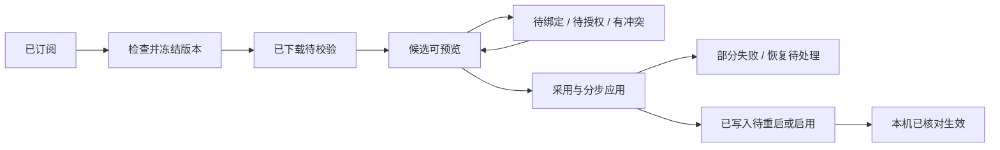

# 客户端流程与本地共存

状态：候选交互与解析规则；无可交互原型或生产实现。底层身份和版本见 [发布与订阅契约](发布与订阅契约.md)。

## 1. 入口与页面职责

建议增加一个“订阅”工作区，集中管理“已订阅 / 发现与添加 / 我的发布”。“当前组合”显示模型体系、Skills、MCP 各模块的源、版本、更新与本地保留状态。是否新增一级导航留待整体导航评审；先在模型与拓展页提供统一订阅入口。

模型页继续编辑模型，拓展页继续管理 Skills / MCP；条目旁显示“本地 / 某源某版本 / 有本地覆盖”。由源管理的正文只读，用户可创建本地覆盖或复制为本地。设置页只负责服务端、账户和检查更新策略，避免在三个入口各维护一套订阅列表。

| 页面 | 主要动作 | 应始终可见的状态 |
|---|---|---|
| 当前组合 | 整套采用、分模块选源、固定 / 跟随、保留本地 | 当前实际版本、候选版本、是否自定义组合 |
| 已订阅 | 检查更新、查看差异、暂停、取消订阅 | 发布者 / 服务实例、范围、权限、最后成功检查 |
| 发现与添加 | 站内选择、输入分享地址、选择团队推荐 | 当前登录主体、发布者身份、兼容与可访问性 |
| 我的发布 | 新建源、选范围、发布版本、维护轨道 / 受众 | 源角色、草稿与已发布、受影响受众 |

## 2. 发布流程

1. 从当前组合或模块选择“发布分享”，选择个人 / 团队命名空间、已有源 / 新建源；服务端校验角色。
2. 选择模型体系 / Skills / MCP，再勾选渠道、模版或条目。显示保存态与未保存改动的区别，冻结完整选择。
3. 展示需附带的依赖、预计体积、内容来源 / 许可、可选连接建议与排除的私密字段。发现无权再分发的内容时提供保留引用或移出范围。
4. 填版本名称、变更说明、兼容条件、可见范围；明确本次是否移动 stable / preview 推荐轨道。
5. 最终预览列出将对哪些用户 / 团队可见、增加 / 修改 / 删除的内容及运行影响，再执行上传和发布。
6. 只在服务端确认 release 已完整提交后显示发布成功；轨道更新单独显示结果。提交成功但轨道竞争失败时显示“版本已发布，推荐轨道未更新”。

“再次发布”创建新不可变版本，不覆盖旧版。接收者本地覆盖不会自动进入“我的发布”；有发布权者也要主动把选择的本地修改整理成新发布草稿。

## 3. 接收、整套采用与按模块换源

添加源 → 验证服务实例与发布者 → 登录 / 获得读取权 → 查看内容与兼容信息 → 选择模块 / 条目 → 选择固定版本或跟随轨道 → 设置本地保留 → 完成订阅并下载候选。

首次订阅完成后显示“已订阅，待采用”，不显示“已生效”。团队已经订阅的源出现在成员的推荐列表；成员仍按自己的范围采用。本地模式用户可导入一次性内容包，但文件导入不会凭空建立持续订阅关系。

采用整套时展示三个模块将如何变化，缺少某模块不表示清空本机该模块。某模块换源后组合标为自定义；继续接收其他模块更新。一个模块的发布版本标签可能与另两个完全不同，界面不强求统一版本号。

同一模块保存多个候选源不等于所有源同时参与运行。首期模型体系明确一个策略主源；Skills / MCP 多集合的条目可并存，但安装目标 / 运行名称冲突时必须选一个所有者。未支持的模块独立标注；如果它是所选组合的硬依赖则整个依赖集合无法采用，不能静默跳过。

## 4. “保留本地配置”的两个维度

| 选项 | 说明 | 关闭时 |
|---|---|---|
| 保留本地条目，建议默认开启 | 个人创建的渠道、模型规则、Skill、MCP 继续参与本次组合 | 本地条目暂不参与本次组合，磁盘内容不删除 |
| 保留本地覆盖，建议默认开启 | 对订阅对象明确设置的字段覆盖、启停选择或绑定策略继续保留 | 预览清除哪些覆盖；采用后按源版本解析，原覆盖可从历史恢复 |

两者独立，例如保留个人 MCP 同时恢复订阅 MCP 的默认参数。页面不能用一个“覆盖本地”开关同时删除个人对象和清除人工例外。

**本机凭据 / 路径 / 连接绑定是单独的设备层**，不因上述开关关闭就被清空、导出或替换。若新源需要不同端点或认证，转为待绑定并明确提示。

## 5. 数据层次与解析顺序

建议分别保存以下职责，物理文件名待冻结：

| 层 | 内容 | 可编辑性 / 同步 |
|---|---|---|
| 订阅原始快照 | 下载到的精确清单、内容、来源与校验状态 | 只读缓存；不作为用户本地编辑文件 |
| 本地组合选择 | 模块源、精确解析、参与条目、保留选项 | 用户编辑；账户可选同步选择意图 |
| 本地自建与覆盖 | 本地对象、针对来源对象的明确字段覆盖、例外 | 用户可编辑；按个人同步范围单独处理 |
| 本机绑定 | 本地路径、真实连接 / 凭据引用、目标安装位置 | 设备隔离，不上传 |
| 派生应用计划 / 运行态 | 解析后的模型策略、安装文件与 MCP 生效配置 | 经检查后写入；不是发布事实源 |

这一层次是后续订阅元数据与缓存设计，不把 v0.2.0 的双文件改成互相复制的多份事实源。模板正文仍由模板库负责，模型策略仍由策略负责；实现时需要明确哪些是作者可编辑事实、哪些是可以重建的订阅投影。

处理顺序：选择源的精确快照 → 校验引用与兼容 → 做来源到本机身份映射 → 合并获准参与的本地对象 / 覆盖 → 生成规范化策略 → 交给各模块现有解析器 / 适配器。不得把所有 JSON 递归覆盖视为业务合并。

对模型沿用原继承规则：官方声明 → 模版通用 → 版本或后缀 → 渠道默认 → 渠道内族覆盖 → 单模型覆盖。订阅来源先决定上述各层采用什么内容，本地显式覆盖作用于对应层；它不是凭空再增加一种模版匹配优先级。同优先级模版冲突、缺依赖仍按原方案阻止受影响保存。

## 6. 冲突与更新规则

比较三个基准：上次已采用的源版本 B0、新候选 B1、基于 B0 的本地覆盖 L。仅源改动的字段可进入候选；仅本地改动保持；双方改变同字段时显示 B0 / B1 / L，默认保留本地并要求确认冲突结论后才能应用受影响内容。明确覆盖即使数值恰巧等于旧默认也保留其意图，不能仅靠值差异推断。

| 情况 | 候选处理 | 应用结果 |
|---|---|---|
| 本地和源都叫“研发渠道” | 按来源身份区分；提示运行别名或 slug 冲突 | 选择映射 / 改本地别名 / 取消，不能按显示名合并 |
| 源修改默认推理，本机单模型明确设 low | 保留对应层本地覆盖，显示源已变更 | 无冲突层可更新；重叠变更经确认，例外仍为 low |
| 源新增渠道 / Skill / MCP | 按固定范围或“包含新增项”策略列候选 | 只有确认后的选中项参与应用；不自动启动新工具 |
| 源删除被本地覆盖的条目 | 标“上游已移除，本地有修改” | 选择复制为本地并修复引用，或明确移除；不悬挂覆盖 |
| 新包未包含某模块 / 条目 | 先区分发布范围不含、订阅过滤、完整清单删除 | 不把“未包含”当全局删除 |
| 模型白名单为空 | 按业务 schema 检查与解释 | 不退化为 all，不能扩大可用模型 |
| 全局 Fast / 来源排序两边均修改 | 作为有明确所有者的全局值 / 顺序处理 | 展示整体影响，不做数组并集或最后写入者覆盖 |
| 同名 Skill / MCP 占用相同目标位置 | 展示已有所有者、内容差异和依赖 | 选择唯一所有者；不能覆盖未受管文件或静默重命名后假装等价 |
| Skill 本地改了脚本 | 首期按文件 / 包比较，允许保留本地副本 | 不自动文本拼接脚本；采用新版需明确处理本地改动 |
| MCP 端点 / 可执行命令 / 参数权限变化 | 标明运行与授权差异 | 新授权 / 安装检查，旧令牌不自动转交 |

字段的缺省、inherit、显式 false、空列表和清除必须分别定义。数组按稳定 ID 操作并保留顺序；清除使用明确业务动作。初次采用没有 B0 时显示现有本机与候选的完整比较，不能伪造无冲突结论。

默认模型排序建议：采用源的渠道顺序，再追加保留的本地渠道，各自保持模型内部顺序；用户已有明确本地来源排序则展示差异并保留覆盖。停用对象保留身份与位置。无论来源如何混用，最后仍按 v0.2.0 全渠道预算及适配能力检查，不把多个源分别通过检查等同全局通过。

## 7. 三种模块的应用闭环

统一操作为“采用到当前组合”，具体步骤与状态由模块负责。执行前冻结选择、精确内容、权限检查结果、本地覆盖与当前运行基准，生成 planId；预览期间任何相关基准变化都重新生成预览。

| 模块 | 写入前 | 执行与完成条件 |
|---|---|---|
| 模型体系 | 渠道 / 端点绑定、模板引用、真实能力和全局选择器预算 | 生成渠道草稿，走原“保存”计划；持久化 / 运行读回后仍可能待 Codex 重启，核对后才标生效 |
| Skills | 包完整、平台 / 依赖兼容、安装目标、与已有内容冲突、脚本差异 | 暂存验证后安装并确认目标内容；启用另有可见动作，下载不执行脚本，启用后也仍遵守宿主的执行授权 |
| MCP | 固定包或命令、非敏感参数、本机变量、目标授权与连接信任 | 写受管配置，安装 / 启动 / 授权分别显示；需要重启或未连通如实保留状态，不自动冒充连接成功 |

跨模块不宣称数据库式原子事务。先验证全部硬依赖，备份成功后开始；每模块逐步记录、读回、必要时补偿。若有硬依赖的组合不能安全暂存 / 激活，则阻止整套应用并说明适配缺口；无硬依赖的部分可在明确缩小范围后单独应用。

例如模型写入成功、MCP 安装失败，应显示实际分步结果并提供恢复计划；不能把 UI 版本号全部退回旧值后宣称无变化。恢复只触及仍归本计划管理的对象 / 字段；并发外部修改保留并提示冲突。回滚配置不承诺撤销已运行脚本的外部效果。

一次工作区只允许一个应用计划。超时先核对实际状态，避免重复安装 / 写入；退出窗口不丢执行记录；崩溃恢复按日志核对。依赖文件、运行路径、批准的命令 / 参数变化须重新检查，摘要匹配不等于来源可信或内容安全。

## 8. 状态、离线与退出

订阅活跃 / 暂停、候选状态、本机运行状态是可共存的维度。离线期间仍显示“当前用哪版、最后何时检查”；同步失败不会把当前版本清成空。固定版本也能收到撤回提示，不能因为固定就完全停止安全 / 可用状态检查。

| 操作 | 推荐默认 | 需要显式选择的动作 |
|---|---|---|
| 暂停订阅 | 暂停检查 / 下载，当前本机配置保留 | 是否仍允许手动检查 |
| 停用某模块 | 形成应用差异，保留内容与来源记录 | 完成配置撤下 / 停用，其他模块依赖须校验 |
| 换源 | 下载并预览新源，旧源在成功应用前继续服务 | 映射对象、处理覆盖、确认依赖与新授权 |
| 取消订阅 | 停止后续接收，询问本地已应用内容的处置 | 保留为固定本地副本或移除订阅管理内容；个人原有条目保持独立 |
| 回退组合 | 历史目标生成新的候选应用计划 | 检查撤回、依赖、绑定和外部漂移后应用，不直接覆盖运行目录 |

## 9. 与 WebDAV、导入导出的关系

WebDAV 继续承担个人内容同步；订阅承担发布者到接收者的单向分发。首期建议 WebDAV 只同步可分享的本地自建 / 覆盖事实，订阅缓存、本机绑定、访问令牌和已安装运行投影不作为个人同步的可编辑事实，避免收到团队更新后又回传为另一份个人作者内容。

既有 v0.2.0 是同步已提交双文件。本功能接入时必须增加来源分层与容器版本 / 过滤规则，并验证旧客户端不会把订阅派生值重新发布或覆盖本地层；在该隔离实现前，不能一边开放订阅写入一边声称原 WebDAV 无需修改。

可选同步的订阅引用只表达来源和选择，不携带私有内容或令牌；新设备重新登录、验证权限并下载。成员自行拥有的个人覆盖也可能包含公司信息，上传个人 WebDAV 前显示范围；不得因“本地覆盖”标签就默认获得再分发权。账户切换按服务实例 + 用户隔离缓存与候选，不把 A 的私有内容复用给 B。

文件导入进入相同候选校验 / 应用流程，但其来源可信度按文件实际来源判断。导出当前有效组合应重新做范围、来源许可、依赖与私密内容预览；不能把三种运行时文件原样打包。任何个人同步 / 导入收到变化都只影响候选或本地草稿，不反向更改团队发布源。
