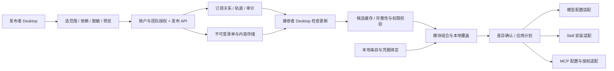

# 团队配置发布订阅总体方案

状态：2026-10-05 候选设计；产品版本、生产 schema、接口与实施范围均待评审。

## 1. 产品定位

让团队维护一份可持续更新的工作环境，个人按需订阅并组合成自己的本机配置。发布者负责内容与版本，服务端负责目录、权限和订阅关系，客户端负责选源、差异、本地绑定和实际应用。

与个人同步最关键的区别是**内容所有权和变化方向**：发布源由有权维护它的人更新，订阅者修改的是自己的配置或新建分支；订阅者的本地改动不会自动回传为团队版本。

| 能力 | 个人导入导出 | 个人 WebDAV 同步 | 团队发布订阅 |
|---|---|---|---|
| 主要关系 | 一次传递快照 | 同一人多个设备交换配置 | 维护者发布，个人 / 团队持续接收 |
| 更新入口 | 再导入文件 | 同步与冲突处理 | 版本轨道、更新提醒、范围及权限 |
| 本地修改 | 形成自己的配置 | 按同步规则合并 | 保留本地覆盖；贡献回源须另有发布权和显式操作 |
| 身份与权限 | 文件获取边界 | WebDAV 端点凭据 | 用户、团队成员、发布源角色及读权限 |
| 组合方式 | 手动选范围 | 同步范围 | 模块独立选源 / 版本，或采用推荐整套组合 |

“像 Clash”按本包理解为保存多个订阅源、检查更新、选取配置、保留本地选择这一交互类比。这里自行定义模型 / Skills / MCP 的内容契约，不承诺兼容 Clash YAML 或直接导入其订阅地址。

## 2. 内容模块与整套方案

| 模块 | 可发布范围 | 接收时补充 | 应用边界 |
|---|---|---|---|
| 模型体系（models） | 逻辑渠道、模型选择 / 顺序、协议声明、模型策略、匹配规则、精确模版 revision；可只发布所选渠道或模版 | 本机渠道 / 端点绑定、凭据、目标能力检查 | 复用模型配置的草稿、预览、保存、读回与待重启流程 |
| Skills（skills） | 所选 Skill 的完整目录内容、清单、来源 / 许可、版本、依赖与权限说明 | 本机安装目标、运行依赖、个人参数 | 下载和预览可独立；安装、启用及脚本执行分开 |
| MCP（mcp） | 所选服务的启动 / 连接描述、固定包版本或远端地址建议、非敏感参数、环境变量需求 | 本机路径、环境变量值、目标 MCP 服务自己的认证 | 保存描述不等于安装、启动、授权或成功连通 |

“整套方案”是一份发布版本的组合清单，指向各模块精确版本，不是第四种运行配置文件。只改 Skills 时可以复用原模型 / MCP 的 digest 后发布新组合，不要求三个模块的版本号一起增长。

模型体系内沿用 v0.2.0 的模板库与策略分工：

- 模版正文按 templateId + revision 固定，策略明确引用；发布清单负责把二者和所需依赖一起分发。
- 仅模版发布与订阅可用；接收只入库候选，不自动设为主版本、不自动采用到渠道。
- 仅策略发布必须声明精确模版依赖；接收方有权取得并校验依赖才可采用。
- 局部发布不隐含全局 Fast、全局来源顺序或其他渠道的选择；这类字段另行勾选并展示全域影响。
- 模版范围中的渠道 ID、模型策略中的渠道 ID 经过一致身份映射；移除未分享渠道的引用时不得把“白名单为空”误解为“全部渠道”。

首期建议模型体系一个策略主源；可以保存多个源并切换，个人渠道继续共存。Skills / MCP 可从多个集合勾选条目，但一个实际安装位置 / 运行名称只能有一个明确所有者。额外模版来源可丰富候选库，跨源改引用要重新校验。复杂的多策略自动合并后置。

## 3. 用户实际看到的组合

一个“组合方案”保存：各模块的来源、选中内容、版本策略、本地保留选项。用户可保存“公司研发”“个人实验”等多个组合，首期同一工作区只启用一个；它们共享本地库但保留自己的选择状态。

| 槽位 | 当前选择 | 更新策略 | 可独立操作 |
|---|---|---|---|
| 模型体系 | 团队 A / 研发环境 / 版本 1.4 | 跟随 stable，实际生效仍锁定已采用内容 | 换为团队 D 的整套模型体系；先处理本机渠道映射 |
| Skills | 团队 B / 编码技能 / 已选 3 项 | 跟随 stable，新项目先提示 | 切换来源或只换冲突条目的所有者 |
| MCP | 团队 C / 工具集合 / 版本 2.0 | 固定版本 | 单独升级、回退或换源并重新认证 |
| 本地 | 个人渠道、个人技能、本地 MCP | 本机编辑 / 个人同步 | 选择参与或暂时排除，数据继续保留 |

一键“采用整套”填入发布者推荐的模块组合；如果随后换了 Skills，显示“自定义组合”，不会在下一次整套更新时悄悄换回。回到推荐组合必须展示哪些模块将改变。切换某模块也可能影响硬依赖它的其他模块，不能承诺任何组合都可用。

## 4. 与前序协作包的关系

| 依赖 | 可复用的方向 | 需要新增 / 核实 | 本包的交付边界 |
|---|---|---|---|
| 模型配置 v0.2.0 | 双文件、不可变模版版本、绑定、草稿、应用日志、恢复 | 生产 schema / 适配仍待实现；增加发布来源身份映射与组合解析 | 不重写原模型继承规则，不把订阅塞进 v0.2.0 |
| 账户与用量服务 | 服务实例、登录、用户、设备、凭据，以及已纳入首期设计的团队 / 成员 / 三角色 | 共用模型仍是候选、待实施；内容权限独立扩展，不能把统计权限当发布权 | 复用团队身份域，新增内容源、发布版本与订阅域 |
| 用量数据管道 | 可共用部署与运维基础 | 配置版本和用量事件生命周期不同 | 使用订阅不要求上传用量，配置也不进入用量事件表 |
| 本地 Skills / MCP 能力 | 可复用已有安装 / 配置入口的方向 | 逐项核对生产导入、安装、冲突、卸载与读回能力 | 不因已有“拓展”页就声称订阅应用已经可用 |

建议依赖共同的服务基础，而不是让配置订阅等待用量报表、预算、排行榜等功能全部完成。服务端包已把团队所有者 / 管理员 / 成员及成员期纳入首期设计，本包直接引用 [团队与数据权限模型](../../../2026-10-05-多用户多设备用量与服务端协作/01-需求分析/02-方案草案/团队与数据权限模型.md)，不再创建第二套团队事实。身份与团队基础可先独立落地，再与用量模块同站部署；也可独立启用内容模块。未连接服务端时，本地配置管理和文件导入导出继续工作。

发布源的所有者、接收者当前组合和模型调用的用量归属分别管理。采用团队 A 的模型或 Skill 不会把个人调用自动计入团队 A；用量空间继续按服务端包的已授权来源绑定决定，历史与待传队列保持原归属。

## 5. 架构与职责

| 位置 | 负责 | 不由它证明的事情 |
|---|---|---|
| 发布客户端 | 冻结选中范围、计算依赖、筛出可分享内容、发布差异 | 本机运行成功不证明所有订阅者可运行 |
| 服务端 | ACL、团队关系、不可变版本、轨道、下载授权、订阅与审计 | 发布通过不证明代码安全；不执行用户上传脚本或试连私有端点 |
| 接收客户端 | 版本解析、依赖缓存、来源比对、本地覆盖、适配与读回 | 下载完成不证明安装完成或运行生效 |
| 本机凭据存储 | 按服务 / 用户 / 设备保存认证值与本机绑定 | 不随订阅内容传播或由发布者远程读取 |

建议采用服务端包已有的模块化单体方向，在共用账户与团队域之上增加内容发布订阅域、内容存储接口和异步清理；首期可用受控文件卷或兼容对象存储，不因本功能立即拆微服务。具体技术栈、容量和存储方式在实施前冻结。

## 6. 发布、订阅与运行的三种状态

发布版本说明“维护者提供了什么”；服务端订阅说明“谁希望接收什么”；本机应用记录说明“这台设备实际采用了什么”。三者分别记录，不能用一个版本号替代。

订阅设置可随账户在多设备间可见。新设备仍独立解析兼容性、绑定凭据并采用；团队管理员订阅一个源只形成团队可见的推荐和访问关系，不自动改写成员设备。同一用户 A 设备已应用而 B 离线时，各自实际版本如实显示。

版本名称只是便于阅读的标签；真正采用的是源身份、不可变 release / module revision 与内容摘要。跟随 stable 也会生成一次精确解析记录；离线使用的是已校验的本机版本。

## 7. 首期与后续

| 阶段 | 目标 | 条件 |
|---|---|---|
| P0 契约与验证 | 模型导出闭包、Skills 全包、MCP 描述、来源与本地状态分层、三类适配的失败恢复 | 通过技术门，界定哪些格式和运行方式实际支持 |
| P1 团队闭环 | 一个站点内个人 / 团队发布、模块范围选择、固定 / 跟随、整套 / 分模块采用、本地共存、更新 / 退出 / 恢复 | 三模块都走通发布到接收；不以“仅模型已做”宣称整套完成 |
| P2 深化 | 多个组合的便利切换、贡献 / 派生源流程、更多模块内混用、团队推荐管理 | 依赖和冲突可解释，权限不扩大 |
| 后续独立评估 | 多站点聚合、跨站镜像、公共同步市场、签名分发、托管设备强制策略、服务端凭据代管 | 分别定义信任、分发权、管理边界与运维要求 |

不承诺正式版本号或工期。若 P1 需要拆开发交付，须在发布说明中列清尚未支持的模块；本包仍保留三类发布订阅的完整目标。
