# 团队与数据权限模型（候选）

2026-10-05 用户补充：“那么还得加入团队的概念。” 团队由后续扩展上调为**首期核心对象**。本页是对 [总体方案](总体方案.md) 和 [数据契约](数据与同步契约.md) 的补充；多团队成员、角色细分与历史策略是推荐方案，尚待评审。

## 1. 站点、个人、团队、设备与来源

```mermaid
flowchart TD
  SITE[服务站点] --> USERS[用户账户]
  SITE --> TA[团队 A]
  SITE --> TB[团队 B]
  USERS --> MEMBER[团队成员关系与角色]
  TA --> MEMBER
  TB --> MEMBER
  USERS --> DEV[个人设备]
  DEV --> SOURCE[有明确归属的用量来源]
  SOURCE --> PERSONAL[个人空间事件]
  SOURCE --> TEAM[团队空间事件]
  PERSONAL --> GLOBAL[全站唯一事件集合]
  TEAM --> GLOBAL
```

图中两类事件表示不同来源的选择；**一个首期来源绑定一个空间，一条事件只能属于个人或一个团队**，不能同时分摊到多个团队。

| 对象 | 候选定义 |
|---|---|
| 站点 Site | 一套服务的顶层范围，首期一个站点；站点管理员管理基础设施和全站聚合 |
| 用户 User | 稳定登录身份，默认有个人空间，可加入多个团队 |
| 团队 Team | 独立协作与用量归属空间，有成员、角色、保留策略和团队报告 |
| 成员关系 Membership | user_id + team_id + 角色 + 状态；每次重新加入产生新的 membership_epoch_id |
| 设备 Device | 归个人账户，不因加入 / 离开团队转移所有权；一台设备可产生不同空间的用量 |
| 来源 Source | 归明确采集用户管理，并固定绑定 personal 或 team_id；团队来源需当前有效成员授权 |
| 用量事件 UsageEvent | 保留 actor、来源、原设备、唯一空间和成员期；设备归属、行为人和数据空间不能混为一谈 |
| 项目 Project | 团队下的可选分析维度，后续扩展；首期不引入嵌套团队或独立组织层 |

“多用户隔离”更新为：个人空间按用户隔离，团队空间按团队与角色授权隔离。不能继续用“所有数据永远只有记录所属用户可见”概括，因为团队管理者有明确的团队聚合权限。

## 2. 首期角色与权限

团队角色：**所有者、管理员、成员**。一个团队恰好一名所有者；所有者可转移，但交接成功前不能退出或被移除。管理员不能授予所有者、接管团队或移除所有者；普通成员不自动具有团队全量统计权限。

| 能力 | 普通团队成员 | 团队管理员 | 团队所有者 | 站点管理员（无团队角色） |
|---|---|---|---|---|
| 本人个人空间 | 仅自己 | 仅自己 | 仅自己 | 仅自己 |
| 本人在当前团队 / 当前成员期的用量明细 | 允许 | 允许 | 允许 | 禁止 |
| 团队总量、趋势、模型 / 渠道分布 | 默认禁止；后续可设汇总分享 | 允许 | 允许 | 仅包含在不可钻取的全站汇总中 |
| 团队成员用量聚合与聚合导出 | 禁止 | 允许 | 允许 | 禁止 |
| 其他成员逐条事件 / 原始日志导出 | 禁止 | 首期不提供 | 首期不提供 | 禁止 |
| 邀请 / 移除普通成员 | 禁止 | 允许，不能操作所有者 / 管理员 | 允许 | 不因站点角色自动获得团队内容管理权 |
| 任命 / 撤销管理员 | 禁止 | 禁止 | 允许 | 不默认允许 |
| 转移所有权、解散团队、团队数据删除 | 禁止 | 禁止 | 允许，需重新认证及范围确认 | 不默认允许 |
| 站点停用账户 / 团队、全站聚合 | 禁止 | 禁止 | 禁止 | 允许，留审计 |

团队管理者看到成员在**本团队**发生的聚合，不看到成员个人空间、其他团队或完整私人设备目录。设备维度使用团队范围的来源 / 设备别名，不直接暴露系统主机名。普通成员可见必要的团队基本信息和本人的成员角色，不默认导出全体成员邮箱。

站点管理员仍可能通过数据库运维权限接触底层数据；这里定义的是产品权限，不承诺服务器运营方不可解密。首期不提供自动取得团队身份的“万能管理员”页面入口。

## 3. 数据归属与三种统计视角

事件具有服务器校验的：`actor_user_id`、`scope_kind = personal | team`、`scope_id`、团队事件的 `membership_epoch_id`，以及 source / device 身份。个人事件归个人空间管理，团队事件归团队管理；actor 表示谁产生，不改变团队的数据管理范围。

| 视角 | 事件集合 | 离队后的行为 |
|---|---|---|
| 我的用量 | 本人个人事件 + 本人在当前仍有权访问的团队 / 成员期事件，跨自己的设备去重合并 | 不再从服务读取已离开团队的历史；个人部分保留 |
| 某团队用量 | 该 team_id 的全部有效事件；管理者可按成员、模型、团队来源聚合 | 团队保留成员离队前的历史，显示已离队成员标记 |
| 全站用量 | 全站所有有效个人 / 团队事件的唯一集合 | 随对应空间删除 / 保留策略变化，不因成员退出直接扣除团队历史 |

例如 Alice 的个人空间有 10 条、团队 A 有 20 条、团队 B 有 5 条，则她有权限时“我的用量”是 35；若站点只有这些记录，全站也是 35，**不能把个人视图 35 再加团队 A 20 和团队 B 5**。个人视图是行为人的观察视角，不是和团队空间互斥的第二份存储。

一个用户加入两个团队不意味着全部设备用量复制到两个团队。团队成员之间也不自动共享提示词、配置、供应商密钥或私人项目。

## 4. 如何确定一条调用属于哪个团队

首期建议采用**来源绑定空间**，不从当前打开的报表、设备名字、上传时的团队选择或提示词猜归属。个人设备可以登记多个独立来源：例如个人 profile → 个人空间，工作 profile → 团队 A。每个来源都仍有明确的个人采集身份。

- 登记来源时选择空间，服务端验证成员资格并签发受限上传授权；后续事件携带来源绑定引用，而不是可任意修改的 team_id。
- 事件进入本地队列时固定空间和成员期，补传时不读取“目前选中的团队”重写它们。
- 首期已有来源不直接从个人改成团队 A，也不从 A 改到 B。切换工作空间应切换独立来源 / profile；重复登记同一旧账本不能成为改归属的捷径。
- 如果未来允许单一代理内逐请求选团队，必须有可信的调用上下文、绑定的接入凭据或协议扩展；只改 Desktop 页面筛选不够。
- 如果未来允许同来源切换空间，必须提供可验证的无重叠分界、在途请求处理和审计；原 source_event_id 不变，已接收事件不能被重新上传到另一个团队。

本轮未证明 Desktop 当前已具备多 profile 的产品流程。S0 要验证独立配置 / 账本、单设备多空间切换的可行性；若暂不能支持，首期明确限制“本设备当前来源只归一个空间”，同时允许账户加入多个团队、查看多团队已有用量。不能在 UI 上做了切换就宣称所有调用自动获得正确团队标签。

共有机器 / Hub 以后可引入团队服务身份与每调用者独立 key；首期不创建假个人账户来承载不明调用者，缺个人映射的请求不得伪装为某成员用量。

## 5. 邀请、离队、暂停与离线数据

| 状态变化 | 候选规则 |
|---|---|
| 邀请 | 一次性、有到期时间、固定团队与可授予角色；用户登录后明确接受，不凭邮箱字符串自动合并身份 |
| 成员加入 | 建立新的成员期；团队上传源必须取得该期授权 |
| 角色变化 | 服务端更新授权版本；每次查询 / 导出 / 上传复核，不能只相信旧 token 的角色声明 |
| 成员暂停 / 移除 / 退出 | 立即停止新的团队读写和导出下载；设备仍归用户、个人同步继续；已提交团队历史保留 |
| 被移除时仍离线 | 设备可有未上传记录，但重新联网后必须复核成员资格；不保证远程即时清掉离线缓存 |
| 离队前采集、离队后补传 | **首期拒绝直接写入团队**，封存为原团队待处理；不自动改个人归属。后续如支持管理员批准补交，需限来源 / 范围的一次性授权 |
| 重新加入同团队 | 新成员期；旧队列、旧授权和旧成员期明细不自动恢复。首期使用新建独立来源记录新用量，不能把原期账本改名再导入；延续原来源需后续受控分界协议 |
| 团队暂停 | 停止该团队新上传 / 管理动作，历史按只读策略处理；不影响用户个人或其他团队 |
| 所有者退出 | 先完成所有权转移，或走明确解散流程；操作并发时仍保持恰好一名所有者 |

服务器不凭客户端自报 occurred_at 决定“你在离队前有资格，所以现在放行”。上传时的当前授权是必要条件，时间字段只决定统计归档。这样会使部分合法离线用量暂无法补交，必须在产品说明中讲清，不静默丢弃。

Web / Desktop 报表缓存键包含团队、当前角色 / 授权版本和筛选范围；退出 / 撤销后清理可达缓存与下载授权。已经下载到用户本机的文件无法依靠服务器撤销收回，这不等同于服务器继续授予访问。

## 6. 删除、归档和历史责任

- 设备归档、成员离队都不删除团队历史；否则团队趋势会随着人事变动被改写。
- 个人“删除数据 / 删除账户”默认清理个人空间，团队事件按团队政策管理；界面先显示两者不同的影响范围。账户删除后，团队可保留必要的去身份化行为人引用，清除私人档案关联，具体保留条款需在开启团队同步前明示。
- 团队数据删除由所有者发起，独立预览、重新认证和审计；事件、聚合、导出、缓存、删除水位、备份淘汰共同处理。
- 解散团队先关闭邀请和写入、撤销成员 / 来源授权，给出导出和删除时间；不能只删 team 表导致孤儿事件或重新归入个人空间。
- 所有权转移改变管理权，不改变事件原 actor 或 scope。新管理员按团队管理角色获得团队历史聚合，普通重新加入的成员仅获得新成员期权限。

这是候选产品政策，不是对法定义务的判断；真实部署应把保留与删除行为明示给团队使用者。

## 7. 接口、存储与后台任务补充

增加 teams、team_memberships、team_invites、membership_epochs；source 绑定 scope / membership_epoch，事件保存不可变空间事实与 actor 引用。查询、聚合、任务和导出都必须具备同一空间约束；只在事件表加 team_id 不足以实现权限。

| 候选接口 | 边界 |
|---|---|
| `GET /v1/teams`、`POST /v1/teams` | 当前用户所属团队 / 创建团队；站点可限制创建资格与数量 |
| `GET /v1/teams/{id}/membership` | 当前用户在该团队的有效角色 / 成员期 |
| `POST /v1/teams/{id}/invitations`、接受邀请接口 | 只能授予操作者有权授予的角色；一次性、过期、并发接受保护 |
| 成员角色变更 / 移除 / 退出接口 | 当前权限与最后所有者约束；撤销要影响后台任务和下载 |
| `POST /v1/teams/{id}/ownership-transfer` | 所有者重新认证、目标有效成员确认；事务完成唯一所有者交接 |
| `GET /v1/teams/{id}/usage/summary` | 当前团队管理者看聚合；普通成员自己的团队用量走本人查询 |
| 团队聚合导出 / 删除 / 归档接口 | 与个人任务分开，创建、执行、读取与下载时都重新授权 |

聚合查询需分开三种权限：个人事件读取、本人团队事件读取、团队管理聚合。团队管理聚合不能顺便授权基础表中所有成员的原始事件；使用受控聚合查询 / 视图并验证访问路径。

## 8. 首期范围与后续价值

首期加入团队创建、邀请 / 加入、三角色、成员停用 / 退出、来源空间绑定、本人团队统计、管理者团队 / 成员聚合、团队历史及删除权限。全站聚合同时覆盖个人与团队空间且不重复计数。

后续再加入项目维度、团队预算提醒、团队模版与非敏感配置共享、SSO 自动入组、服务身份和跨团队调拨。跨团队拆账、回溯修改归属和供应商凭据池不在首期；这些会改变历史与安全边界，另定契约。
