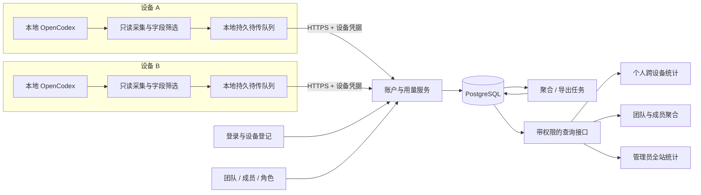

# 多用户多设备用量与服务端总体方案

状态：2026-10-05 候选设计；所有接口和技术选择待冻结。现状依据见 [调研](现有能力与调研依据.md)，细节见 [数据契约](数据与同步契约.md) 和 [团队权限模型](团队与数据权限模型.md)。用户同日补充团队要求后，团队已从后续扩展上调为首期核心对象。

## 1. 产品定位

增加 **OpenCodex Desktop 可选的账户、团队与用量服务**。用户可自建或连接组织提供的服务器，登录后将多个设备关联到自己，并加入一个或多个团队。服务端负责账户、团队 / 成员 / 角色、设备、用量归属、查询及全站汇总。

对这组需求，建议有服务端：需要共同的身份、持久记录、去重和权限控制。可以采用已有托管基础设施承载，并不必然购买独立物理服务器；但仅靠各设备页面或 WebDAV 汇总文件无法自然提供可信的用户边界、并发写入和统一查询。

首期保留本地代理模式。上传精简用量，不转发提示词和模型输出。服务端故障只影响同步和远端报表；本地模型调用与本地用量仍可用。

## 2. 三条路线比较

| 路线 | 适合情况 | 优点 | 代价 / 限制 | 建议 |
|---|---|---|---|---|
| Desktop 采集并上传事件 | 多个独立本地 OpenCodex、多设备和个人服务器 | 不改模型流量路径，能覆盖本地历史和断网使用 | 需版本适配、来源身份、补传及去重；数据为客户端报告 | **首选，首期实现** |
| 单一 OpenCodex Hub + 账户 / 设备层 | 组织愿意把请求集中代理 | 可复用 Hub 按 key 统计；代理侧掌握集中流量 | 接入密钥不是账户；需单独映射；影响网络路径与故障范围 | 可选后续接入 |
| 定时上传汇总文件 / WebDAV | 单人手工备份、粗粒度查看 | 初期接入少 | 累计快照易重复、细分丢失、权限和并发查询薄弱 | 不作为多用户统计底座 |

不把第一条和第二条的同一请求相加。每个来源明确“本地账本”或“Hub 账本”作为权威观察点；Hub 的受限汇总也不能伪造为完整事件历史。

## 3. 架构与边界

| 层 | 职责 |
|---|---|
| OpenCodex | 模型代理与本地原始用量事实；沿用上游实现 |
| Desktop 后台 | 发现来源、归属校验、只读增量采集、白名单投影、本地队列和恢复 |
| Desktop 界面 | 服务地址、登录、团队空间、设备名、来源归属、启停同步、同步健康、个人 / 团队报表 |
| 服务 API | 认证、团队 / 成员管理、设备 / 来源空间登记、校验与幂等落库、按角色查询 |
| 聚合任务 | 可重算的分钟 / 日汇总、晚到数据刷新、导出和保留期清理 |
| 管理页面 | 团队管理与成员聚合；另设站点聚合、用户 / 设备管理、价格目录和同步健康 |

采集器首期跟随 Desktop 后台运行。Desktop 完全退出期间，由仍在运行的 OpenCodex 积累账本，下一次启动补采；补采受到上游保留期限制。需要全天采集时可后续引入独立受管进程，不能把首期描述为无条件持续在线。

## 4. 用户、站点与权限

首期一套服务是一个站点，包含个人空间和多个团队。用户可属于多个团队，成员关系具有所有者 / 管理员 / 成员角色与独立状态；设备仍归个人。个人数据按用户隔离，团队数据按团队与角色隔离。首期不增加嵌套团队或独立组织层。账户身份使用稳定 user_id；接入 OIDC 时由 issuer + subject 映射，不能凭邮箱文本自动合并。

| 能力 | 普通用户 | 站点管理员 |
|---|---|---|
| 本人多设备汇总、记录、个人导出 | 允许，仅当前有权访问的空间 / 成员期 | 仅自己的普通用户身份及有效团队权限 |
| 本人设备命名、暂停 / 撤销凭据 | 允许 | 同上 |
| 他人的原始记录、明细导出 | 禁止 | 首期不提供；后续独立权限并审计 |
| 全站总量、趋势、模型 / provider 分布 | 禁止 | 允许，聚合页面不附带个人行 |
| 用户 / 设备管理与停用 | 仅本人设备 | 允许，操作留审计 |
| 全站个人排行榜 | 禁止 | 首期不提供，避免变成隐含的个人明细入口 |

上表中的管理员指站点管理员；团队角色和权限另见 [团队模型](团队与数据权限模型.md)。团队管理者可看本团队及成员聚合，不因此访问成员个人空间、其他团队或他人原始事件。用户“我的用量”合并个人空间和本人仍有权限的团队记录。

全站总量默认覆盖服务已接收的有效数据；不表示所有用户、所有离线设备的实时真实总量。管理员可见用户目录等管理元数据，但统计 drill-down / 导出仍按独立权限设计。小样本站点的聚合可能被推断，不能宣称匿名化。自建服务器的数据库 / 运维管理员技术上可访问存储；本方案是产品与存储访问控制，不是服务商不可解密的端到端加密分析。

隔离必须覆盖请求、数据库查询、聚合、缓存键、后台任务、导出下载和删除。actor 从服务端认证取得，scope 从已授权的来源绑定取得；不接受上传体自填 user_id / team_id 决定归属。团队聚合权限与原始事件读取权限分开。PostgreSQL 行级策略可作为第二道防线；需使用非表所有者 / 非 BYPASSRLS 运行角色并验证连接池上下文，不能仅写了策略就声称隔离成立。

## 5. 服务地址、账户与设备

- 首期一个 Desktop 同时启用一个服务账户，该账户内可加入多个团队；团队空间切换与服务账户切换是两个不同操作。预留服务档案结构，后续才做多站点切换快捷入口。
- 地址先测试无敏感的发现端点，确认协议版本、服务实例 ID 和认证方式，再发起登录。远端强制 HTTPS，本机开发可明确允许 loopback HTTP；不提供忽略证书错误的一键常态开关。
- 登录复用成熟身份组件，首期可用邀请制账户；支持外部浏览器授权 + PKCE 的原生客户端流程。自建账号的注册 / 重置 / MFA 交给身份组件，OIDC 企业对接可按部署需要纳入。
- 登录会话和每设备上传凭据分离。上传凭据只允许登记来源及其个人 / 团队空间写入；团队成员有效性每次请求复核。查询按本人 / 团队角色授权，站点管理权限单独授予。
- 长效敏感凭据存系统 Keychain / Credential Manager，配置仅留引用；短效凭据留内存。签出、撤销、刷新和多进程竞争要有一致状态。
- 设备显示名默认读取系统设备名，让用户在登记前查看和修改。稳定 installation_id 随机生成；device_id 由服务器分配；设备名变化不重建历史。
- 不用设备名、MAC、序列号或 IP 做唯一身份。重装一般登记新设备，可归档旧设备；受控恢复必须区分“原设备恢复”和“复制为新设备”。

本地队列、认证引用和游标按服务实例 + 经过验证的地址 + 用户 + 设备分别存放，事件再固定空间 / 来源 / 成员期；A 的待传数据不会在登录 B 后重新归属。详细转移边界见数据契约。

## 6. 实现形态建议

建议先采用模块化单体：TypeScript API / worker（可选 Fastify）+ PostgreSQL，管理页面复用 Desktop 的 Vue 能力；容器化部署，数据库和反向代理独立配置。Rust 后台承接 Desktop 凭据与采集，不把长效令牌暴露给嵌入的上游 WebView。技术栈是协作成本建议，不是性能结论或版本锁定。

首期不要求 Redis、Kafka 或对象存储。数据库事务 + 唯一约束承担事件幂等，任务队列表支持小规模异步工作；大导出或规模增长后再按实测引入专用组件。不得把上游本地管理 API 直接开放到公网。

容量仅做假设示例：100 用户 × 每人 3 设备 × 每设备每日 500 条记录 = 150,000 条 / 日。若白名单事件序列化后平均 2 KB，原始载荷约 300 MB / 日、90 天约 27 GB（十进制）；索引、数据库行开销、聚合、WAL、备份会额外占用，attempts 较多时均值也会升高。这个数不是实测基准；实施前按真实分布做负载与保留策略验证。

## 7. 分期与交付边界

| 阶段 | 交付 | 进入下一阶段的条件 |
|---|---|---|
| S0 技术验证 | 字段映射、官方历史 API、来源身份 / 克隆、个人 / 团队归属、多空间来源、计数与成本样本 | 采集可靠性与归属口径可验证；不默默回退为不完整统计 |
| S1 首期闭环 | 登录、团队 / 成员 / 三角色、设备与来源空间、上传补传、个人 / 团队 / 全站汇总、对应导出 / 删除和撤销 | 隔离与去重验收、可部署 / 备份恢复说明、数据缺口可见 |
| S2 使用价值 | 预算提醒、报告、模型 / 渠道质量分析、配置和模版版本同步 | 数据质量稳定；明确同步范围和冲突处理 |
| S3 组织协作增强 | 团队内项目、SSO 自动入组、服务身份、可选 Hub 统一接入 | 另立权限 / 代理 / 运维契约 |

不承诺工期或版本号。S1 范围需要控制，优先证明“两个用户、每人两台设备、两个团队且有交叉成员、网络中断与成员退出后无串账或重复计数”这一完整闭环。
