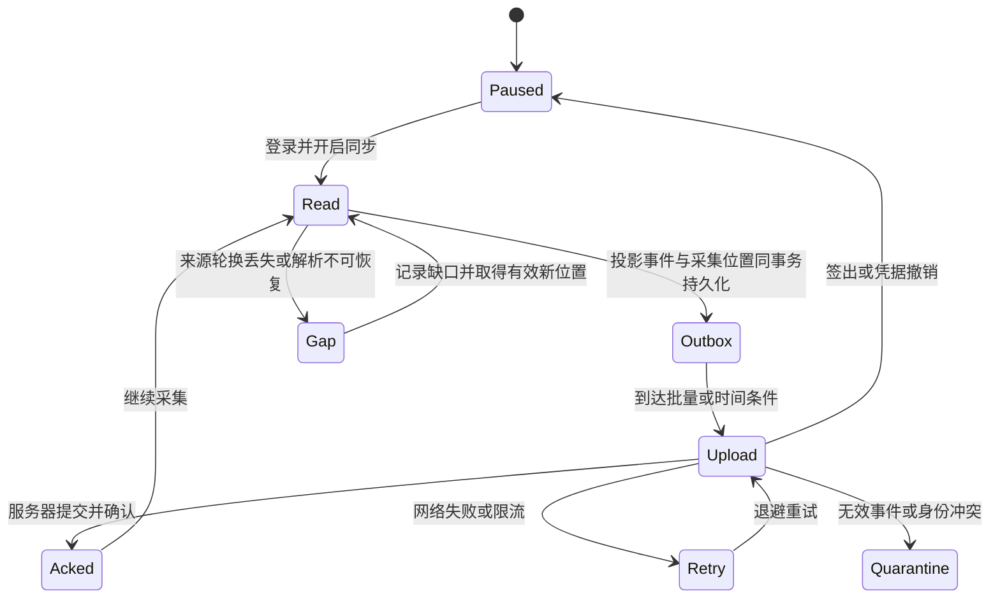

# 数据与同步契约（候选）

本契约定义新服务的候选语义，**不是 OpenCodex 已有 API**。采集来源事实见 [调研](现有能力与调研依据.md)，团队归属与成员生命周期见 [团队模型](团队与数据权限模型.md)，待验证条件见 [评审](../03-确认与评审/README.md)。

## 1. 身份模型

| 对象 | 稳定身份与归属 | 说明 |
|---|---|---|
| 服务实例 | server_instance_id；独立于域名 | 同域名换了一套库必须被识别；实例迁移需要受控流程 |
| 站点 / 用户 | site_id / user_id | 首期单站点多用户；身份由认证确认，不使用邮箱或显示名作主键 |
| 团队 / 成员 | team_id、membership_epoch_id，关联用户、角色和状态 | 用户可加入多个团队；每次重加有新的成员期 |
| 数据空间 | scope_kind + scope_id | 一条事件归个人空间或一个团队，actor 不等于空间所有者 |
| 本地安装 | 随机 installation_id | Desktop 安装的逻辑身份，不是硬件指纹 |
| 服务设备 | device_id，绑定 user_id | 显示名称可变；撤销上传权限与删除历史是不同操作 |
| 数据来源 | source_id，绑定站点、采集用户、固定空间、来源谱系与权威观察点 | 团队来源另绑定有效成员期；不能简单等同机器 / 文件路径 |
| 上传者 | uploader_device_id | 谁执行了采集 / 补传；恢复历史时不覆盖原始归属设备 |
| 原始记录 | source_event_id | 有效 requestId 经固定规则映射；在 source_id 内唯一 |
| 逻辑请求 | logical_request_id，可缺失 | 在 source_id 内解释；禁止假定跨独立代理全局唯一 |
| 尝试 | event_id + attempt_ordinal | 当前只能可靠表达行内尝试；不是已证明的全局物理发送 ID |

设备名默认取系统设备名，可在登记前修改；名称长度 / 字符校验在客户端和服务端一致。改名只更新显示字段，历史仍按原 device_id 关联。事件保存当时 origin_device_id，迁移或归档设备不会把旧记录重新归类为新设备用量。

source_id 由 Desktop 的来源登记表管理，并通过服务端登记。来源表不写进上游配置，保留与受管 runtime / profile 的明确关联，包含来源谱系、导入范围与适配器版本。文件轮换、游标重建和 Desktop 升级都不应产生新 source_id。

**首期来源只允许单一用户作为采集主体，并固定归属一个个人 / 团队空间。** 设备和采集主体属个人，团队事件的数据管理权属团队；来源空间及 actor 不能被上传者任意改写。多个本地调用者共享同一代理、又没有可信调用者身份时，不能把整本账本自动记给当前 Desktop 登录人。应使用独立 runtime / profile，或以后增加经过验证的 apiKeyId → 用户映射；来源不明确的历史暂不上传。首期不支持把已有 source 转交另一用户，或把历史改贴到另一个团队。多空间使用独立来源 / profile；现有 Desktop 多 profile 能力仍须验证，未通过时明确限制当前来源只归一个空间。

## 2. 上传白名单与统计事实

服务端只接受有 schema 的字段，不提供任意 metadata / 任意日志透传。客户端投影与服务端校验各做一遍。未知字段拒绝并返回可理解的升级提示，不能忽略后悄悄落库。

| 字段组 | 建议保留 | 限制 |
|---|---|---|
| 来源 | source_id、source_event_id、scope_binding_ref、source_version、normalization_version、protocol_version | actor、空间和成员期从 token / 已授权登记取得；不接受上传体任意 user_id / team_id |
| 时间 / 设备 | occurred_at（UTC）、origin_device_id、服务器 received_at | origin_device 只能来自该来源授权的历史映射，不接受任意设备 ID |
| 维度 | surface、provider_id / 展示别名、model_id；必要的请求 / 实际模型区分 | 使用有长度上限的稳定键；不能因设备自定义显示名相同就认定同一渠道 |
| Token | input、output、cache_read、cache_write、reasoning、source_total；usage_status | 可空与 0 严格区分；缓存 / 推理细分不再次计入总数 |
| 计价上下文 | 有界的实际模型、effective / response tier、适配后的 tier_outcome | 保留已验证的计价事实和未知状态，不透传任意 wire 参数 |
| 物理消耗 | 有效的行级 spend.sends / settled / unresolved、版本与覆盖标记 | 已含子尝试，只在该投影中计算一次；历史未知不填零 |
| 请求结果 | status、闭集 terminal / failure 枚举、duration、可选 first_output / 有效生成窗口 | 自由文本异常和未知诊断对象不上传；总耗时与生成窗口分别命名 |
| 尝试 | 固定 ordinal、模型 / provider、状态、usage、duration、可选 send_count 与已验证 tier 事实 | attempts 有界；来源语义明确时使用，不和父行总量重复相加 |
| 完整度 | 计量状态、cache_provenance、来源缺口、适配质量标记 | “缺失测量”与“还未同步 / 无法采集”分别展示 |
| 可选标记 | 当前数据空间内手工选定的项目别名（后续） | 不能自动上传代码目录、仓库地址或从提示词猜项目 |

默认排除：提示词、响应文本、代码、文件路径、会话 / conversationId、真实供应商账号、供应商 API key、Authorization、Cookie、完整请求 / 响应、自由文本 upstreamError 和全量配置。上游账户标签与 apiKeyId 首期也不传原值；有后续统计需要时另设用户范围内的不可逆别名和明确用途，不能用它充当登录身份。

模型、渠道名、时间和设备名本身也可能透露工作信息。首次开启展示字段范围；provider 展示别名由用户可查看。不同用户或设备上的相同渠道名不必同源：默认按来源保留独立渠道 ID，全站可按标准供应商类别分组，跨设备合并自建渠道需要显式映射。

金额由服务端价格引擎产生独立 cost_fact：usage_event_id、pricing_version、model_price_key、currency、可计价 Token、estimated_cost、priced / unpriced 状态及 reason。不要只上传客户端算好的金额，否则价格和规则不可核对。价格表缺项显示未定价，不计为零；设备私有价格覆盖不自动传到全站，后续如支持必须有独立版本和范围。

## 3. 采集与上传状态机

1. 先选定已归属的来源和空间；团队来源须在线验证成员授权，本地队列固定该空间 / 成员期。默认从用户开启时的有效账本边界开始；“自某日导入”是另一次有预览的操作，不自动扫描整个本机历史归入当前用户。
2. 首选验证 `request-history` 分页读取：字段完整、稳定排序、游标失效、更新和保留期均需验证。采用有界重叠重扫来抵抗晚写 / 排序边界，并靠事件身份去重，不把时间戳当唯一游标。
3. 如果 API 不满足，使用显式支持版本的只读 JSONL 适配器。完整行才提交；文件身份 / 尺寸 / 重置都要识别。轮换保留 source_id，新读取代次只改变位置；旧文件已被删除则记录采集缺口。不能轮询 `/api/usage` 后把累计值持续相加。
4. 标准化事件与采集 checkpoint 在本地数据库同事务提交后，才推进“已采集位置”。服务器 ack 是另一个“已上传位置”，两者不可混淆。
5. 本地 outbox 持久化，启动重启可恢复。上传批次建议每 30 秒或 100 条触发；候选上限 200 条 / 批、1 MiB 解压后请求体、256 KiB / 条、256 attempts / 条；超过上限必须有显式拒绝 / 待处理状态，不能静默截断。具体数值经 S0 实测冻结。
6. 指数退避并加抖动，遵循 Retry-After；401 / 设备撤销暂停并提示登录；团队成员失效只暂停该团队来源，封存待传数据、不改归个人；413 缩批，单条坏数据进入隔离区并记录数量，其余有效记录可继续上传。
7. 服务端只在事务已提交后返回逐事件 accepted / duplicate / rejected。客户端只清除已确认的记录；超时后重传同一批也不会增加统计。坏事件的人工丢弃会形成可见缺口。
8. 本地队列建议默认上限 256 MiB，可调；接近容量提醒。满额暂停采集位置推进，本地模型调用继续；上游若提前清理尚未采集记录，显示实际缺口，不能保证无限离线无损。

## 4. 幂等、克隆、恢复和重复观察

服务端唯一约束建议为 `(site_id, source_id, source_event_id)`，source 的采集用户与空间是服务登记属性，团队成员期仍须验证；**不把 uploader_device_id 或上传批次 ID 放进事件唯一键**，否则恢复 / 换上传设备会重复。源身份与事件身份在重启、重试和适配升级时保持稳定。

相同身份 + 相同规范化内容摘要返回 duplicate；相同身份 + 不同内容返回 conflict 并隔离，不能最后写入覆盖。若上游确有同一记录更新，必须在 S0 确认 revision / finalized 语义并冻结版本化修订协议；否则首期只接收已完成且不可变记录。规范化逻辑修正也需受控重算，不能换 event ID 重新上传一遍。

| 场景 | 处理规则 |
|---|---|
| 普通网络重试 / 重启 | outbox 使用同一 event ID；只确认一次 |
| 账本轮换 / 重新建索引 | source_id 不变；重读交集依旧去重 |
| 官方 requestId 缺失 / 无效 | 默认隔离，S0 决定是否支持有版本的本地身份映射；不能用时间 + 模型猜唯一性 |
| 同一人恢复含历史的备份 | 受控导出附带来源谱系 / 导入边界；历史保持原 source / event / origin_device |
| 将备份复制成新设备继续使用 | 旧历史保留原归属，新产生事件登记新的分支来源；分界点需要可证明的复制 / 初始化记录 |
| 没有谱系信息的账本副本 | 默认不导入旧历史；先提示人工认领 / 核对，无法可靠识别就标为不支持，不能声称绝对去重 |
| 两设备不同来源恰好 requestId 相同 | source_id 不同可并存；不能仅按 requestId 跨全部数据库去重 |
| 两个采集器同时采同一来源 | 同一来源登记身份和服务唯一约束保护；检测并发来源登记冲突 |
| Hub 与本地 client 观察相同请求 | 明确唯一权威观察点；首期不混合相加，缺可靠相关 ID 时不做模糊合并 |

现有账本格式没有自动提供完整的跨备份谱系协议。来源登记 / 受控备份和无谱系导入策略是新能力，必须通过技术门才能对外承诺。自报事件可以被设备所有者修改，首期定位使用分析，不用于不可抵赖计费、员工绩效或强制财务核算；集中代理产生的数据可信度更高，但仍需要计费对账契约。

## 5. 统计口径

| 指标 | 聚合规则 |
|---|---|
| 请求记录数 | 对有效 source / event 去重后的记录数，与上游行口径兼容；UI 明示名称 |
| 逻辑请求数 | 仅有身份部分按 source + logicalRequestId 去重，同时给出缺失身份的记录数量 / 覆盖率；不能把缺失值当一个请求 |
| 尝试数 | 行内 attempts 数；无 attempts 时只可按兼容规则显示“记录推定”，不宣称已知物理尝试 |
| 全局 Token | 按版本化上游行口径规范化后合计；input 已含缓存细分，output 含其推理细分 |
| 模型 / 渠道 Token | 有 attempts 用其分摊，无则用行；分摊和全局行总量是不同投影，不能叠加 |
| 物理发送 | 有可靠 spend 时取该行已汇总值，不再加 attempts.sendCount；未知不填 0 |
| 计量覆盖 | 各状态计数分别求和后计算比例；区分 reported、estimated、unreported、unsupported |
| 吞吐 / 缓存比例 | 加总有效分子与分母后计算；缓存仅用 observed 的有效样本；保留样本数 |
| 延迟 | 保留样本 / 可合并直方图后计算；不平均各设备 p95，也不混合请求耗时和首输出时间 |
| 估算费用 | 按固定价格版本及 provider / model / tier 的有效 Token 计价；缺价格单列、货币独立 |

例如 input = 1000，其中 cache_read = 600、cache_write = 100，output = 200，其中 reasoning = 50，则基础总量是 **1200**，不是 1950。计费拆分按该模型价格规则，不能把 inclusive input 全额再加一次缓存价。若旧显式 source_total 与 input + output 有差异，保留来源值、规范化版本及质量标记，遵循已验证的兼容规则。

同一 logicalRequestId 可以对应多个有效尝试 / 行：去重逻辑请求数不能顺手删除这些行的消耗。反之，若父子行已经重复承载同一次物理消耗，也不能全部相加。S0 必须验证重试、修复、combo 的覆盖关系；缺少跨行稳定物理身份时，只承诺上游兼容的记录口径并标记范围，不宣称精确供应商扣费。模型分组请求数有重叠时，合计不等于全局请求数要明确提示。

报告展示 `data_as_of`、`aggregation_as_of`、数据缺口、未定价 / 未计量数量、规则版本。服务器响应已接收不等于聚合已更新；异步汇总显示水位。费用默认保留计算时使用的价格版本；“用新价格重算”产生新估价视图，不静默改旧值；全站比较选择同一估价版本和货币。首期只做 USD 估算，不把订阅额度换成确定现金账单。

## 6. 时间、存储与查询

- occurred_at 保存原始 UTC 时刻；received_at 由服务器生成。界面以用户选择的 IANA 时区分桶，默认系统时区但明确显示。查询统一使用 `[from, to)`；读取上游包含式 until 时由适配器转换后再按事件复核边界。
- “今天”和每日汇总不能由各设备自己的日汇总直接相加；跨午夜 / 夏令时 / 出差换时区均基于同一报告时区。未来时间和异常时钟偏差标记为待核对，不静默改成接收时间。
- 晚到记录按 occurred_at 更新历史桶，同时刷新聚合版本；不只加到接收日。
- 基础表建议：users、teams、team_memberships、team_invites、membership_epochs、devices、device_credentials、sources、usage_events、usage_attempts、cost_facts、aggregate_buckets、sync_checkpoints、data_gaps、export_jobs、audit_events。source / device / actor 外键与数据空间分别校验，不能仅依赖一个 owner_user_id。
- 聚合保存可相加的分子 / 分母、精确语义和维度版本。逻辑请求的去重集合不是可加标量：跨时间桶、模型或设备的 distinct 数不能直接相加；需要保留受控的去重键 / 首次归属口径，或按统一视图重算。选择近似去重时必须标明误差，首期默认精确范围或明确不可用。个人 / 团队 / 站点汇总由同一事件事实投影；个人视图与团队视图可包含同一事件，全站对唯一事件集合统计，不能把各视图直接相加；不维护一份人工追加且不可回溯的全站数字。
- 首期可按事件与 UTC 小时桶结合查询；任意时区边界需从事件精确计算。旧明细过期后若只剩日桶，应限制历史细分能力并显示固定报表时区，不能承诺任意时区精确重分桶。

## 7. 候选 API

下列路径属于新服务的 `/v1` 命名空间，与 OpenCodex `/api/*` 和 Hub `/v1/usage` 不直接等价。

| 路径 | 授权 / 用途 |
|---|---|
| `GET /.well-known/opencodex-desktop` | 无敏感发现信息：实例 ID、协议 / schema 能力、认证入口、条数 / 大小上限 |
| 身份组件的登录 / 授权 / 撤销接口 | 外部浏览器 + PKCE；只信任用户确认服务绑定的 issuer / redirect |
| `GET /v1/me` | 当前用户和角色；由会话决定身份 |
| `POST /v1/devices` | 当前用户登记设备并建立设备凭据；防止无限注册 |
| `GET /v1/devices`、`PATCH /v1/devices/{id}` | 本人设备目录与显示名；严格校验 owner |
| `POST /v1/devices/{id}/revoke` | 撤销上传凭据；立即影响新请求，历史是否保留另处理 |
| `POST /v1/sources` | 登记单采集用户、固定空间和允许的 origin_device 映射；团队需有效成员授权，不能抢占旧来源 |
| `POST /v1/usage/batches` | 设备凭据，仅写登记来源；逐事件提交确认和冲突状态 |
| `GET /v1/usage/summary`、`GET /v1/usage/timeline` | 当前用户在仍有权访问的个人 / 团队成员期范围，全部 / 指定本人设备；不能借筛选扩大权限 |
| `GET /v1/sync/status` | 本人的上传 / 聚合水位、缺口、异常设备 |
| `GET /v1/admin/usage/summary` | 独立管理员聚合 scope；不因 userId 参数切换到个人明细 |
| `POST /v1/exports`、`GET /v1/exports/{id}` | 当前用户有权读取范围的异步导出；创建 / 执行 / 读取 / 下载复核 owner、空间与成员状态，结果短期过期 |
| `POST /v1/data-deletions` | 本人个人空间删除任务，重新认证、预览和进度；团队数据走团队所有者授权接口 |

团队 / 成员 / 邀请 / 团队聚合和删除接口见 [团队模型](团队与数据权限模型.md)。

上传体只描述 source / event 和已授权绑定引用，不含可决定归属的 user_id / site_id / team_id；服务器从登记推导 actor、scope 与 membership_epoch。服务端响应含 request_id、server_time、每条状态、错误码；错误不得泄露别人的事件内容或来源 owner。所有分页、缓存和下载链接都把站点 / 用户 / 团队 / 成员期及角色版本 / scope / 查询条件 / 规则版本纳入授权边界。名称在页面按纯文本渲染，导出另做 CSV 公式注入防护。

## 8. 切换账户、删除和保留

| 操作 | 候选行为 |
|---|---|
| 暂停同步 | 停止采集 / 上传，保留本地与已入库记录；恢复时展示可补采范围 |
| 签出 A | 停止 A 上传并撤销 / 清理会话；未上传数据封存为 A 的队列，不能交给新登录 B |
| 登录 B | 单独的凭据和队列；A 来源不自动转属，选择独立 runtime / profile 才能开启 B 采集 |
| 换服务地址或同域服务实例变化 | 暂停，重新验证实例和登录；旧队列不默认转发，新站历史迁移需要单独范围预览 |
| 团队切换 | 切换报表只改变查询；采集要使用该空间独立来源，旧队列空间不变 |
| 离队 / 团队停用 | 拒绝该团队新的读写和补传；已入库历史留团队，个人来源继续；重新加入建立新成员期 |
| 设备改名 / 归档 | 历史 device_id 不变；归档保留统计、关闭新上传 |
| 删除数据 | 个人删除只影响个人空间；团队删除须团队所有者授权。各自处理事件、聚合、导出、缓存和重放保护 |
| 删除账户 | 撤销会话 / 设备 / 成员授权，清理个人空间；团队历史按明示团队政策保留去身份化 actor 引用，全站仅扣减实际被删除的事件 |

候选默认值：事件明细 90 天、按个人 / 团队删除权限管理的汇总 365 天、导出文件 24 小时；最终按规模与用户需求确认。明细到期后保留无载荷的去重标记 / source 导入截止线，避免重传重新增加已保留的汇总；可接收补传范围与去重保留窗口必须配套，超窗只走明确历史导入，不自动接受。

主动删除要建立来源范围删除水位或必要的去重墓碑，并撤销相关重放权限；不能靠“删完所有行”假装已经解决旧队列再次写入。删除承诺须区分在线数据与备份淘汰时间，向用户显示预计完成时间。备份恢复后先重放独立保存的删除 / 撤销记录再恢复对外服务；旧凭据不能因恢复旧库复活。
